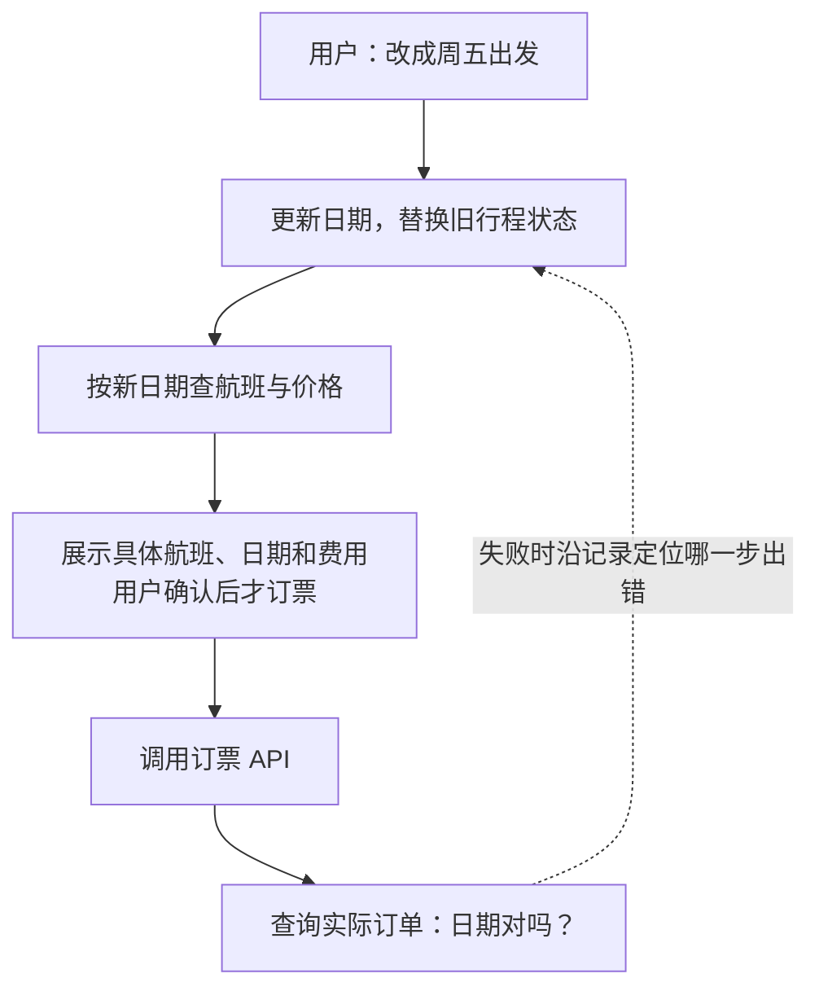
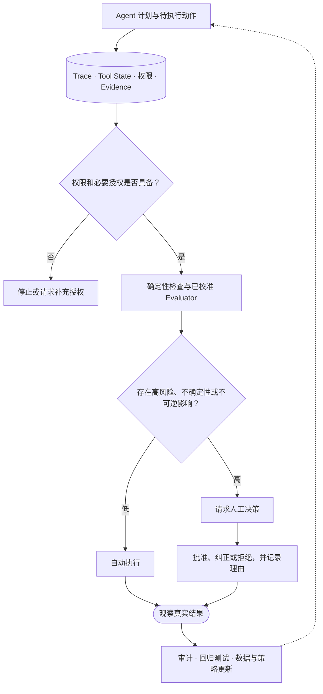

# 现代 AI 系统：模型只是其中一部分

**中文** · [English](README.en.md)

## 先看看模型前后还有什么

一个 AI 系统的结果，不只取决于模型。读到的数据、取出的记忆、找到的资料和调用的工具，都会影响它最后做什么。要改进系统，就得一起看这些环节，而不是只换一个更大的模型。

## 一次请求真正经过哪些环节

假设旅行 Agent 给用户订错了机票日期。

“模型答错了”只是最表面的描述。真正原因可能是：

- 用户在前一轮修改了日期，但状态没有更新；
- 搜索找到了过期的航班信息；
- 工具参数里的时区转换错误；
- 模型选对了日期，但执行层传错字段；
- 最终评估只检查回复文字，没有核对真实订单。

如果只盯着最后一句回答，很可能修错地方。

## 从头到尾走一遍


```mermaid
flowchart TB
    change["用户：改成周五出发"] --> state["更新日期，替换旧行程状态"]
    state --> search["按新日期查航班与价格"]
    search --> confirm["展示具体航班、日期和费用<br/>用户确认后才订票"]
    confirm --> tool["调用订票 API"]
    tool --> order["查询实际订单：日期对吗？"]
    order -. "失败时沿记录定位哪一步出错" .-> state
```

### 1. 用户目标：到底想解决什么

先说清楚任务、目标人群、失败成本和不能违反的条件。否则系统很容易优化一个方便测量、却不代表真实价值的指标。

### 2. 数据与反馈：模型看见的过去

数据由旧模型、产品界面和用户行为共同产生。它不是中立事实。详见 [数据与反馈](../01-data-and-feedback/)。

### 3. 表征与记忆：哪些信息要留下来

这一层决定本轮要用什么信息、哪些要留到以后的对话，以及新信息来了怎么更新旧记录。详见[表征与记忆](../02-memory/)。

### 4. 搜索与工具：怎样获取信息、执行操作

搜索负责找资料，工具负责查询或执行操作。接口没有报错，不代表信息就正确：搜到的文档可能过期，工具也可能读到了旧状态。

### 5. 模型与策略：系统怎样决定下一步

模型把目标、状态和证据组合起来，决定回答、追问、搜索还是行动。Post-training 则塑造这种行为倾向。

### 6. 运行与执行：能不能把事情做成

延迟、缓存、并发、重试、权限、状态同步和成本不一定是研究主题，却会直接改变用户看到的行为。

### 7. 用户结果：不是“生成完成”就算完成

真正要看任务有没有完成、外部状态是否正确，以及用户是否得到想要的结果。

### 8. 评估与学习：怎么发现问题、避免再犯

可以结合规则检查、实际执行结果、LLM Judge、人工审核和在线指标来判断。发现失败案例以后，还要补测试、改数据或调整策略，避免下次再犯。

## 例子：能查询订单并执行退款的客服 Agent

这类系统不能只生成自然语言。它要读取不断变化的业务事实，并可能执行有副作用的动作：

```text
用户消息
→ 语言、意图与风险识别
→ 结构化会话状态
→ 检索订单、物流、政策与商家证据
→ 模型决定回复、追问或调用工具
→ 权限、schema 与政策校验
→ 执行 read / write tool
→ 基于执行结果生成回答
→ 置信度检查、澄清或转人工
```

订单、物流和退款规则随时可能变化，不能只靠模型“记得”。处理请求时，需要通过检索或工具调用查最新状态。后训练教的是**怎样依据这些信息作答、执行操作**，不是把业务数据库装进模型参数里。

不同信息要分开存：最近几轮对话帮助模型接上话；任务状态保存订单 ID、已验证的身份、工具结果和待确认操作；长对话摘要记录已确认的事实和还没解决的事。订单、物流和退款规则仍要查数据库，不能只相信摘要。

退款会改变真实的业务状态。执行前要检查权限、参数格式和用户确认，执行时用幂等键防止重复退款，并保留审计日志。超时不代表操作一定没执行，重试前要查询状态或依赖接口的幂等保证；信息不足、规则冲突或风险过高时，应先追问或转人工。

评估时要看任务有没有解决、回答有没有依据、是否遵守业务规则、工具参数是否正确，以及有没有不安全的操作。还要检查多语言表现、转人工是否及时、延迟和成本，并结合满意度（CSAT）及重复咨询率。回答自然只是其中一项。

## 不同问题，要用不同的检查方法

| 方法 | 适合检查什么 | 好处 | 局限 |
| --- | --- | --- | --- |
| 确定性规则 | 格式、字段、状态和工具参数 | 快、稳定，适合反复检查旧问题 | 很难判断开放式回答的含义和质量 |
| 参考答案或实际执行 | 数学、代码、证据和任务是否完成 | 比较接近可验证的结果 | 参考答案也可能有遗漏或错误 |
| 模型评分（LLM judge） | 相关性、帮助程度、表达方式 | 可以批量判断语义 | 会有偏差，换版本或重复运行也可能变 |
| 成对比较（Pairwise） | 比较两个模型、提示或策略 | 通常比直接打绝对分更容易 | 受展示顺序影响，也可能只是“两者都不好” |
| 人工审查 | 评分标准、边界情况和价值判断 | 能结合实际语境 | 成本高，不同人也会意见不一 |
| 线上与长期指标 | 真实结果和持续使用体验 | 更接近用户最终得到的价值 | 有混杂因素、反馈延迟和实验成本 |

### 让模型打分前，先把标准说清楚

- 先定义什么算好，再决定给单个回答打分，还是比较两个回答。
- 能用规则准确判断的条件，不必交给模型猜。
- 复杂要求拆成几项分别检查；画出流程图不代表判断就一定有效。
- 成对比较时交换展示顺序，并允许“平局”和“两者都不好”。
- 用参考答案、示例和人工标注校准评分标准。
- 分组核对模型与人的判断是否一致，别只看平均分。
- 保存提示、模型版本、温度和用到的证据，方便回头复核。

## 为什么要看完整链路

系统里的错误会向后传播：

```text
错误或缺失的数据
→ 错误的用户状态
→ 错误的 query
→ 错误的检索结果
→ 模型在错误上下文里做出“合理”决定
→ 最终体验失败
```

模型即使根据收到的信息作出了合理判断，也可能因为前面的信息错了，把整件事做错。

## 排查前，先问自己这九个问题

```text
Goal        真正想改善什么？
User        对谁改善？有没有被平均值遮住的群体？
System      数据、组件和控制流怎样连接？
Invariant   哪些性质绝对不能破坏？
Failure     具体在哪里、怎样失败？
Hypothesis  我认为原因是什么？什么结果会推翻它？
Constraint  延迟、成本、硬件、隐私和兼容性限制是什么？
Evidence    用什么证据判断修复有效？
Tradeoff    改善了什么，又可能伤害什么？
```

这不是为了把简单问题写复杂，而是避免只修最显眼的症状。

## 两个帮助系统持续改进的模块

### Agent Observability：先看见发生了什么

它把模型、检索、工具、记忆和状态变化串成可查询的轨迹，再用这些记录构造受控回放测试。

→ [阅读 Agent Observability](agent-observability.md)

### Human-in-the-Loop：什么时候请人帮忙判断

不是每一步都要找人，而是遇到高风险操作、证据不足或没处理过的任务时，请人确认、纠正或接管。

→ [阅读 Human-in-the-Loop](human-in-the-loop.md)


```mermaid
flowchart TB
    A["Agent 计划与待执行动作"] --> B[("Trace · Tool State · 权限 · Evidence")]
    B --> P{"权限和必要授权是否具备？"}
    P -- "否" --> stop["停止或请求补充授权"]
    P -- "是" --> C["确定性检查与已校准 Evaluator"]
    C --> D{"存在高风险、不确定性或不可逆影响？"}
    D -- "低" --> E["自动执行"]
    D -- "高" --> F["请求人工决策"]
    F --> G["批准、纠正或拒绝，并记录理由"]
    E --> H(["观察真实结果"])
    G --> H
    H --> I["审计 · 回归测试 · 数据与策略更新"]
    I -.-> A
```

## 再往下一层：infra

如果想先弄懂训练怎样分到几张卡上，可以读[多卡训练](distributed-training.md)：用同一个小模型比较 DDP、FSDP、TP 和 PP，算清全局 loss 分母，再看通信与显存。它是理解机制的入口，不是部署手册。

这一章讲的是「一次请求经过哪些环节」，再往下——推理引擎怎么调度、显存怎么排、
RL 的训练和 rollout 怎么拼——就不是我的强项了，也不是我最感兴趣的方向。

那一层我见过最扎实的是
[Awesome-ML-SYS-Tutorial](https://github.com/zhaochenyang20/Awesome-ML-SYS-Tutorial)：
[zhaochenyang20](https://github.com/zhaochenyang20) 从 2024 年 8 月写到现在的 ML SYS 学习笔记，
RL infra、在线离线推理、SGLang（包括 SGLang Omni 那一串多阶段生成模型的推理优化）都有，中英文都写。
他人就在 SGLang 社区里做 RL infra，写的是自己手上正在改的东西。想往这一层走，从那儿开始。
