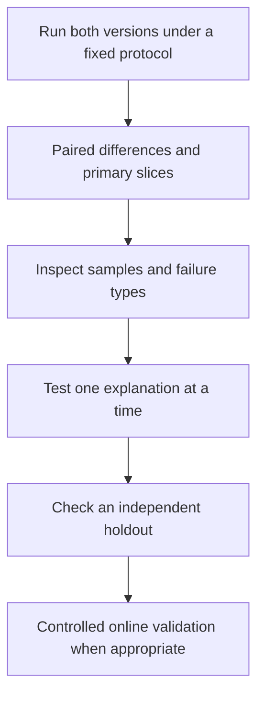

# After the score goes up: controlled comparisons and slices

[中文](ablation-and-slices.md) · **English**

Before asking whether a one-point gain is significant, check whether both systems used the same samples, candidates, and budget. Beautiful error bars cannot rescue a comparison answering the wrong question.

This synthetic example builds a minimal experiment record. It contains no business results and makes no claim that offline changes imply online gains.

## Write a falsifiable statement

“More information should help” is too broad. Try: “At fixed candidate and inference budgets, adding field X improves sparse-history retrieval without a meaningful regression elsewhere.”

This identifies the intervention, target population, controls, and failure condition. Define primary metrics and thresholds before inspecting results.

## Hold the comparison steady

| Item | Record | Risk if it changes |
| --- | --- | --- |
| Data | Version, time split, filters, deduplication | Population changes get attributed to the model |
| Candidates | Pool, sampling, positive definition | Difficulty or denominator changes make Recall incomparable |
| Compute | Training and inference budgets, seeds | Extra compute explains an apparent architecture benefit |
| Metrics | Formula, aggregation unit, slices | Identically named metrics may measure different things |
| Uncertainty | Retraining runs, resampling, intervals | A lucky run becomes a claim of repeatability |

Initially separate label changes from architecture changes. With enough budget, use a small factorial comparison to test whether they interact.

## A rising average can hide a regression

This example has two groups with fixed weights:

| Slice | Weight | Baseline | Candidate | Change |
| --- | --- | --- | --- | --- |
| Rich history | 80% | 0.60 | 0.66 | +0.06 |
| Sparse history | 20% | 0.50 | 0.30 | −0.20 |
| Weighted average | 100% | 0.58 | 0.588 | +0.008 |

The average improves while the sparse-history group regresses sharply. This does not establish a cause; it identifies something to investigate.

```python
weights = [0.8, 0.2]
baseline = [0.60, 0.50]
candidate = [0.66, 0.30]
change = sum(weight * (new - old)
             for weight, old, new in zip(weights, baseline, candidate))
assert abs(change - 0.008) < 1e-12
```

Between-group comparisons also require checking positive counts, candidate difficulty, and observation windows. Higher Recall in group A doesn't automatically mean better understanding of A. Matching does not eliminate every confounder.

## Measure differences, not just two means

For shared test samples, calculate a paired difference per unit before aggregation. If users are the unit, summarize by user. Correlated events from one user are not independent observations.

Bootstrap resampling at an appropriate independent unit can estimate test-set uncertainty. It cannot replace retraining or establish performance under a different distribution. **Sampling variation, training variation, and distribution shift are different questions.**

More slices aren't always better. Define primary slices beforehand. Patterns found after inspecting results are exploratory; check them on a fresh holdout rather than choosing the best-looking table.

## Turn the finding into a next step



With no change, check sensitivity and whether the intervention actually reached the computation. With a change, test repeatability across seeds, time, or environments. Neither result should end with only an aggregate score.

Continue: [Metric robustness](metric-robustness.en.md) · [Judge bias and validation](llm-as-a-judge/bias-and-workflow.en.md).
