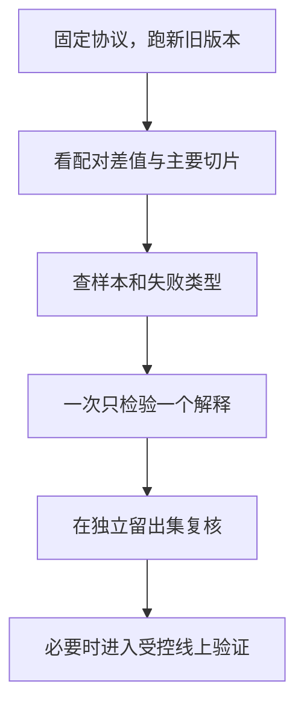

# 分数涨了以后：用对照实验和切片看清变化

**中文** · [English](ablation-and-slices.en.md)

新模型高了 1 个点，先别急着问是不是显著。先确认：比的是不是同一批样本、同一套候选和同一个预算？如果这些没对齐，误差条画得再漂亮，也可能在回答另一个问题。

下面用合成例子演示一份最小实验记录。没有真实业务结果，也不把离线变化当成线上收益。

## 先写一句能被推翻的话

“更多信息应该更好”太宽了。换成：“在相同候选池和推理预算下，加入字段 X 能改善薄历史样本的检索，同时不明显损害其他样本。”

它至少给了我们四件事：改哪个变量、在哪些样本上看、固定什么、怎样才算没达到预期。阈值和主要指标应在看结果之前确定。

## 给比较双方锁住相同条件

| 项目 | 要记录什么 | 不一致时会怎样 |
| --- | --- | --- |
| 数据 | 版本、时间切分、过滤、去重 | 换了人群，可能把数据差异当成模型差异 |
| 候选 | 池子、采样规则、正例定义 | 难度和分母变了，Recall 不能直接比 |
| 计算 | 训练预算、推理预算、种子 | 更多计算可能解释所谓架构收益 |
| 指标 | 公式、聚合单位、切片 | 同名指标也可能不是同一把尺子 |
| 不确定性 | 重训次数、抽样方式、误差范围 | 一次幸运训练容易被讲成稳定结论 |

改标签和改架构最好先分开。预算允许时，再做一个小型组合实验，检查两者是否互相影响。

## 平均分上涨，也可能有人变差

这个例子只有两组，权重固定：

| 切片 | 权重 | 旧版本 | 新版本 | 变化 |
| --- | --- | --- | --- | --- |
| 历史充分 | 80% | 0.60 | 0.66 | +0.06 |
| 历史稀疏 | 20% | 0.50 | 0.30 | −0.20 |
| 加权平均 | 100% | 0.58 | 0.588 | +0.008 |

平均分确实涨了，但稀疏人群退步很大。这里没有证明原因；它只告诉我们值得往哪儿查。

```python
weights = [0.8, 0.2]
baseline = [0.60, 0.50]
candidate = [0.66, 0.30]
change = sum(weight * (new - old)
             for weight, old, new in zip(weights, baseline, candidate))
assert abs(change - 0.008) < 1e-12
```

跨人群比较时，还要检查正例数量、候选难度和观察窗口。人群 A 的 Recall 更高，不自动说明模型对 A 的理解更好；“匹配过”也不等于消除了所有混杂因素。

## 差值怎么量，比单独报两个均值更有用

同一批测试样本上，先逐单位计算新旧差值，再汇总。单位如果是用户，就按用户统计；同一用户有许多相关事件时，不要把这些事件当成互相独立的样本。

Bootstrap 可以按独立抽样单位重采样，估计这个测试集合上的不确定性。但它不能替代重新训练，也不能告诉你换个数据分布后会怎样。**抽样波动、训练波动和分布变化，是三件不同的事。**

切片也不是越多越好。先写下主要切片；看完结果才发现的模式可以记录为探索发现，再用新的留出集复核，避免从几十张表里挑最漂亮的一张。

## 从发现到下一步



没有变化时，检查实验有没有足够灵敏、改动是否真的进入计算路径。出现变化时，问它有没有跨种子、跨时间或跨环境复现。两种情况下，都不要只拿一张总分表收尾。

继续读：[指标稳健性](metric-robustness.md) · [Judge 的偏差与验证](llm-as-a-judge/bias-and-workflow.md)。
