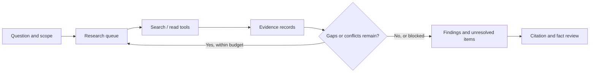

# Deep Research: Organizing Multi-Step Research

[中文](deep-research.md) · **English**

“What time does this library close?” may need one lookup. “How have these libraries' hours changed this year, including weekends and holidays?” needs decomposition, date checks, conflict handling, and decisions about what remains unknown. Length is not the distinction; **adapting the next step to evidence** is.

This is an original teaching design, not a product reproduction. [Anthropic's engineering account](https://www.anthropic.com/engineering/multi-agent-research-system) is a useful public example; its models, costs, and results describe that configuration, not ours.

## 1. Define what must be answered

Break the request into verifiable questions before launching searches:

| Question | Evidence needed | Completion condition |
| --- | --- | --- |
| Current regular hours | Effective official notice | Matching location, date, and hours |
| Weekend differences | Applicable provision | Explicit rule or explicit evidence gap |
| Holiday exceptions | Notice for that occasion | Not last year's holiday notice |
| When rules changed | Earlier and later versions | Publication and effective dates distinguished |

Not finding an exception does not prove none exists. Partial answers are acceptable; filling a table is not a reason to invent facts.

## 2. Start with five components



- The **planner** proposes questions and dependencies, not unsupported conclusions.
- The **executor** runs authorized tools with validation, timeouts, and bounded retries.
- The **evidence store** retains versions, source locations, dates, and supported claims.
- The **controller** enforces budgets, detects repeats, and stops loops.
- The **writer / verifier** connects claims to evidence and checks omissions and unsupported additions.

One model plus ordinary code is a reasonable first version. Parallelize genuinely independent questions. Multiple agents add context, duplication, coordination, and costs; quality is not a free upgrade.

## 3. A summary alone is not an evidence record

Retain at least `source_id, URL, fetched_at, published_at, effective_at, content_hash, span, claim_id`. Leave unknown dates empty rather than inventing them from a search snippet.

In an invented example, an old notice says 17:00 and a newer one 18:00. Check that they cover the same location and that the newer rule is effective. One might cover weekdays and the other holidays, so both could be correct. If the source cannot be read, record that only a snippet is available.

Group duplicated reporting by its underlying source. Five pages repeating one announcement are not five independent confirmations. Source text also cannot grant tool permissions: reading a page does not authorize emails, code execution, or uploads.

## 4. Enforce boundaries in code

This minimal implementation checks research state and citation locations. Whether evidence actually supports a claim requires a separate review; a discovered URL must not automatically set the state to `supported`.

```python
def research_status(questions, calls_left):
    if type(calls_left) is not int or calls_left < 0 or not questions:
        raise ValueError("Expected questions and a nonnegative call budget")
    allowed = {"unseen", "supported", "conflict", "unavailable"}
    unresolved = []
    for question_id, record in questions.items():
        status = record["status"]
        if status not in allowed:
            raise ValueError("Unknown evidence status")
        if status != "supported" or not record.get("evidence_ids"):
            unresolved.append(question_id)
    if not unresolved:
        return "ready_for_review", []
    return ("budget_exhausted" if calls_left == 0 else "needs_research"), unresolved


def check_citation_spans(citations, sources):
    errors = []
    for citation in citations:
        source = sources.get(citation["source_id"])
        start, end = citation["span"]
        if source is None or not source.get("read"):
            errors.append("missing_or_unread_source")
        elif type(start) is not int or type(end) is not int or not 0 <= start < end <= len(source["text"]):
            errors.append("invalid_span")
        elif source["text"][start:end] != citation["quote"]:
            errors.append("quote_mismatch")
    return errors


questions = {
    "hours": {"status": "supported", "evidence_ids": ["notice-v2"]},
    "holiday_exception": {"status": "conflict", "evidence_ids": ["notice-v1", "notice-v2"]},
}
assert research_status(questions, 0) == ("budget_exhausted", ["holiday_exception"])
sources = {"notice-v2": {"read": True, "text": "Open until 18:00."}}
citations = [{"source_id": "notice-v2", "span": (0, 17), "quote": "Open until 18:00."}]
assert check_citation_spans(citations, sources) == []
```

The first example reports the holiday conflict when the budget runs out: stopping does not become completion. The second verifies that quoted text occurs in a read source, **not semantic entailment**. “Closes at 18:00” does not establish that it opens on Sunday.

Persist the question queue, content hashes, tool results, budgets, and versions. Resume unfinished items after a restart instead of dropping conflicts and searching again. Unique tool-call IDs prevent retries from being mistaken for independent evidence.

## 5. When is another search worthwhile?

There is no universal minimum number of pages:

| State | Reasonable action |
| --- | --- |
| Key claims sourced and conflicts reviewed | Final review |
| Missing user date or location | Ask rather than search blindly |
| Repeated searches return the same information | Change the question or stop with limits |
| Inaccessible or unauthorized source | Record the gap; do not bypass access |
| Time, tool, or token budget reached | Partial answer with unresolved items |

Evidence sufficiency can suggest stopping, but model confidence alone should not determine high-risk decisions. Longer searches can also introduce misreadings and stale information; quality need not improve monotonically.

## 6. Test the process, not just the demo

Start with invented local documents: an old notice, a new one, a duplicate, and a conflicting notice. Inject timeouts, disappearing sources, incorrect citations, and instructions to ignore prior rules. Fixed fixtures isolate program errors; live-web tests cover environmental changes. Both matter.

| Metric | What it checks | Misleading shortcut |
| --- | --- | --- |
| Factual accuracy | Agreement with independent labels | Fluency is not correctness |
| Citation accuracy / coverage | Support and coverage of important claims | A link need not support its claim |
| Conflict handling / abstention | Missing evidence is recognized | Refusing everything is not success |
| Cost and latency | Calls, tokens, wall time | Parallel can be faster but more expensive |
| Repeatability | Repeated runs of the same task | One success does not establish reliability |

Following the approach in [agent evaluation guidance](https://www.anthropic.com/engineering/demystifying-evals-for-ai-agents), judge outcomes and important constraints rather than requiring one exact trace. Anchor evaluation in human review and calibrate judges; do not let the answering process award itself full credit unchecked.

The code performs no live search, model calls, or measured quality improvements. It implements testable boundaries. After connecting models, compare one-shot RAG, a single agent, and multiple agents under explicit budgets.
