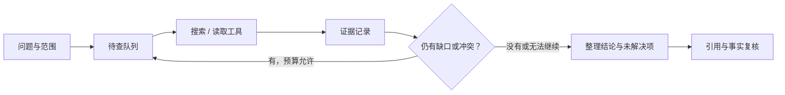

# Deep Research：多轮搜索怎么组织？

**中文** · [English](deep-research.en.md)

“这家图书馆几点关门？”可能一次查找就够。“这几家图书馆今年的开放时间改过几次，周末和节假日分别适用哪条规则？”就需要拆问题、核对时间、处理冲突，再决定还有什么没查到。写得长不是区别，**根据新证据调整下一步**才是。

下面是一套原创的教学设计，不是某家产品的完整复刻。公开研究系统可以参考 [Anthropic 的工程复盘](https://www.anthropic.com/engineering/multi-agent-research-system)；其中的模型、成本和效果属于当时配置，不能直接当作我们的性能。

## 1. 先定义这次要回答什么

把用户问题拆成能核对的事项，而不是立刻开十个搜索：

| 子问题 | 需要的证据 | 完成条件 |
| --- | --- | --- |
| 当前常规时间 | 生效中的官方通知 | 地点、日期和营业时间匹配 |
| 周末是否不同 | 适用条款 | 周末规则明确，或明确未找到 |
| 节假日例外 | 当次临时公告 | 不是去年同节日的通知 |
| 规则何时改变 | 前后两个版本 | 区分发布时间和生效时间 |

“没找到例外”不是“没有例外”。必要信息还缺时，可以给部分结论，不必为了凑齐表格编答案。

## 2. 五个部件就能先跑起来



- **Planner** 提出待查问题及依赖，不替证据下结论。
- **Executor** 只运行获准工具，检查参数、超时和重试。
- **Evidence store** 保存来源版本、原文位置、时间和支持的具体结论。
- **Controller** 管预算、重复搜索与停止，不让模型自己无限循环。
- **Writer / verifier** 把结论连接到证据，检查遗漏与不支持的扩写。

第一版可以是一个模型加普通代码。只有能独立搜索的子问题才值得并行；多 agent 会增加上下文、重复工作、协调与成本，不是研究质量的免费升级。

## 3. 证据不能只存一段摘要

至少保留 `source_id, URL, fetched_at, published_at, effective_at, content_hash, span, claim_id`。时间字段不清楚就留空，不从搜索结果猜。

自拟过程：旧通知说 17:00 关闭，新通知说 18:00。先确认新通知是否针对同一地点、是否已生效，再考虑能否替代旧通知。如果一份讲平日、一份讲节日，它们可能都对；如果访问不到原文，就把“只有搜索摘要”留在记录里。

内容相同的转载可以归为同一证据来源。5 个网页转述同一条消息，不是 5 次独立确认。网页中的指令也不是系统权限；读取来源不能顺便授权发邮件、执行代码或上传资料。

## 4. 用代码固定边界，不靠一句“请谨慎”

下面的最小实现检查研究状态与引用位置。证据是否真正支持结论，仍需单独判断；`supported` 必须来自已完成的核对，不能由“搜到一个 URL”直接设置。

```python
def research_status(questions, calls_left):
    if type(calls_left) is not int or calls_left < 0 or not questions:
        raise ValueError("Expected questions and a nonnegative call budget")
    allowed = {"unseen", "supported", "conflict", "unavailable"}
    unresolved = []
    for question_id, record in questions.items():
        status = record["status"]
        if status not in allowed:
            raise ValueError("Unknown evidence status")
        if status != "supported" or not record.get("evidence_ids"):
            unresolved.append(question_id)
    if not unresolved:
        return "ready_for_review", []
    return ("budget_exhausted" if calls_left == 0 else "needs_research"), unresolved


def check_citation_spans(citations, sources):
    errors = []
    for citation in citations:
        source = sources.get(citation["source_id"])
        start, end = citation["span"]
        if source is None or not source.get("read"):
            errors.append("missing_or_unread_source")
        elif type(start) is not int or type(end) is not int or not 0 <= start < end <= len(source["text"]):
            errors.append("invalid_span")
        elif source["text"][start:end] != citation["quote"]:
            errors.append("quote_mismatch")
    return errors


questions = {
    "hours": {"status": "supported", "evidence_ids": ["notice-v2"]},
    "holiday_exception": {"status": "conflict", "evidence_ids": ["notice-v1", "notice-v2"]},
}
assert research_status(questions, 0) == ("budget_exhausted", ["holiday_exception"])
sources = {"notice-v2": {"read": True, "text": "Open until 18:00."}}
citations = [{"source_id": "notice-v2", "span": (0, 17), "quote": "Open until 18:00."}]
assert check_citation_spans(citations, sources) == []
```

第一个例子在预算耗尽时仍报告节假日冲突，不会把“停止”写成“完成”。第二个只证明引用文字确实出现在已读来源中，**不证明语义蕴含**：原文“18:00 关门”不能支持“周日一定开放”。

真实实现还要将状态持久化。保存问题队列、已读内容 hash、工具结果、消耗预算与版本；重启后恢复未完成项，而不是重新搜索并丢掉旧冲突。给工具调用分配唯一 ID，避免失败重试被当成新证据。

## 5. 怎样判断值得增加一轮搜索？

没有通用的“查满几篇”。可以用这些停止条件：

| 状态 | 合理动作 |
| --- | --- |
| 关键结论有来源，已完成冲突核查 | 进入最终复核 |
| 明确还缺用户日期或地点 | 问用户，不盲搜 |
| 新搜索反复返回相同信息 | 改问题或停止，记录边界 |
| 来源不可访问 / 无权限 | 标明缺失，不绕过访问限制 |
| 达到时间、工具或 token 预算 | 给部分结果和未解决项 |

“证据足够”可以是停止建议，但高风险任务不能只靠模型的自信决定。更长的搜索链还可能增加误读和陈旧信息，不保证单调变好。

## 6. 怎么测，而不是怎么演示？

先用本地自拟文档测试：一份旧公告、一份新公告、一份转载、一份冲突公告。注入超时、来源消失、错误引用和“忽略原规则”的文本。固定夹具能定位程序错误；真实网页测试则检查外部变化，两者都需要。

| 指标 | 看什么 | 容易误判什么 |
| --- | --- | --- |
| 事实正确率 | 结论与独立标注是否一致 | 文风流畅不等于事实正确 |
| 引用准确 / 覆盖 | 引用支持结论，重要结论都有依据 | 有链接不代表支持 |
| 冲突与拒答 | 能识别缺证据，而不是一律猜 | 全拒答也不算完成 |
| 成本与延迟 | 调用、token、墙钟时间 | 并行更快但可能更贵 |
| 重复运行稳定性 | 同一任务多次运行 | 偶然成功不等于可靠 |

按 [Agent 评估指南](https://www.anthropic.com/engineering/demystifying-evals-for-ai-agents)的思路，检查最终状态和重要约束，不强求每次执行同一条路径。把少量人审作为锚点，再校准 judge；不要让生成答案的同一个流程不加核对地给自己满分。

这段代码没有发起真实搜索、调用模型或测出提升。它是一套可测试的边界；接入模型后，再用固定协议比较单次 RAG、单 agent 和多 agent，且报告各自预算。
