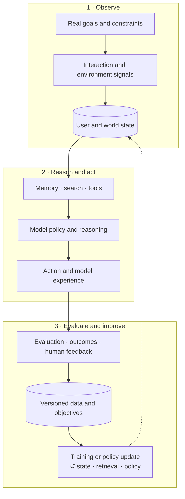

# AGI Study Notes

[中文](README.md) · **English**

### 📖 Read it at **<https://tianyi-zhang-02.github.io/cooking-agi/>**

The site is the finished form of these notes: topic navigation in the sidebar, rendered
math, English glosses on the terms in the Chinese pages, and experiments you can train
yourself in the foundations chapter. **This repository is the site's source and build
system** — to change the content or to contribute, start here (see [CONTRIBUTING.md](CONTRIBUTING.md)).

---

<!-- widget:roadmap -->

<!-- widget:blocks -->

<!-- widget:gallery -->

<!-- widget:threads -->

<!-- widget:categories -->

<!-- widget:about-head -->

This repository records what I have understood about modern AI systems from studying and building them.

What I want to figure out is not only “how to train a bigger model,” but how to put data, memory, search, tools, feedback, and evaluation together into **an AI system that really understands people, can find information, and gets better the more it is used**.

Each topic tries to answer a few questions directly: what the system is trying to solve, whether the inputs and feedback are reliable, why the model made this decision, and whether a failure really comes from the model itself or from the data, memory, and search upstream.

This is not a paper collection or a taxonomy of isolated fields. I use it to follow one question across papers, systems, and experiments: how can a model understand a person over time, find what is useful now, and improve its behavior from incomplete interaction feedback?

The repository is written **modern-first**: it starts from today's LLM, agent, multimodal, post-training, search, serving, and evaluation systems. Historical material stays only when it explains a current design; there is no standalone encyclopedia or chronological review of traditional AI models.

## The whole-system view

A modern AI product is not an isolated model. It is a set of system modules that affect one another:

| System stage | Main responsibility | What most easily goes wrong |
| --- | --- | --- |
| Goal and task definition | Make clear what to improve and for whom | The metrics look great, but the problem solved is not the user's |
| Data and feedback | Provide training and evaluation signals | Data is sparse, stale, or only covers what the old system chose to show |
| Representation and memory | Retain, compress, and update important information | Multiple intents are squashed into one average, and key history is lost |
| Search, retrieval, and tools | Obtain the external evidence and capabilities the current task needs | Content is relevant but repetitive, or key evidence is missing |
| Model, SFT, preference learning, and RL | Learn policies for generation, reasoning, and action | The training objective does not match the real usage scenario |
| Runtime and agent observability | Execute reliably and record state changes | Only the final failure is visible, with no idea at which step things went wrong |
| Evaluation | Judge whether the system really improved | One aggregate score hides long-tail users and specific failure modes |
| Human-in-the-Loop | Bring in human judgment at uncertain or high-risk steps | Only a label is kept, with no record of the basis for the judgment |
| Model Experience | Turn system capability into a sustained, controllable user experience | Single answers are fine, but long-term use grows narrower or less controllable |



The key point: **these modules are not unrelated boxes on a pipeline.**

Search results change the world the model can see; the model's output changes what the user does next; and that behavior in turn becomes training data. If we do not understand this closed loop, it is easy to mistake a bias created by the old system for the user's own preference.

An AI product is never only its model weights:

> **System behavior = data × representation and memory × search and tools × model policy × runtime × evaluation loop**

Failure in any layer propagates to the final experience. The expanded framework lives in [`06-systems/`](06-systems/README.en.md).

## My three main threads

The interests connect as one system:

- **Personal AGI is the goal:** sustained understanding, adaptation, and assistance for a specific person.
- **Search is the interface to the world:** it determines what evidence, candidates, and actions are visible.
- **Model experience is the observable outcome:** relevance, breadth, control, trust, and improvement across interactions.
- **Post-training is the behavior-update mechanism:** demonstrations, preferences, and interaction feedback become policy changes.
- **Multimodal learning is the evidence layer:** text, images, video, behavior, and social context jointly describe intent and value.
- **Evaluation is the measurement loop:** it determines whether the system improved or merely moved a proxy metric.

### Personal AGI: what I ultimately want to build

To me, Personal AGI is not “stuffing every chat log into an extremely long context.” It should gradually come to understand one specific person, while knowing that its understanding may be wrong and letting the user correct it.

It is a closed learning system: one that maintains revisable user and world state, searches for external evidence, reasons and acts, and then updates itself from evaluation and real interaction.

→ [Start with Personal AGI](09-personal-agi/README.en.md)

### Search: how the model connects to the outside world

A model cannot hold all knowledge, the latest information, and personal state in its parameters. Search decides what it sees and what it misses in the current task, and whether the next step should be to keep looking, ask a follow-up question, or act directly.

→ [Start with Search](04-search/README.en.md)

### Model Experience: what the user ultimately feels

What the user experiences is not a benchmark score but a continuing relationship: whether the model understands context, whether it repeats its mistakes, whether it gives a sense of control, and whether it really is more helpful after long use.

→ [Start with Model Experience](08-model-experience/README.en.md)

## Read slowly, topic by topic

Each note tries to follow the same order: **first what it is, then why it is needed, then one example to explain it, and only then the technical questions.**

The numeric prefixes on the folders are the suggested reading order. By default a note
answers one main question and takes about five minutes to read; fast-moving APIs, hardware
support, and engineering practices carry a review date. The detailed rules are in the
[modern-first editorial and freshness policy](EDITORIAL.en.md).

### First, lay the foundations

- [Learning LLMs: from tokens to generation](00-foundations/README.en.md): Tokenization → RNN / LSTM → Seq2Seq → Vanilla Transformer → Decoder-only, one main line split into core knowledge, deep dives, and from-scratch implementation labs.
- [Core knowledge](00-foundations/core/README.en.md): first understand what each generation of architecture computes, and which bottleneck of the previous generation it solved.
- [Deep dives](00-foundations/deep-dives/README.en.md): BPTT, gating, the language-model objective, and the training and generation paths.
- [Build-it-yourself labs](00-foundations/code/README.en.md): see the computation clearly in pure Python / NumPy, then use PyTorch to make the same mechanism actually learn.

### Then understand the inputs

- [Data and feedback](01-data-and-feedback/README.en.md): logs are not facts, and a click is not a preference.
- [Representation and memory](02-memory/README.en.md): what should the model remember, and what should it forget?
- [Multimodal learning](03-multimodal-learning/README.en.md): how do images, video, and behavior supply what text cannot show?

### Then understand how the model gets things done

- [Search](04-search/README.en.md): from similarity retrieval toward finding evidence and taking action.
- [Post-Training](05-post-training/README.en.md): what do SFT, preference learning, and RL each change?
- [Modern AI systems overview](06-systems/README.en.md): how do these modules really connect?

### Finally, understand how to judge whether it is doing well

- [Evaluation](07-evaluation/README.en.md): why is “giving the model one score” nowhere near enough?
- [LLM-as-a-Judge](07-evaluation/llm-as-a-judge.en.md): how do few-shot examples, references, rubrics, and scoring combine?
- [Agent Observability](06-systems/agent-observability.en.md): what actually happened in one agent run?
- [Human-in-the-Loop](06-systems/human-in-the-loop.en.md): when should a human step in?
- [Model Experience](08-model-experience/README.en.md): how do offline metrics connect to long-term user experience?

## How I think about LLM evaluation

An LLM judge is best treated as a **scalable semantic sensor**, not ground truth. Reliable evaluation combines several layers:

1. **Deterministic checks** for schemas, tool calls, state transitions, and structural invariants.
2. **Reference-based or executable verification** for code, math, retrieval evidence, and task completion.
3. **Single-output and pairwise judges** for open-ended quality, relevance, helpfulness, and preference.
4. **Human audit and calibration** for rubrics, edge cases, position bias, self-preference, and style bias.
5. **Online and longitudinal outcomes** to test whether offline gains improve real experience.

Decomposing a complex rubric into atomic decisions, swapping pairwise order, and calibrating against references and examples are generally more defensible than asking for an ungrounded 1–10 score. The important question is not which judge is used, but whether the measurement is interpretable, reproducible, and able to reveal its own failure modes.

## Foundational papers still shaping modern systems

These papers do not lose their value just because they are older; they stay because their mechanisms still directly affect today's systems. You can start by picking one from each thread:

- **Memory and long-term interaction**: [Generative Agents](https://arxiv.org/abs/2304.03442), [MemGPT](https://arxiv.org/abs/2310.08560)
- **Search and external evidence**: [Dense Passage Retrieval](https://arxiv.org/abs/2004.04906), [ColBERT](https://arxiv.org/abs/2004.12832), [RAG](https://arxiv.org/abs/2005.11401)
- **Reasoning and action**: [ReAct](https://arxiv.org/abs/2210.03629)
- **Feedback and behavior learning**: [InstructGPT](https://arxiv.org/abs/2203.02155), [DPO](https://arxiv.org/abs/2305.18290)
- **Multimodal understanding**: [CLIP](https://arxiv.org/abs/2103.00020), [Flamingo](https://arxiv.org/abs/2204.14198)

They define the conceptual map rather than form a complete reading list. Why each one is here:

| Thread | Paper | Why it is here |
| --- | --- | --- |
| Persistent agents | [Generative Agents](https://arxiv.org/abs/2304.03442) | Connects memory, reflection, and planning into persistent behavior. |
| Memory systems | [MemGPT](https://arxiv.org/abs/2310.08560) | Treats context management as a systems problem. |
| Dense search | [Dense Passage Retrieval](https://arxiv.org/abs/2004.04906) | A clean foundation for learned dual-encoder retrieval. |
| Late interaction | [ColBERT](https://arxiv.org/abs/2004.12832) | Avoids compressing every matching signal into one vector too early. |
| Retrieval + generation | [Retrieval-Augmented Generation](https://arxiv.org/abs/2005.11401) | Treats retrieval as revisable external evidence for generation. |
| Reasoning and action | [ReAct](https://arxiv.org/abs/2210.03629) | Lets models gather information while solving a task. |
| Context experience | [Lost in the Middle](https://arxiv.org/abs/2307.03172) | Shows that context access is not equivalent to context use. |
| Human feedback | [InstructGPT](https://arxiv.org/abs/2203.02155) | Establishes the classic SFT–reward modeling–RLHF pipeline. |
| Preference optimization | [Direct Preference Optimization](https://arxiv.org/abs/2305.18290) | Expresses preference learning as a direct policy objective. |
| Multimodal representation | [CLIP](https://arxiv.org/abs/2103.00020) | A foundation for scalable language-supervised vision learning. |
| Multimodal interaction | [Flamingo](https://arxiv.org/abs/2204.14198) | Studies few-shot learning over interleaved visual and textual context. |

More single-paper notes will go in [`papers/`](papers/README.en.md). The English paper-note template is [`templates/paper-note.en.md`](templates/paper-note.en.md).

## How I want to write these notes

I do not want to merely restate what a paper did. Every topic should ultimately answer:

1. What real problem does it solve?
2. Why, intuitively, is it needed?
3. What is the simplest example?
4. What are the main technical approaches?
5. Which assumptions does it depend on?
6. What evidence would show that it works?
7. In which situations does it fail?
8. How does it connect to the other parts of the whole system?

This is a personal understanding under continuous revision, not a final answer. I will keep changing it as I read, experiment, and actually build.

## Publication boundary

This repository publishes foundational principles, mathematical derivations, public
papers, reproducible experiments, AI infrastructure, and open-source project notes.
Implementations, evidence, retrospectives, and hands-on notes that come from employment,
recruiting, or a specific company stay in private notes only; even with names and numbers
removed, they will not be placed here as “anonymized case studies.” A public note must
stand on its own, independent of any company experience, and be supportable from public
sources or reproducible experiments.

## How the repository is organised

- The numeric folder prefixes are the reading order; GitHub sorts alphabetically, so the file listing itself is the outline.
- Notes are **pure markdown** with no front matter — the file you read on GitHub and the one on the site are the same.
- The site build lives in [`site/`](site/): [`nav.toml`](site/nav.toml) controls navigation order,
  [`glossary.tsv`](site/glossary.tsv) controls the Chinese–English term annotations (do not
  hand-write bracketed glosses in the prose), and the figures are generated by the scripts in each chapter's `code/`.
- Pushing to `main` makes GitHub Actions rebuild and redeploy automatically.

## Contributing

Pointing out something that is wrong, saying a passage did not make sense, adding an
example, adding a paper note — all of it counts. A single typo counts too. See [CONTRIBUTING.md](CONTRIBUTING.md).

Local preview:

```bash
pip install markdown pygments
python site/build.py --serve
```
