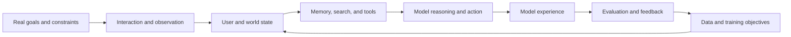

# Cooking AGI

[中文](README.md) · **English**

Working notes on **personal AGI, search, model experience, and AI infrastructure**.

This is not a recipe for AGI. It is an attempt to place models, data, memory, search, feedback, and evaluation on the same workbench: to understand what each ingredient contributes, how they interact, and why the complete system behaves the way it does.

This is not a paper collection or a taxonomy of isolated fields. I use it to follow one question across papers, systems, and experiments: how can a model understand a person over time, find what is useful now, and improve its behavior from incomplete interaction feedback?

The repository is **modern-first**: it starts from current LLM, agent, multimodal, post-training, search, serving, and evaluation systems. Historical material remains only when it explains a mechanism still active today; there are no standalone encyclopedic surveys of traditional AI models.

## The thread I am following

Personal AGI is not simply a larger model with an unlimited context window. It is a closed learning system: one that maintains revisable user and world state, searches for external evidence, reasons and acts, and then updates itself from evaluation and real interaction.

The interests connect as one system:

- **Personal AGI is the goal:** sustained understanding, adaptation, and assistance for a specific person.
- **Search is the interface to the world:** it determines what evidence, candidates, and actions are visible.
- **Model experience is the observable outcome:** relevance, breadth, control, trust, and improvement across interactions.
- **Post-training is the behavior-update mechanism:** demonstrations, preferences, and interaction feedback become policy changes.
- **Multimodal learning is the evidence layer:** text, images, video, behavior, and social context jointly describe intent and value.
- **Evaluation is the measurement loop:** it determines whether the system improved or merely moved a proxy metric.
- **AI infrastructure is the execution substrate:** it turns model capability into trainable, scalable, and reliable systems.

## A systems view of modern AI

An AI product is never only its model weights:

> **System behavior = data × representation and memory × search and tools × model policy × runtime × evaluation loop**

Failure in any layer propagates to the final experience.

| Layer | Central question | Common distortion |
| --- | --- | --- |
| Goal and constraints | What are we really improving, for whom, and where? | Replacing the true objective with an easy proxy |
| Data and feedback | Where do observations come from, and who is missing? | Sparse, delayed, policy-biased, non-longitudinal data |
| Representation and memory | What is retained, compressed, revised, or forgotten? | Averaging multiple intents into one point |
| Search and context | Which evidence and candidates can the model see? | Narrow recall, repetition, or poor evidence ordering |
| Model and policy | How does the model reason, choose, and act? | Training objectives that do not match deployment |
| Runtime and tools | Can the intended capability execute reliably? | Timeouts, tool failures, stale state, or runaway cost |
| Evaluation | What evidence supports the claim that the system is better? | Aggregate scores hiding subgroup and long-tail regressions |
| Product loop | How does deployed behavior become future learning data? | Treating exposure-conditioned clicks as natural preference |

The expanded framework lives in [`systems/`](systems/README.en.md).

## How I think about LLM evaluation

An LLM judge is best treated as a **scalable semantic sensor**, not ground truth. Reliable evaluation combines several layers:

1. **Deterministic checks** for schemas, tool calls, state transitions, and structural invariants.
2. **Reference-based or executable verification** for code, math, retrieval evidence, and task completion.
3. **Single-output and pairwise judges** for open-ended quality, relevance, helpfulness, and preference.
4. **Human audit and calibration** for rubrics, edge cases, position bias, self-preference, and style bias.
5. **Online and longitudinal outcomes** to test whether offline gains improve real experience.

Decomposing a complex rubric into atomic decisions, swapping pairwise order, and calibrating against references and examples are generally more defensible than asking for an ungrounded 1–10 score. The important question is not which judge is used, but whether the measurement is interpretable, reproducible, and able to reveal its own failure modes.

## Recommended starting points

These papers remain because their mechanisms still shape modern systems, not merely because they were historically important. They define the conceptual map rather than form a complete reading list.

| Thread | Paper | Why it is here |
| --- | --- | --- |
| Persistent agents | [Generative Agents](https://arxiv.org/abs/2304.03442) | Connects memory, reflection, and planning into persistent behavior. |
| Memory systems | [MemGPT](https://arxiv.org/abs/2310.08560) | Treats context management as a systems problem. |
| Dense search | [Dense Passage Retrieval](https://arxiv.org/abs/2004.04906) | A clean foundation for learned dual-encoder retrieval. |
| Late interaction | [ColBERT](https://arxiv.org/abs/2004.12832) | Avoids compressing every matching signal into one vector too early. |
| Retrieval + generation | [Retrieval-Augmented Generation](https://arxiv.org/abs/2005.11401) | Treats retrieval as revisable external evidence for generation. |
| Reasoning and action | [ReAct](https://arxiv.org/abs/2210.03629) | Lets models gather information while solving a task. |
| Context experience | [Lost in the Middle](https://arxiv.org/abs/2307.03172) | Shows that context access is not equivalent to context use. |
| Human feedback | [InstructGPT](https://arxiv.org/abs/2203.02155) | Establishes the classic SFT–reward modeling–RLHF pipeline. |
| Preference optimization | [Direct Preference Optimization](https://arxiv.org/abs/2305.18290) | Expresses preference learning as a direct policy objective. |
| Multimodal representation | [CLIP](https://arxiv.org/abs/2103.00020) | A foundation for scalable language-supervised vision learning. |
| Multimodal interaction | [Flamingo](https://arxiv.org/abs/2204.14198) | Studies few-shot learning over interleaved visual and textual context. |

## Repository map

- [`ai-infra/`](ai-infra/README.en.md) — hardware, kernels, numerical formats, distributed training, inference, clusters, and learning loops
- [`systems/`](systems/README.en.md) — connecting data, models, runtime, evaluation, and the product loop
- [`data and feedback`](data-and-feedback/README.en.md) — understanding sparsity, delay, ambiguity, and policy-biased behavior
- [`representation and memory`](memory/README.en.md) — persistent, revisable user and world state
- [`evaluation`](evaluation/README.en.md) — combining deterministic, semantic, human, and longitudinal evidence
- [`LLM-as-a-Judge`](evaluation/llm-as-a-judge.en.md) — demonstrations, references, rubrics, judging modes, and score aggregation
- [`agent observability`](systems/agent-observability.en.md) — using traces, state, and outcomes to explain agent failures
- [`human in the loop`](systems/human-in-the-loop.en.md) — routing uncertain or high-risk decisions to human judgment
- [`personal-agi/`](personal-agi/README.en.md) — persistent user state, memory, adaptation, and agents
- [`search/`](search/README.en.md) — retrieval, ranking, exploration, and retrieval-augmented reasoning
- [`model-experience/`](model-experience/README.en.md) — behavioral evaluation, interaction quality, and control
- [`post-training/`](post-training/README.en.md) — SFT, preference learning, RL, objectives, and data quality
- [`multimodal-learning/`](multimodal-learning/README.en.md) — multimodal representation and content understanding
- [`papers/`](papers/README.en.md) — paper-by-paper notes
- [`templates/paper-note.en.md`](templates/paper-note.en.md) — English paper-note template

Notes default to one central question and roughly five minutes of reading. Fast-moving APIs, hardware support, and engineering practices carry review dates; see the [modern-first editorial and freshness policy](EDITORIAL.en.md).

## How I take notes

I try not to restate a paper section by section. Each note should answer:

- What problem is actually being solved?
- What assumptions make the method work?
- What is the central mechanism or invariant?
- What evidence supports the claim, and what would falsify it?
- Where does the method sit in the larger system?
- What does it change in my current research map?

This is a living notebook. Interpretations will change as I read, reproduce, and build.
