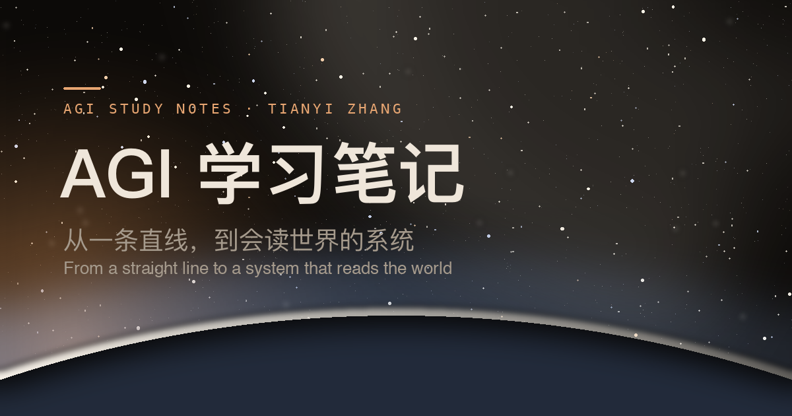

<div align="center" markdown="1">



<h1>AGI 学习笔记</h1>

**我的 AI 学习笔记，也欢迎你来补充。**

学过的基础、读过的论文，还有准备找工作时的一些记录。<br>
中英文都有，部分内容配了可以动手玩的交互图。

[](https://tianyi-zhang-02.github.io/cooking-agi/)
[](https://github.com/tianyi-zhang-02/cooking-agi/actions/workflows/site.yml)
[](README.en.md)

[**开始阅读**](https://tianyi-zhang-02.github.io/cooking-agi/) ·
[English](README.en.md) ·
[幕后](contributors.md) ·
[加入我们！](CONTRIBUTING.md)

</div>

---

## 关于这份笔记

去年开始，我决定试试 industry。之前本科基本都在做科研，真正开始准备找工作，才发现有不少东西要补。准备了挺久，也走了一些弯路，所以想把学过的东西整理出来，方便自己回头看，也希望能帮到有类似需要的人。

整理这些笔记，也是希望大家少花点时间到处搜资料、纠结先看什么，能更快开始准备。省下来的时间可以做点自己喜欢的事，好好休息，不用每天都被学习和找工占满。希望大家准备得顺利，也能过得轻松、开心一点 :)

内容主要围绕 ML 和 language models，包括基础原理、post-training、evaluation 和论文笔记，也有我的面试准备方法和找工过程中的一些想法。

如果你在找 ML 相关的实习或 new-grad 岗位，或者想转到 ML / LLM 方向，可以按需看看。不找工作、只是对这些东西感兴趣，也欢迎。

我的准备和面试经历主要集中在 MLE 和 Research Scientist 岗位，不太适合给 SDE 面试建议。AI infra 等我还不熟悉的方向，会整理一些自己觉得不错的资料，方便大家去看更有经验的人怎么讲。

这里不是面经题库，不会放具体公司的面试题，主要分享我怎么学、怎么准备。很多章节还没写完，也不保证所有理解都对，大家按自己的情况参考就好。

## 可以看些什么

| 板块 | 讲什么 |
| --- | --- |
| [大模型基础](00-foundations/) | 从 Tokenization、RNN / LSTM 到 Transformer，也有 MoE 和不同模型家族的介绍 |
| [Post-training](05-post-training/) | SFT、RLHF、PPO 等方法怎么做，又各自适合什么情况 |
| [评估](07-evaluation/) | 怎么设计评估、理解指标，以及用 LLM-as-a-judge 辅助判断 |
| [数据与检索](01-data-and-feedback/) | 数据从哪儿来、反馈怎么收、检索怎么建 |
| [系统与多模态](06-systems/) | 一次请求经过哪些环节，怎么排查问题，什么时候需要人来确认 |
| [Agents](10-agents/) | 这个词的来历、几种结构、不同场景，以及模型怎么选 |
| [AI Infra](open-source/) | 在 NeMo RL 里做贡献：从具体改动出发，逐步看懂整套系统 |
| [面试准备](interview/) | ML 基础复习、代码练习和系统设计资料 |
| [求职](career/) | 我的准备过程、踩过的坑，以及心态上的一些变化 |
| [论文](papers/) | 记录读论文时的理解、疑问和实验思路 |

建议在[网站](https://tianyi-zhang-02.github.io/cooking-agi/)上阅读，可以切换中英文，也能直接操作交互图。如果想先随便看看，可以从 [Transformer 图解](https://tianyi-zhang-02.github.io/cooking-agi/00-foundations/transformer-lab.html)开始。

## 本地运行

想在本地打开网站，可以运行下面的命令。网站是静态的，用 Python 脚本生成：

```bash
pip install markdown pygments
python3 site/build.py            # 构建到 _site/
python3 site/build.py --serve    # 本地预览
```

提交前跑两个检查：

```bash
python3 site/paritycheck.py      # 中英两版结构是否一致
python3 site/leakcheck.py        # 不该公开的东西有没有混进来
```

## 加入我们！

发现错误、哪段没看懂，或者有想看的内容，都欢迎提 issue。有自己的笔记或更好的例子，也欢迎提 PR，我也想跟着大家多学一点。

怎么参与可以看[贡献指南](CONTRIBUTING.md)，参与过的朋友会出现在[幕后](contributors.md)。

想在贡献者地图上留下一个位置，也可以[告诉我你所在的国家或地区](https://github.com/tianyi-zhang-02/cooking-agi/issues/new?template=add-me-to-the-crew.yml)，不用提供具体地址。

这里分享公开的技术知识和学习心得，请不要上传公司内部资料、未公开的面试内容或其他敏感信息。
