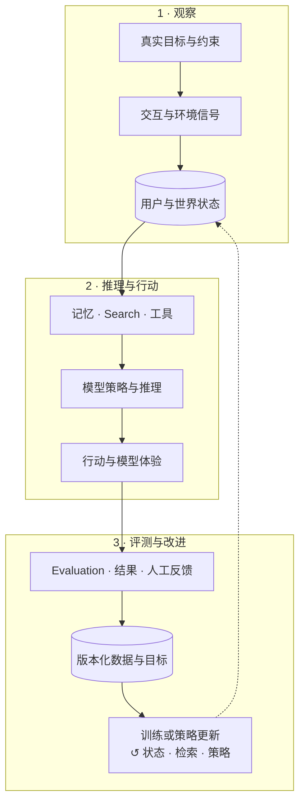

# AGI 学习笔记

**中文** · [English](README.en.md)

### 📖 阅读请到 **<https://tianyi-zhang-02.github.io/cooking-agi/>**

站点是这些笔记的正式形态：左侧按主题跳转、公式渲染、中文里的术语标注英文原文、
基础章节有能自己训练的实验。**这个仓库是站点的源码和构建系统**——想改内容或参与，
从这里开始（见 [CONTRIBUTING.md](CONTRIBUTING.md)）。

---

这个仓库记录我对现代 AI 系统的学习与实践理解。

我想弄明白的，不只是“怎样训练一个更大的模型”，而是怎样把数据、记忆、搜索、工具、反馈和评估放在一起，做出一个**真的会理解人、会找信息、也会越用越好的 AI 系统**。

每个主题都尽量直接回答几个问题：系统想解决什么，输入和反馈是否可靠，模型为什么会做出这个决定，以及失败究竟来自模型本身还是上游的数据、记忆和搜索。

这个仓库采用 **modern-first** 的写法：从今天的 LLM、Agent、multimodal、post-training、search、serving 和 evaluation 系统出发。历史内容只有在能够解释当前设计时才保留，不单独做传统 AI model 的百科或年代回顾。

## 整体系统视角

现代 AI 产品不是一个孤立模型，而是一组相互影响的系统模块：

| 系统环节 | 主要职责 | 最容易出的问题 |
| --- | --- | --- |
| 目标与任务定义 | 明确要改善什么、为谁改善 | 指标很好看，但解决的不是用户问题 |
| 数据与反馈 | 提供训练和评估信号 | 数据稀疏、过时，或者只看见旧系统展示过的内容 |
| 表征与记忆 | 保留、压缩并更新重要信息 | 多种意图被压成一个平均值，关键历史被丢失 |
| Search、Retrieval 与工具 | 获取当前任务需要的外部证据和能力 | 内容相关但重复，或者缺少关键证据 |
| 模型、SFT、偏好学习与 RL | 学习生成、推理和行动策略 | 训练目标与真实使用场景不一致 |
| Runtime 与 Agent Observability | 可靠执行并记录状态变化 | 只看到最终失败，不知道从哪一步开始出错 |
| Evaluation | 判断系统是否真的改善 | 一个总分掩盖长尾用户和具体失败模式 |
| Human-in-the-Loop | 在不确定或高风险环节引入人工判断 | 只留下标签，没有记录判断依据 |
| Model Experience | 把系统能力转化为持续、可控的用户体验 | 单次回答不错，长期使用却越来越窄或不可控 |



关键是：**这些模块不是流水线里互不相关的盒子。**

搜索结果会改变模型能看到的世界；模型的输出会改变用户下一次的行为；这些行为又会变成训练数据。如果不理解这个闭环，我们很容易把旧系统造成的偏差，当成用户本来的偏好。

## 我的三条主线

### Personal AGI：最终想做成什么

Personal AGI 对我来说，不是“把所有聊天记录塞进超长上下文”。它应该能逐渐理解一个具体的人，同时知道自己的理解可能会错，并允许用户纠正。

→ [从 Personal AGI 开始](09-personal-agi/)

### Search：模型怎样连接外部世界

模型不可能把所有知识、最新信息和个人状态都放在参数里。Search 决定它在当前任务中看见什么、错过什么，以及下一步应该继续找、追问，还是直接行动。

→ [从 Search 开始](04-search/)

### Model Experience：用户最终感受到什么

用户体验到的不是 benchmark 分数，而是一段连续关系：模型是否懂上下文、是否重复犯错、是否给人控制感，以及用久以后是不是真的更有帮助。

→ [从 Model Experience 开始](08-model-experience/)

## 按知识点慢慢读

每一篇都尽量按照同一个顺序写：**先讲它是什么，再讲为什么需要它，然后用一个例子解释，最后再进入技术问题。**

目录的数字前缀就是建议的阅读顺序。默认一篇只回答一个主要问题，阅读时间约五分钟；
快速变化的 API、硬件支持和工程实践需要标注审阅时间，详细规则见
[Modern-first 写作与时效性规范](EDITORIAL.md)。

### 先把地基打上

- [大模型学习：从 Token 到生成](00-foundations/)：Tokenization → RNN / LSTM → Seq2Seq → Vanilla Transformer → Decoder-only，一条主线分成必修、进阶与从零实现实验。
- [必修知识](00-foundations/core/)：先理解每代架构在算什么，以及它解决了上一代的哪个瓶颈。
- [进阶拆解](00-foundations/deep-dives/)：BPTT、门控、语言模型目标、训练与生成路径。
- [从零实现实验](00-foundations/code/)：纯 Python / NumPy 看清计算，再用 PyTorch 让同一机制真正学起来。

### 再理解输入

- [数据与反馈](01-data-and-feedback/)：日志不是事实，点击也不等于偏好。
- [表征与记忆](02-memory/)：模型应该记住什么，又该忘掉什么？
- [多模态学习](03-multimodal-learning/)：图片、视频和行为怎样补充文字看不到的信息？

### 然后理解模型怎样做事

- [Search](04-search/)：从相似度检索走向寻找证据与行动。
- [Post-Training](05-post-training/)：SFT、偏好学习和 RL 分别在改变什么？
- [现代 AI 系统总览](06-systems/)：这些模块怎样真正连在一起？

### 最后理解怎样判断它做得好不好

- [Evaluation](07-evaluation/)：为什么“给模型打一个分”远远不够？
- [LLM-as-a-Judge](07-evaluation/llm-as-a-judge.md)：few-shot、reference、rubric 与 scoring 怎样组合？
- [Agent Observability](06-systems/agent-observability.md)：一次 Agent 运行到底发生了什么？
- [Human-in-the-Loop](06-systems/human-in-the-loop.md)：什么时候应该让人介入？
- [Model Experience](08-model-experience/)：离线指标怎样连接到长期用户体验？

## 仍在塑造现代系统的基础论文

这些论文不因为较早就自动失去价值；保留它们是因为其机制仍直接影响今天的系统。可以先从每条主线选一篇：

- **记忆与长期交互**：[Generative Agents](https://arxiv.org/abs/2304.03442)、[MemGPT](https://arxiv.org/abs/2310.08560)
- **Search 与外部证据**：[Dense Passage Retrieval](https://arxiv.org/abs/2004.04906)、[ColBERT](https://arxiv.org/abs/2004.12832)、[RAG](https://arxiv.org/abs/2005.11401)
- **推理与行动**：[ReAct](https://arxiv.org/abs/2210.03629)
- **反馈与行为学习**：[InstructGPT](https://arxiv.org/abs/2203.02155)、[DPO](https://arxiv.org/abs/2305.18290)
- **多模态理解**：[CLIP](https://arxiv.org/abs/2103.00020)、[Flamingo](https://arxiv.org/abs/2204.14198)

更多单篇记录会放在 [`papers/`](papers/) 中。

## 我希望怎样写这些笔记

我不想只复述论文做了什么。每个知识点最终都应该回答：

1. 它解决的真实问题是什么？
2. 为什么直觉上需要它？
3. 最简单的例子是什么？
4. 技术上有哪些主要做法？
5. 它依赖什么假设？
6. 什么证据能证明它有效？
7. 它会在哪些情况下失败？
8. 它和整套系统的其他部分怎样连接？

这是持续更新的个人理解，不是最终答案。我也会随着阅读、实验和实际构建不断修改它。

## 公开边界

这个仓库公开基础原理、数学推导、公开论文、可复现实验、AI infra 和开源项目笔记。
来自雇佣、招聘或具体公司的实现、证据、复盘与实操手记只保留在私有笔记中；即使
已经去掉名称和数字，也不会以“脱敏案例”的形式放进这里。公开文章必须能脱离任何
公司经历独立成立，并能由公开来源或可复现实验支撑。

## 这个仓库怎么组织

- 目录的数字前缀就是阅读顺序，GitHub 按字母排序，所以文件列表本身就是大纲。
- 笔记是**纯 markdown**，没有 front matter——在 GitHub 上看和在站点上看是同一份文件。
- 站点构建在 [`site/`](site/)：[`nav.toml`](site/nav.toml) 管导航顺序，
  [`glossary.tsv`](site/glossary.tsv) 管术语中英对照（不要在正文里手写括号注释），
  图由各章 `code/` 里的脚本生成。
- 推到 `main` 后 GitHub Actions 自动重新构建并部署。

## 欢迎参与

指出讲错的地方、说某段没看懂、补一个例子、加一篇论文笔记——都算。
一个错字也算。见 [CONTRIBUTING.md](CONTRIBUTING.md)。

本地预览：

```bash
pip install markdown pygments
python site/build.py --serve
```
