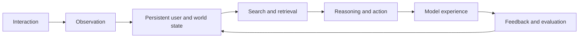

# Learning Notes

Working notes on **personal AGI, search, and model experience**.

This repository is where I connect papers, systems, and experiments into one research thread: how a model can understand a person over time, find the right information or content for the current moment, and improve its behavior through interaction.

## The thread I am following

Personal AGI is not simply a larger model with a longer context window. A useful personal model needs a persistent but revisable understanding of the user, a search process that can recover the right evidence and possibilities, and an interaction loop that learns without confusing observed behavior with true preference.

I currently organize the problem around five connected questions:

1. **Representation** — How should a model represent a person whose goals are multi-intent, contextual, and changing rather than one fixed embedding?
2. **Memory** — What should be remembered, forgotten, compressed, or revised across a long interaction history?
3. **Search** — How should retrieval move beyond nearest-neighbor matching toward evidence gathering, exploration, and decision-making?
4. **Learning from interaction** — How can models learn from sparse, delayed, and policy-biased feedback without optimizing misleading proxies?
5. **Model experience** — How should the complete experience feel: relevant, controllable, diverse, trustworthy, and increasingly useful over time?

Multimodal understanding cuts across all five. Images, video, text, actions, and social context are not extra features; they are different evidence about intent and value.

## Recommended starting points

These are not a complete reading list. They are papers that help define the conceptual map.

| Thread | Paper | Why it matters |
| --- | --- | --- |
| Persistent agents | [Generative Agents](https://arxiv.org/abs/2304.03442) | Connects memory, reflection, and planning in agents that persist over time. |
| Memory systems | [MemGPT](https://arxiv.org/abs/2310.08560) | Treats context management as a systems problem rather than assuming one unlimited prompt. |
| Dense search | [Dense Passage Retrieval](https://arxiv.org/abs/2004.04906) | A clean foundation for learned dual-encoder retrieval. |
| Late interaction | [ColBERT](https://arxiv.org/abs/2004.12832) | Preserves token-level matching signals instead of compressing everything into one vector. |
| Retrieval + generation | [Retrieval-Augmented Generation](https://arxiv.org/abs/2005.11401) | Frames retrieval as external, revisable evidence for generation. |
| Acting with models | [ReAct](https://arxiv.org/abs/2210.03629) | Interleaves reasoning and action so models can gather information while solving a task. |
| Context experience | [Lost in the Middle](https://arxiv.org/abs/2307.03172) | Shows that access to context is not the same as effective use of context. |
| Human feedback | [InstructGPT](https://arxiv.org/abs/2203.02155) | Establishes the SFT–reward modeling–RLHF pipeline and its behavioral tradeoffs. |
| Preference optimization | [Direct Preference Optimization](https://arxiv.org/abs/2305.18290) | Turns preference learning into a direct policy objective without an explicit reward-model training loop. |
| Multimodal representation | [CLIP](https://arxiv.org/abs/2103.00020) | Demonstrates scalable language-supervised visual representation learning. |
| Multimodal interaction | [Flamingo](https://arxiv.org/abs/2204.14198) | Studies few-shot learning over interleaved visual and textual context. |

## Repository map

- [`personal-agi/`](personal-agi/) — persistent user models, memory, adaptation, and agents
- [`search/`](search/) — retrieval, ranking, exploration, and retrieval-augmented reasoning
- [`model-experience/`](model-experience/) — behavioral evaluation, interaction quality, and controllability
- [`post-training/`](post-training/) — SFT, preference learning, RL, objectives, and data quality
- [`multimodal-learning/`](multimodal-learning/) — multimodal representation and content understanding
- [`papers/`](papers/) — paper-by-paper notes
- [`templates/paper-note.md`](templates/paper-note.md) — the note format I use

## How I take notes

I try not to restate a paper section by section. Each note should answer:

- What problem is actually being solved?
- What assumptions make the method work?
- What is the central mechanism or invariant?
- What evidence supports the claim, and what would falsify it?
- Where does the method sit in the larger system?
- What does it change in my current research map?

This is a living notebook. Interpretations will change as I read, reproduce, and build.
