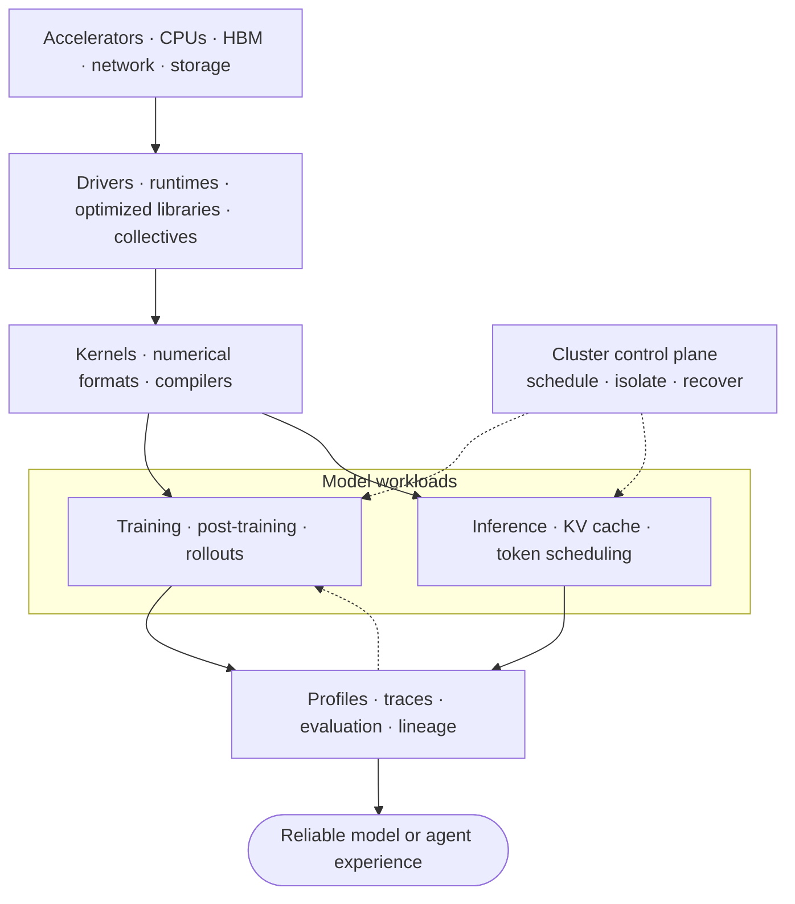

# AI Infrastructure: Category Index

[中文](README.md) · **English**

> Reading time: ~5 minutes · Type: index · Last reviewed: 2026-08

AI infrastructure is the stack that makes modern LLMs trainable, deployable, scalable, observable, and continuously improvable. This section covers knowledge that still directly affects current LLM systems; it is not a historical tour of traditional AI models or an algorithm encyclopedia.

## The stack in one view



Keep asking:

```text
Where does computation time go?
Where do memory and GPU memory go?
What moves between devices?
Did the optimization preserve correctness?
```

## Read this first

[Modern AI Infra Stack: Where Each Layer Fits](notes/ecosystem/01-modern-ai-infra-stack.en.md) maps the ecosystem by responsibility—from hardware, runtimes, kernels, and compilers through training, serving, platforms, and evaluation. Use it to choose a specialty without mistaking a list of tools for a learning plan.

## Start by goal

| Goal | Recommended path |
| --- | --- |
| Read low-level systems code | 00 → 01 → 02 |
| Write CUDA kernels | 01 → 02 → 03 → P01 |
| Build large-model training systems | 03 → 04 → 06 |
| Build LLM serving systems | 02 → 03 → 05 → 06 |
| Build self-evolving LLMs | 05 → 07 → 08 |
| Learn directly through projects | P00 → P01 → P06 |

## Modern focus for this edition

- compiler-aware PyTorch and kernel DSLs rather than framework calls alone;
- BF16 as a baseline, with FP8, MXFP8, and NVFP4 treated as hardware-and-configuration decisions;
- FSDP2/DTensor, multidimensional device meshes, context parallelism, and expert parallelism;
- token-level serving, KV-cache management, chunked prefill, speculative decoding, and disaggregation;
- rollout, tracing, evaluation, canary, and rollback infrastructure for agents and learning loops.

## Foundations

| Note | Central question | Freshness |
| --- | --- | --- |
| [00 · C/C++ foundations](modules/00-c-cpp-foundations.en.md) | How do memory, ownership, and compilation work? | stable foundation |
| [01 · Computer systems](modules/01-computer-systems.en.md) | How do CPUs, caches, and virtual memory execute a program? | stable foundation |
| [02 · GPU programming](modules/02-gpu-programming.en.md) | How do threads, warps, SMs, and HBM determine performance? | stable concepts, evolving hardware |
| [03 · Numerical computing](modules/03-numerical-computing.en.md) | What do BF16, FP8, FP4, and quantization trade? | fast-moving |

## Training systems

| Note | Central question | Freshness |
| --- | --- | --- |
| [04 · Distributed training](modules/04-distributed-training.en.md) | How do DDP, FSDP, TP, PP, CP, and EP compose? | fast-moving |
| [06 · GPU platforms](modules/06-gpu-platforms.en.md) | How are GPU workloads scheduled, isolated, and recovered? | evolving |

## Inference systems

| Note | Central question | Freshness |
| --- | --- | --- |
| [05 · LLM inference](modules/05-llm-inference.en.md) | How do KV cache, batching, prefill, and decode shape serving? | fast-moving |
| [P01 · Attention from scratch](projects/01-attention-from-scratch.en.md) | How does a CPU reference become tiled CUDA attention? | stable principles, evolving implementations |

## Learning loops

| Note | Central question | Freshness |
| --- | --- | --- |
| [07 · Data, evaluation, and continual learning](modules/07-data-eval-learning-loop.en.md) | How do deployed failures safely become training signals? | evolving |
| [08 · Capstone](modules/08-capstone.en.md) | How do serving, tracing, training, canary, and rollback connect? | stable architecture, evolving tools |

## Hands-on projects

The [project ladder](projects/README.en.md) follows one contract: establish correctness, benchmark, and then explain the result with profiling evidence.

| Project | Output |
| --- | --- |
| [P00 · C/C++ Tensor Core](projects/00-c-cpp-tensor-core.en.md) | tensors, views, matmul, softmax, tests, and benchmarks |
| [P01 · Attention from Scratch](projects/01-attention-from-scratch.en.md) | CPU/CUDA attention, online softmax, and KV cache |
| [P06 · Self-Improving Service](modules/08-capstone.en.md) | serving → evaluation → SFT → canary → rollback |

## Editorial and freshness rules

Each note answers one main question and targets a five-minute read. Oversized topics are split into child notes instead of hidden behind a long table of contents.

- Review stable foundations annually.
- Review low precision, distributed APIs, serving engines, and GPU platforms quarterly.
- Re-verify version numbers, defaults, and hardware support at writing time.
- Move obsolete but explanatory material into historical context rather than the main path.
- Do not create standalone surveys of CNNs, RNNs, SVMs, or other traditional models unless they directly explain a current systems decision.

See [Five-Minute Notes and Freshness Policy](EDITORIAL.en.md) for the complete standard.

## Current starting resources

- [CUDA Programming Guide](https://docs.nvidia.com/cuda/cuda-programming-guide/)
- [PyTorch `torch.compile`](https://docs.pytorch.org/docs/stable/generated/torch.compile.html)
- [Triton Tutorials](https://triton-lang.org/main/getting-started/tutorials/)
- [PyTorch FSDP2](https://docs.pytorch.org/docs/main/distributed.fsdp.fully_shard.html)
- [NCCL Documentation](https://docs.nvidia.com/deeplearning/nccl/)
- [Transformer Engine Low Precision](https://docs.nvidia.com/deeplearning/transformer-engine/user-guide/examples/fp8_primer.html)
- [vLLM Serving](https://docs.vllm.ai/en/latest/cli/serve/)
- [TensorRT-LLM Documentation](https://docs.nvidia.com/tensorrt-llm/)
- [Kubernetes GPU Scheduling](https://kubernetes.io/docs/tasks/manage-gpus/scheduling-gpus/)

Related maps: [modern AI systems](../systems/README.en.md) · [post-training](../post-training/README.en.md) · [evaluation](../evaluation/README.en.md)
