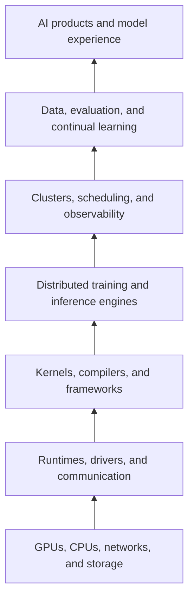
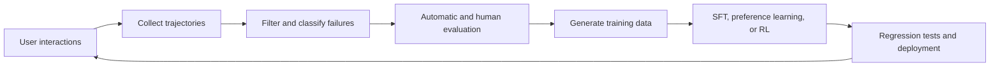

# AI Infrastructure: How Models Actually Run

[中文](README.md) · **English**

## In one sentence

AI infrastructure is the complete technical stack that makes models **trainable, deployable, scalable, observable, and continuously improvable**. It includes not only GPUs, but also kernels, compilers, communication, training frameworks, inference engines, clusters, data systems, and evaluation loops.

## A kitchen analogy

If the model is a chef, AI infrastructure is the kitchen:

- CPUs and GPUs are the stoves and tools;
- HBM, memory, and storage are the preparation areas and pantry;
- CUDA, kernel libraries, and compilers determine how the tools are used;
- distributed training lets many chefs work on the same dish;
- inference systems handle many orders at once;
- scheduling, monitoring, and fault tolerance keep the kitchen running during peak demand;
- data and evaluation systems record what worked and turn failures into material for the next improvement cycle.

Model capability becomes a reliable user experience only through this system.

## The stack from hardware to product



Each layer can be a specialization of its own, but together they answer three recurring questions:

```text
Where does computation time go?
Where do memory and GPU memory go?
What moves between devices, and what does that movement cost?
```

## The major niches

| Area | Central problem | Common technologies | Main metrics |
| --- | --- | --- | --- |
| Hardware and systems | How do we provide and feed compute? | GPUs, HBM, PCIe, NVLink, RDMA | FLOPS, bandwidth, power |
| GPU kernels | How do we make one operator faster? | CUDA, Triton, CUTLASS | latency, throughput, occupancy |
| Compilers and frameworks | How do we organize and fuse computation automatically? | PyTorch, XLA, MLIR, TorchInductor | fusion, compile overhead, coverage |
| Distributed training | How do we train models that do not fit on one GPU? | NCCL, DDP, FSDP, Megatron | MFU, scaling efficiency, resilience |
| LLM inference | How do we generate with low latency and high throughput? | vLLM, SGLang, TensorRT-LLM | TTFT, TPOT, tokens/s |
| GPU platforms | How do we manage scarce shared accelerators? | Kubernetes, Slurm, Ray | utilization, queue time, SLA |
| Data infrastructure | How do we continuously supply reliable training data? | object storage, Parquet, Spark, Ray Data | throughput, quality, lineage |
| Evaluation and learning loops | How do we know the model truly improved? | tracing, benchmarks, A/B tests, HITL | quality, regressions, safety |

## Modular study notes

The notes are ordered by dependency. They can be read sequentially or entered through the module most relevant to a current project.

| Module | Central question | Concrete output |
| --- | --- | --- |
| [01 · Computer systems](modules/01-computer-systems.en.md) | How do CPUs, memory, and operating systems execute a program? | a performance-bottleneck analysis |
| [02 · GPU programming](modules/02-gpu-programming.en.md) | How does a GPU organize threads, memory, and operators? | vector add, reduction, and tiled matmul |
| [03 · Numerical computing](modules/03-numerical-computing.en.md) | What do BF16, FP8, and quantization trade? | a precision, memory, and throughput experiment |
| [04 · Distributed training](modules/04-distributed-training.en.md) | How are models and training state divided across GPUs? | a DDP/FSDP memory and communication analysis |
| [05 · LLM inference](modules/05-llm-inference.en.md) | How can TTFT, TPOT, and throughput be optimized together? | a serving benchmark |
| [06 · GPU platforms](modules/06-gpu-platforms.en.md) | How are GPU clusters scheduled and operated reliably? | a job-lifecycle and observability design |
| [07 · Data, evaluation, and learning loops](modules/07-data-eval-learning-loop.en.md) | How do deployed failures safely become improvements? | a traceable and reversible update loop |
| [08 · Capstone](modules/08-capstone.en.md) | How do all the modules connect into one system? | a self-improving LLM service |

Every module follows the same structure: learning goals, core notes, quantities to calculate, hands-on work, and mastery checks. New papers, experiments, and incidents can therefore be added to the right conceptual home.

## Shared foundation: CPUs, GPUs, and memory

CPUs are optimized for complex control flow and low-latency work. GPUs are optimized for running large numbers of similar operations concurrently and maximizing throughput.

A simplified modern CPU instruction path is:

```text
Fetch → Decode → Rename → Dispatch → Execute → Retire
```

Modern CPUs rely on pipelining, out-of-order execution, branch prediction, SIMD, multiple cores, and caches. GPUs organize threads into grids, blocks, and warps, using massive concurrency to hide memory latency.

Both are constrained by a memory hierarchy:

```text
Registers → L1/shared memory → L2/L3 → HBM/DRAM → SSD
faster and smaller                              slower and larger
```

Many AI performance problems are not caused by slow multiplication. They occur because data does not reach the compute units quickly enough.

## GPU kernels and operator optimization

Much of an LLM eventually reduces to a small set of important operators: matrix multiplication, attention, softmax, normalization, Top-K, quantization, and communication.

This area requires understanding:

- threads, warps, blocks, grids, and Streaming Multiprocessors;
- CUDA Cores and Tensor Cores;
- registers, shared memory, L2, and HBM;
- memory coalescing, tiling, and data reuse;
- warp divergence, occupancy, and synchronization;
- kernel fusion;
- compute-bound versus memory-bound execution and the roofline model.

Common tools include CUDA C++, Triton, CUTLASS, Nsight Systems, Nsight Compute, and PyTorch Profiler.

## Numerical formats and mixed precision

Low precision is not simply about using fewer bits. It trades among precision, numerical range, throughput, memory capacity, and communication volume.

| Format | Intuition | Common use |
| --- | --- | --- |
| FP32 | Relatively high range and precision | sensitive computation, accumulation, references |
| TF32 | FP32-oriented Tensor Core matrix mode | matrix computation on NVIDIA GPUs |
| FP16 | More mantissa precision but a smaller exponent range | mixed-precision training and inference |
| BF16 | FP32-like exponent range with a shorter mantissa | mainstream LLM training |
| FP8 | Higher throughput and lower communication volume | training and inference on newer hardware |
| FP4 / INT4 | Very low storage cost with harder quantization error | quantized inference and low-precision research |

Real systems usually use mixed precision: matrix multiplication may run in BF16, FP16, or FP8, while accumulation and sensitive operations stay at higher precision. Important concepts include overflow, underflow, loss scaling, FP32 accumulation, quantization, and dequantization.

“BF24” is not a common mainstream LLM format. When that name appears, first determine whether it means TF32, FP8, FP4, or a hardware-specific representation.

## Distributed training

When the model or its training state exceeds one GPU's capacity, the system must partition data, parameters, layers, sequences, or experts.

### Common parallelism dimensions

- **Data Parallel / DDP:** every worker holds the full model, processes different data, and synchronizes gradients.
- **FSDP / ZeRO:** parameters, gradients, and optimizer states are sharded and materialized when needed.
- **Tensor Parallel:** a matrix operation is split across GPUs.
- **Pipeline Parallel:** different layers run on different GPUs, with micro-batches forming a pipeline.
- **Sequence / Context Parallel:** long sequences are divided along the sequence dimension.
- **Expert Parallel:** different Mixture-of-Experts experts live on different devices.

Large training runs often combine several dimensions:

```text
DP × FSDP × TP × PP × CP × EP
```

### Communication primitives to understand

- AllReduce
- AllGather
- ReduceScatter
- AllToAll
- Broadcast
- Send / Receive

Choosing a strategy requires accounting for model state, activations, temporary buffers, and communication on every GPU, as well as whether communication can overlap with computation.

## LLM inference infrastructure

An inference system must efficiently place requests with different lengths and arrival times onto a shared GPU fleet.

```text
Request → Tokenization → Queueing and batching → Prefill → Decode → Streaming
```

Core topics include:

- KV cache and paged attention;
- continuous batching;
- prefix caching and chunked prefill;
- speculative decoding;
- request scheduling and admission control;
- tensor and pipeline parallelism;
- quantization and multi-tenant isolation;
- autoscaling and overload protection.

Important metrics include:

- **TTFT:** time to first token;
- **TPOT:** time per output token after the first;
- **Throughput:** tokens or requests processed per second;
- **P50/P95/P99 latency**;
- GPU utilization and cost per million tokens.

Prefill is usually more compute-intensive, while decode is often more constrained by memory bandwidth and KV-cache access. This distinction is a useful starting point for analyzing LLM serving.

## GPU clusters and platform engineering

This layer treats GPUs as expensive, scarce, shared resources. It covers:

- Linux, containers, and images;
- Kubernetes or Slurm scheduling;
- GPU device plugins, topology, and discovery;
- job queues, quotas, preemption, and priorities;
- checkpointing, retries, and failure recovery;
- GPU isolation, sharing, and autoscaling;
- logs, metrics, traces, cost accounting, and capacity planning.

The goal is not merely to make one run succeed. It is to make many users and workloads reproducible despite resource contention, hardware failures, and software-version changes.

## Data, evaluation, and continual learning

Self-evolving or continual-learning systems also need a controlled feedback loop:



This area requires data versioning, deduplication, contamination detection, lineage, experiment tracking, model registries, canary deployment, and regression detection. The goal is not unlimited self-modification. Every update should be evidence-backed, reversible, and checked for silent damage to existing capabilities.

## Knowledge combinations by role

| Direction | Main knowledge combination |
| --- | --- |
| GPU Kernel Engineer | C++ + CUDA + architecture + numerical computing + profiling |
| Distributed Training Engineer | PyTorch + NCCL + networking + parallelism + model architecture |
| LLM Inference Engineer | Transformers + serving + KV cache + scheduling + quantization |
| ML Platform Engineer | Linux + Docker + Kubernetes + APIs + observability |
| AI Infrastructure SRE | Linux + networking + clusters + diagnosis + incident response |
| Continual Learning / Evaluation Engineer | training methods + data engineering + evaluation + feedback loops |

It is unnecessary to specialize in every layer. A practical strategy is to build the shared foundation first and then go deep in one vertical direction.

## A recommended learning path

### Stage 1: Build performance intuition

1. Learn processes, threads, virtual memory, and caches.
2. Understand CPU and GPU execution and memory models.
3. Profile a model with PyTorch Profiler.
4. Estimate parameters, gradients, optimizer state, activations, and KV-cache memory.

### Stage 2: Single-GPU systems

1. Implement vector addition and reduction.
2. Understand tiled matrix multiplication.
3. Implement a fused operator with Triton.
4. Compare FP32, BF16, and quantized inference.

### Stage 3: Multi-GPU systems

1. Run single-node multi-GPU DDP.
2. Compare DDP and FSDP memory and communication.
3. Observe AllReduce, AllGather, and ReduceScatter.
4. Estimate tensor- and pipeline-parallel communication for a Transformer.

### Stage 4: Serving and the learning loop

1. Serve a model with vLLM, SGLang, or TensorRT-LLM.
2. Measure TTFT, TPOT, throughput, and tail latency.
3. Store request traces and classify failure modes.
4. Convert failures into training examples and regression tests.
5. Fine-tune and canary-deploy a new model version.

## One project across the entire stack

```text
Deploy an LLM service
→ collect and inspect interaction traces
→ score and classify failures
→ generate improvement data
→ update with LoRA / SFT
→ run regression evaluations
→ deploy the new version
```

This project connects inference, data, evaluation, continual learning, and deployment. It also exposes the real system trade-offs among quality, latency, throughput, GPU memory, reliability, and cost.

## Starting resources

- [CUDA Programming Guide](https://docs.nvidia.com/cuda/cuda-programming-guide/)
- [PyTorch Distributed Overview](https://docs.pytorch.org/tutorials/beginner/dist_overview.html)
- [PyTorch Automatic Mixed Precision](https://docs.pytorch.org/docs/stable/amp.html)
- [NCCL Documentation](https://docs.nvidia.com/deeplearning/nccl/)
- [TensorRT-LLM Documentation](https://docs.nvidia.com/tensorrt-llm/)
- [Kubernetes GPU Scheduling](https://kubernetes.io/docs/tasks/manage-gpus/scheduling-gpus/)

## Continue reading

- [A systems view of modern AI](../systems/README.en.md)
- [Post-training](../post-training/README.en.md)
- [Data and feedback](../data-and-feedback/README.en.md)
- [Evaluation](../evaluation/README.en.md)
- [Agent observability](../systems/agent-observability.en.md)
