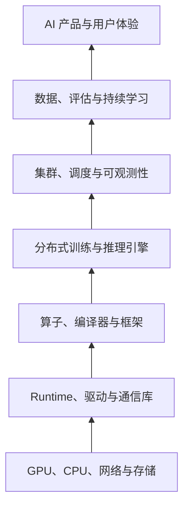
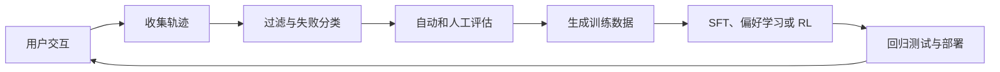

# AI Infra：模型怎样真正跑起来？

**中文** · [English](README.en.md)

## 先用一句话讲清楚

AI Infrastructure 是让模型能够被**训练、部署、扩展、观测和持续改进**的整套技术。它不只是 GPU，也包括算子、编译器、通信、训练框架、推理引擎、集群、数据和评估闭环。

## 用厨房来理解

如果模型是一位厨师，那么 AI Infra 是厨房本身：

- GPU 和 CPU 是灶台与厨具；
- HBM、内存和存储是备菜区与仓库；
- CUDA、算子库和编译器决定怎样使用厨具；
- 分布式训练负责让许多厨师一起做同一道菜；
- 推理系统负责同时接住大量订单；
- 调度、监控和容错保证厨房不会在高峰期停摆；
- 数据与评估系统记录哪些菜真正做好了，并把失败变成下一轮改进材料。

模型能力只有经过这套系统，才能稳定地变成用户体验。

## 从硬件到产品的完整栈



每一层都可以形成一个独立的工程方向，但它们最终共同回答三个问题：

```text
计算时间花在哪里？
显存和内存花在哪里？
设备之间传输了什么，代价是多少？
```

## 主要生态位

| 方向 | 核心问题 | 常见技术 | 主要指标 |
| --- | --- | --- | --- |
| 硬件与系统 | 怎样提供并喂满计算能力？ | GPU、HBM、PCIe、NVLink、RDMA | FLOPS、带宽、功耗 |
| GPU Kernel | 怎样让一个算子更快？ | CUDA、Triton、CUTLASS | 延迟、吞吐、occupancy |
| 编译器与框架 | 怎样自动组织和融合计算？ | PyTorch、XLA、MLIR、TorchInductor | fusion、编译开销、覆盖率 |
| 分布式训练 | 怎样训练单卡放不下的模型？ | NCCL、DDP、FSDP、Megatron | MFU、扩展效率、容错 |
| LLM 推理 | 怎样低延迟、高吞吐地生成？ | vLLM、SGLang、TensorRT-LLM | TTFT、TPOT、tokens/s |
| GPU 平台 | 怎样管理昂贵的共享资源？ | Kubernetes、Slurm、Ray | 利用率、排队时间、SLA |
| 数据 Infra | 怎样持续提供可靠训练数据？ | 对象存储、Parquet、Spark、Ray Data | 吞吐、质量、可追溯性 |
| Eval 与学习闭环 | 怎样知道模型真的变好了？ | tracing、benchmark、A/B、HITL | 质量、回归、安全性 |

## 模块化学习笔记

这些笔记按照依赖关系组织。可以顺序学习，也可以从与当前项目最相关的模块开始。

| 模块 | 核心问题 | 完成后的产出 |
| --- | --- | --- |
| [00 · C/C++ 基础](modules/00-c-cpp-foundations.md) | 内存、指针、对象生命周期和编译怎样工作？ | 一个无第三方数值库的小型 tensor core |
| [01 · 计算机系统](modules/01-computer-systems.md) | CPU、内存和操作系统怎样执行程序？ | 一份性能瓶颈分析 |
| [02 · GPU 编程](modules/02-gpu-programming.md) | GPU 怎样组织线程、内存和算子？ | vector add、reduction 与 tiled matmul |
| [03 · 数值计算](modules/03-numerical-computing.md) | BF16、FP8 和量化在交换什么？ | 精度、显存和吞吐对比实验 |
| [04 · 分布式训练](modules/04-distributed-training.md) | 模型和训练状态怎样拆到多张卡？ | DDP/FSDP 通信与显存分析 |
| [05 · LLM 推理](modules/05-llm-inference.md) | 怎样同时优化 TTFT、TPOT 和吞吐？ | 一份 serving benchmark |
| [06 · GPU 平台](modules/06-gpu-platforms.md) | 怎样可靠地调度和运营 GPU 集群？ | job lifecycle 与 observability 设计 |
| [07 · 数据、Eval 与学习闭环](modules/07-data-eval-learning-loop.md) | 部署后的失败怎样安全地变成改进？ | 可追溯、可回滚的更新闭环 |
| [08 · 综合项目](modules/08-capstone.md) | 怎样把所有模块连接成一个系统？ | self-improving LLM service |

每个模块都使用同一套结构：学习目标、核心笔记、需要会算的量、动手练习和掌握检查。这样新的论文、实验和故障案例可以继续追加到正确位置。

## 实战项目

模块回答“需要理解什么”，项目回答“能不能把它做出来并证明它正确”。[实战项目路线](projects/README.md) 从 C/C++ tensor primitives 开始，逐步进入 [手搓 Attention](projects/01-attention-from-scratch.md)、CUDA kernel、混合精度、分布式训练和完整的 self-improving service。

## 共同基础：CPU、GPU 与内存

CPU 擅长复杂控制、分支和低延迟任务；GPU 擅长让大量线程同时执行相似计算，追求总体吞吐。

CPU 的典型指令链路可以简化为：

```text
Fetch → Decode → Rename → Dispatch → Execute → Retire
取指      解码      重命名      调度       执行       提交
```

现代 CPU 依靠流水线、乱序执行、分支预测、SIMD、多核和缓存提高性能。GPU 则把线程组织成 grid、block 和 warp，通过大量并发隐藏访存延迟。

两者都受内存层级约束：

```text
寄存器 → L1/Shared Memory → L2/L3 → HBM/DRAM → SSD
更快、更小                                      更慢、更大
```

因此，很多 AI 性能问题不是“乘法不够快”，而是数据没有及时到达计算单元。

## GPU Kernel 与算子优化

LLM 的大量计算最终落在少数核心算子上：矩阵乘法、Attention、Softmax、Normalization、Top-K、量化和通信。

这一方向需要理解：

- thread、warp、block、grid 与 SM；
- CUDA Core 与 Tensor Core；
- register、shared memory、L2 与 HBM；
- memory coalescing、tiling 与数据复用；
- warp divergence、occupancy 与同步；
- kernel fusion；
- compute-bound、memory-bound 与 roofline model。

常用工具包括 CUDA C++、Triton、CUTLASS、Nsight Systems、Nsight Compute 和 PyTorch Profiler。

## 数值格式与混合精度

低精度的目标不是单纯“少用几个 bit”，而是在精度、数值范围、吞吐、显存和通信之间做权衡。

| 格式 | 直觉 | 常见用途 |
| --- | --- | --- |
| FP32 | 范围和精度都较高 | 敏感计算、累加、参考结果 |
| TF32 | 面向 Tensor Core 的 FP32 矩阵计算模式 | NVIDIA GPU 上的矩阵计算 |
| FP16 | 尾数更多，但指数范围较小 | 混合精度训练与推理 |
| BF16 | 指数范围接近 FP32，尾数更短 | 主流 LLM 训练 |
| FP8 | 更高吞吐和更低通信量 | 新硬件上的训练与推理 |
| FP4 / INT4 | 极低存储成本，量化误差更难控制 | 量化推理及低精度研究 |

实际系统通常采用 mixed precision：矩阵乘法使用 BF16、FP16 或 FP8，累加和敏感操作保留更高精度。这里需要掌握 overflow、underflow、loss scaling、FP32 accumulation，以及量化和反量化。

“BF24”不是目前主流 LLM 系统中的常用格式；看到类似名称时，应先确认它指的是 TF32、FP8、FP4，还是某个硬件的专用格式。

## 分布式训练

当模型或训练状态超出单卡容量时，需要拆分数据、参数、层、序列或专家。

### 常见并行方式

- **Data Parallel / DDP**：每张卡保存完整模型，处理不同数据，然后同步梯度。
- **FSDP / ZeRO**：切分参数、梯度和优化器状态，需要时再聚合。
- **Tensor Parallel**：把一次矩阵计算拆到多张 GPU。
- **Pipeline Parallel**：把不同层放在不同 GPU，并用 micro-batch 形成流水线。
- **Sequence / Context Parallel**：沿序列维度切分长上下文。
- **Expert Parallel**：把 MoE 的不同 expert 放到不同设备。

大型训练通常组合为多维并行：

```text
DP × FSDP × TP × PP × CP × EP
```

### 必须理解的通信操作

- AllReduce
- AllGather
- ReduceScatter
- AllToAll
- Broadcast
- Send / Receive

选择并行策略时，需要同时计算每张卡的模型状态、activation、临时 buffer 和通信量，并考虑计算与通信能否重叠。

## LLM 推理 Infra

推理系统需要把许多长度不同、到达时间不同的请求高效地放到同一组 GPU 上。

```text
请求 → Tokenization → 排队与 batching → Prefill → Decode → Streaming
```

核心知识包括：

- KV cache 与 paged attention；
- continuous batching；
- prefix caching 与 chunked prefill；
- speculative decoding；
- request scheduling 与 admission control；
- tensor/pipeline parallelism；
- quantization 与多租户隔离；
- autoscaling 与过载保护。

常用指标：

- **TTFT**：第一个 token 的等待时间；
- **TPOT**：后续每个 token 的生成时间；
- **Throughput**：每秒处理的 token 或请求；
- **P50/P95/P99 latency**；
- GPU 利用率与每百万 token 成本。

Prefill 通常更偏计算密集，decode 通常更受显存带宽和 KV cache 影响。理解两者差异，是分析 LLM serving 的起点。

## GPU 集群与平台工程

这一层把 GPU 当成昂贵且稀缺的共享资源，负责：

- Linux、容器与镜像；
- Kubernetes 或 Slurm 调度；
- GPU device plugin、拓扑和资源发现；
- job queue、配额、抢占和优先级；
- checkpoint、重试和故障恢复；
- GPU 隔离、共享和 autoscaling；
- 日志、指标、trace、成本与容量规划。

平台工程最重要的不是让某一次运行成功，而是让大量用户和任务在资源竞争、硬件故障和软件版本变化下仍然可重复运行。

## 数据、Eval 与持续学习

对于 self-evolving 或 continual-learning 系统，基础设施还需要形成反馈闭环：



这一方向需要数据版本、去重、污染检测、lineage、实验追踪、模型注册、canary deployment 和回归检测。关键不是让模型无限更新，而是让每次更新都有证据、可回滚，并且不会静默破坏旧能力。

## 不同方向需要什么知识

| 方向 | 主要知识组合 |
| --- | --- |
| GPU Kernel Engineer | C++ + CUDA + 体系结构 + 数值计算 + profiling |
| Distributed Training Engineer | PyTorch + NCCL + 网络 + 并行策略 + 模型结构 |
| LLM Inference Engineer | Transformer + serving + KV cache + 调度 + 量化 |
| ML Platform Engineer | Linux + Docker + Kubernetes + API + 可观测性 |
| AI Infra SRE | Linux + 网络 + 集群 + 故障诊断 + incident response |
| Continual Learning / Eval Engineer | 训练方法 + 数据工程 + evaluation + 反馈闭环 |

不需要同时成为所有方向的专家。更实际的方法是先建立共同基础，再选一个纵向方向深入。

## 推荐学习路线

### 第一阶段：建立性能直觉

1. 学习进程、线程、虚拟内存和缓存。
2. 理解 CPU 与 GPU 的执行和内存模型。
3. 使用 PyTorch Profiler 分析一个模型。
4. 学会估算参数、梯度、优化器状态、activation 和 KV cache 显存。

### 第二阶段：单卡 GPU

1. 写 vector addition 和 reduction。
2. 理解 tiled matrix multiplication。
3. 用 Triton 实现一个 fused operator。
4. 比较 FP32、BF16 和量化推理。

### 第三阶段：多 GPU

1. 跑通单机多卡 DDP。
2. 比较 DDP 与 FSDP 的显存和通信。
3. 观察 AllReduce、AllGather 和 ReduceScatter。
4. 为一个 Transformer 估算 TP 和 PP 的通信成本。

### 第四阶段：Serving 与学习闭环

1. 用 vLLM、SGLang 或 TensorRT-LLM 部署模型。
2. 测量 TTFT、TPOT、吞吐和尾延迟。
3. 保存请求轨迹并分类失败模式。
4. 把失败转成训练样本与回归测试。
5. 微调并以 canary 方式部署新版本。

## 一个贯穿全栈的项目

```text
部署一个 LLM 服务
→ 收集并观测交互轨迹
→ 自动评分与失败分类
→ 生成改进数据
→ LoRA / SFT 更新
→ 回归评估
→ 部署新版本
```

这个项目把推理、数据、评估、持续学习和部署连在一起，也能暴露最真实的系统权衡：质量、延迟、吞吐、显存、稳定性和成本。

## 起始资料

- [CUDA Programming Guide](https://docs.nvidia.com/cuda/cuda-programming-guide/)
- [PyTorch Distributed Overview](https://docs.pytorch.org/tutorials/beginner/dist_overview.html)
- [PyTorch Automatic Mixed Precision](https://docs.pytorch.org/docs/stable/amp.html)
- [NCCL Documentation](https://docs.nvidia.com/deeplearning/nccl/)
- [TensorRT-LLM Documentation](https://docs.nvidia.com/tensorrt-llm/)
- [Kubernetes GPU Scheduling](https://kubernetes.io/docs/tasks/manage-gpus/scheduling-gpus/)

## 从哪里继续读

- [现代 AI 系统总览](../systems/)
- [Post-Training](../post-training/)
- [数据与反馈](../data-and-feedback/)
- [Evaluation](../evaluation/)
- [Agent Observability](../systems/agent-observability.md)
