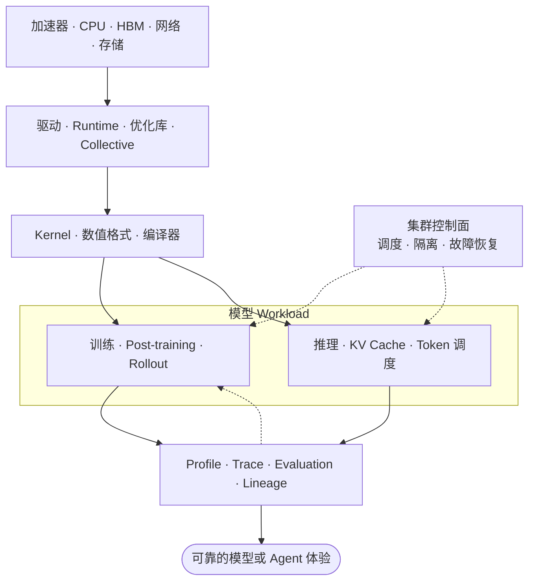

# AI Infra：分类索引

**中文** · [English](README.en.md)

> 阅读时间：约 5 分钟 · 类型：索引 · 最近审阅：2026-08

AI Infra 是让现代 LLM 能够被训练、部署、扩展、观测和持续改进的技术栈。这里关注当前仍直接影响 LLM 系统设计的知识，不做传统 AI model 的历史巡礼或算法百科。

## 一张图看完整栈



阅读时始终问：

```text
计算时间花在哪里？
显存和内存花在哪里？
设备之间移动了什么？
优化是否保持了正确性？
```

## 先读这一篇

[现代 AI Infra 全栈：每一层负责什么](notes/ecosystem/01-modern-ai-infra-stack.md)按职责梳理从硬件、运行时、kernel、编译器到训练、serving、平台和评测的生态位。先用它选择方向，避免把工具名单误当成学习路线。

## 按目标开始

| 我想做什么 | 推荐路线 |
| --- | --- |
| 学会读底层代码 | 00 → 01 → 02 |
| 写 CUDA kernel | 01 → 02 → 03 → P01 |
| 做大模型训练系统 | 03 → 04 → 06 |
| 做 LLM serving | 02 → 03 → 05 → 06 |
| 做 self-evolving LLM | 05 → 07 → 08 |
| 直接通过项目学习 | P00 → P01 → P06 |

## 本版的现代重点

- 不只会调用框架，还要理解 compiler-aware PyTorch 与 kernel DSL；
- 以 BF16 为基线，把 FP8、MXFP8、NVFP4 当成硬件与 recipe 的联合决策；
- FSDP2/DTensor、多维 device mesh、context parallel 与 expert parallel；
- token 级 serving、KV-cache 管理、chunked prefill、speculative decoding 与 disaggregation；
- 面向 Agent 和学习循环的 rollout、tracing、evaluation、canary 与 rollback 基础设施。

## Foundations

| 笔记 | 核心问题 | 时效性 |
| --- | --- | --- |
| [00 · C/C++ 基础](modules/00-c-cpp-foundations.md) | 内存、ownership 和编译怎样工作？ | 稳定基础 |
| [01 · 计算机系统](modules/01-computer-systems.md) | CPU、cache 和虚拟内存怎样执行程序？ | 稳定基础 |
| [02 · GPU 编程](modules/02-gpu-programming.md) | thread、warp、SM 和 HBM 怎样决定性能？ | 基础稳定，硬件细节持续更新 |
| [03 · 数值计算](modules/03-numerical-computing.md) | BF16、FP8、FP4 和量化交换了什么？ | 快速变化 |

## Training Systems

| 笔记 | 核心问题 | 时效性 |
| --- | --- | --- |
| [04 · 分布式训练](modules/04-distributed-training.md) | DDP、FSDP、TP、PP、CP、EP 怎样组合？ | 快速变化 |
| [06 · GPU 平台](modules/06-gpu-platforms.md) | 怎样调度、隔离和恢复 GPU workload？ | 持续变化 |

## Inference Systems

| 笔记 | 核心问题 | 时效性 |
| --- | --- | --- |
| [05 · LLM 推理](modules/05-llm-inference.md) | KV cache、batching、prefill 和 decode 怎样影响 serving？ | 快速变化 |
| [P01 · 手搓 Attention](projects/01-attention-from-scratch.md) | 怎样从 CPU reference 走到 tiled CUDA attention？ | 原理稳定，实现快速变化 |

## Learning Loops

| 笔记 | 核心问题 | 时效性 |
| --- | --- | --- |
| [07 · 数据、Eval 与持续学习](modules/07-data-eval-learning-loop.md) | 部署后的失败怎样安全地变成训练信号？ | 持续变化 |
| [08 · 综合项目](modules/08-capstone.md) | 怎样连接 serving、trace、训练、canary 和 rollback？ | 架构稳定，工具持续变化 |

## 实战项目

[项目路线](projects/README.md) 使用统一标准：先验证 correctness，再 benchmark，再用 profiler 解释结果。

| 项目 | 产出 |
| --- | --- |
| [P00 · C/C++ Tensor Core](projects/00-c-cpp-tensor-core.md) | tensor、view、matmul、softmax、tests、benchmark |
| [P01 · 手搓 Attention](projects/01-attention-from-scratch.md) | CPU/CUDA attention、online softmax、KV cache |
| [P06 · Self-Improving Service](modules/08-capstone.md) | serving → eval → SFT → canary → rollback |

## 内容规则与时效性

每篇只回答一个主要问题，目标阅读时间约五分钟。篇幅过长时拆成子笔记，不靠长目录掩盖内容过载。

- 稳定基础每年复核；
- 低精度、distributed API、serving engine 和 GPU platform 每季度复核；
- 版本号、默认配置和硬件支持在写作时重新验证；
- 已过时但仍有解释价值的内容移入历史背景，不占主学习路线；
- 传统 CNN、RNN、SVM 等模型不单独展开，除非它们直接解释当前系统设计。

完整规范见 [五分钟笔记与时效性规则](EDITORIAL.md)。

## 当前起始资料

- [CUDA Programming Guide](https://docs.nvidia.com/cuda/cuda-programming-guide/)
- [PyTorch `torch.compile`](https://docs.pytorch.org/docs/stable/generated/torch.compile.html)
- [Triton Tutorials](https://triton-lang.org/main/getting-started/tutorials/)
- [PyTorch FSDP2](https://docs.pytorch.org/docs/main/distributed.fsdp.fully_shard.html)
- [NCCL Documentation](https://docs.nvidia.com/deeplearning/nccl/)
- [Transformer Engine Low Precision](https://docs.nvidia.com/deeplearning/transformer-engine/user-guide/examples/fp8_primer.html)
- [vLLM Serving](https://docs.vllm.ai/en/latest/cli/serve/)
- [TensorRT-LLM Documentation](https://docs.nvidia.com/tensorrt-llm/)
- [Kubernetes GPU Scheduling](https://kubernetes.io/docs/tasks/manage-gpus/scheduling-gpus/)

相关总览：[现代 AI 系统](../systems/) · [Post-Training](../post-training/) · [Evaluation](../evaluation/)
