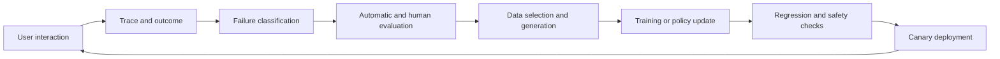

# Module 07 · Data, Evaluation, and Continual-Learning Loops

[中文](07-data-eval-learning-loop.md) · **English** · [Back to AI Infra](../README.en.md)

> Reading time: ~5 minutes · Level: Intermediate · Freshness: Evolving · Last reviewed: 2026-08

## What this module solves

The defining property of a self-evolving system is not that its model can be updated. It is that every update has credible evidence, known provenance, regression protection, and a rollback path. This module turns interactions into a controlled learning loop.

## Learning goals

- Define an end-to-end interaction trace.
- Understand dataset versioning, lineage, deduplication, and contamination.
- Build a failure taxonomy and layered evaluation system.
- Distinguish offline metrics, online experiments, and longitudinal outcomes.
- Design an auditable and reversible model-update workflow.

## Core notes

### The loop



Every arrow needs version and causal context. Saving only prompts and responses cannot reveal which model, retrieved evidence, tool state, configuration, and experiment policy produced an interaction.

### Interaction traces

A debuggable trace should include:

- the request, user goal, and applicable privacy boundary;
- model, prompt, tool, retriever, and index versions;
- intermediate actions, observations, state transitions, and errors;
- token, latency, cost, and resource information;
- task outcome, automatic evaluation, human correction, and user feedback.

A trace is an event record, not automatically a training example. Consent, filtering, de-identification, quality checks, and a sampling policy are still required.

### Data lineage and contamination

Every dataset version should answer where samples came from, which filters changed them, which prior policy generated them, why they were selected, and which models consumed them.

Deduplication prevents wasted computation and accidental overweighting. Evaluation contamination can create false gains when models memorize test content rather than acquiring transferable capability.

### Failure taxonomy

“Bad answer” is too broad to guide repair. Failures can be divided into:

- input-understanding and goal errors;
- memory or user-state errors;
- retrieval recall, ranking, or freshness errors;
- reasoning, planning, or tool-selection errors;
- tool-execution and state-mutation errors;
- policy, safety, expression, or calibration errors;
- runtime, timeout, capacity, and concurrency errors.

Categories should point toward actionable fixes rather than describe superficial style.

### Layered evaluation

1. deterministic checks for schemas, permissions, tool calls, and state invariants;
2. executable or reference checks for code, math, evidence, and task completion;
3. model-based judges for open-ended quality and preferences;
4. human audit to calibrate rubrics, edge cases, and judge bias;
5. online and longitudinal outcomes for real tasks and sustained experience.

No one layer is ground truth. The system combines evidence and preserves disagreements.

### Safe updates

A candidate model reaches canary only after passing fixed regression sets, recent failure slices, safety checks, and resource benchmarks. Canary deployment limits traffic, continuously compares against the previous model, and defines explicit rollback triggers.

Continual learning must also test catastrophic forgetting. Improving a new slice can degrade prior capability, calibration, diversity, or safety.

## Quantities to calculate

Track at least:

```text
slice pass rate
regression rate
judge-human agreement
failure recurrence rate
cost per successful task
rollback frequency
```

Online metrics must preserve the exposure policy. Clicks, dwell time, and continued conversation are shaped by what the previous system displayed and are not natural, independent preference labels.

## Hands-on work

1. Define a trace schema for a tool-using agent.
2. Build a taxonomy from 50 failures and measure labeling consistency.
3. Write deterministic, judge, and human evaluation layers for one task.
4. Design a dataset manifest containing source, version, filtering, and usage lineage.
5. Draw the candidate-model state machine from offline evaluation to canary, promotion, or rollback.

## Common misconceptions

- Collected data is not automatically authorized training data.
- High agreement among LLM judges does not eliminate shared bias.
- A higher aggregate score can hide regression on a critical slice.
- User clicks are affected by the old policy and are not IID preference labels.
- More frequent updates do not guarantee faster system improvement.

## Mastery check

- Why can a trace not be used directly as training data?
- How does data lineage help explain behavior changes?
- How does a failure taxonomy connect to concrete repairs?
- Why can an offline improvement fail online?
- What evidence is sufficient to promote a canary to the default model?

Next: [Module 08 · Capstone](08-capstone.en.md)
