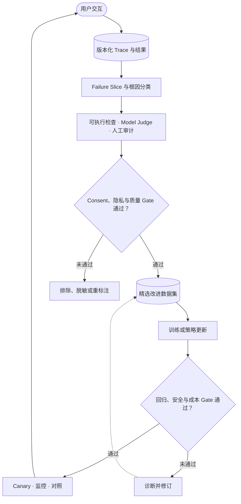

# Module 07 · 数据、Evaluation 与持续学习闭环

**中文** · [English](07-data-eval-learning-loop.en.md) · [返回 AI Infra](../README.md)

> 阅读时间：约 5 分钟 · 难度：Intermediate · 时效性：Evolving · 最近审阅：2026-08

## 这一模块解决什么

Self-evolving 系统的关键不是模型能够更新，而是更新过程有可靠证据、清晰来源、回归保护和回滚能力。本模块把用户交互转成受控的学习闭环。

## 学习目标

- 能定义一条端到端 interaction trace；
- 理解数据版本、lineage、去重和 contamination；
- 能建立 failure taxonomy 和分层 evaluation；
- 区分离线指标、在线实验与长期结果；
- 能设计可审计、可回滚的模型更新流程。

## 核心笔记

### 闭环结构



每个箭头都必须携带版本和因果上下文。只保存 prompt 与 response，无法说明当时用了哪个模型、检索结果、工具状态、配置和实验策略。

### Interaction trace

一条可调试轨迹至少包括：

- request、用户目标和适用的隐私边界；
- model、prompt、tool、retriever 和 index 版本；
- 中间 action、observation、state transition 与错误；
- token、latency、cost 和资源信息；
- 最终任务结果、自动评估、人工修正和用户反馈。

Trace 是事实记录，不等于训练样本。进入训练前还需要 consent、过滤、去标识、质量判断和 sampling policy。

### 数据 lineage 与污染

每个 dataset version 应能回答：样本来自哪里、经过什么过滤、由什么旧策略产生、为什么被选择、在哪些模型中使用。

去重不仅防止浪费，也防止重复样本获得过高权重。Evaluation contamination 则会让系统通过记忆测试内容获得虚假的能力提升。

### Failure taxonomy

“答案不好”太宽，无法指导修复。可以把失败拆成：

- 输入理解与目标错误；
- memory 或用户状态错误；
- retrieval recall、ranking 或 freshness 错误；
- reasoning、planning 或 tool-selection 错误；
- tool execution 与状态写入错误；
- policy、安全、表达或 calibration 错误；
- runtime、timeout、capacity 与并发错误。

分类应指向可采取的修复，而不是只描述表面风格。

### 分层 Evaluation

1. deterministic checks：schema、权限、tool call、状态不变量；
2. executable/reference checks：代码、数学、检索证据、任务完成；
3. model-based judges：开放式质量与偏好；
4. human audit：校准 rubric、边界案例和 judge bias；
5. online/longitudinal outcomes：真实任务与长期体验。

没有一层能够独立代表 ground truth。系统需要把不同证据组合起来，并保存 disagreement。

### 安全更新

候选模型只有通过固定回归集、最新失败 slice、安全检查和资源基准，才进入 canary。Canary 需要限制流量、持续比较旧版本，并具备明确 rollback trigger。

持续学习还要防止 catastrophic forgetting：新 slice 改善时，旧能力、校准、多样性和安全性可能下降。

## 需要会算

至少跟踪：

```text
slice pass rate
regression rate
judge-human agreement
failure recurrence rate
cost per successful task
rollback frequency
```

线上指标必须记录 exposure policy。点击、停留和继续对话都受到旧系统展示内容的影响，不能直接当作天然偏好。

## 动手练习

1. 为一个 tool-using agent 定义 trace schema。
2. 从 50 个失败样本建立 taxonomy，并检查分类一致性。
3. 为同一任务写 deterministic、judge 和 human 三层 rubric。
4. 设计 dataset manifest，包含 source、version、filter 和 usage lineage。
5. 写出候选模型从离线评估到 canary、promotion 或 rollback 的状态机。

## 常见误区

- 收集到的数据不自动等于有权训练的数据；
- LLM judge 的高一致性不等于它没有共同偏差；
- 总分提高可能掩盖关键 slice 回归；
- 用户点击由旧 policy 影响，不是独立同分布偏好标签；
- 更频繁更新不等于系统更快进步。

## 掌握检查

- 为什么 trace 不能直接当训练数据？
- 数据 lineage 如何帮助解释模型行为变化？
- failure taxonomy 怎样连接具体修复？
- 离线提升为什么可能在线失败？
- 什么证据足以让新模型从 canary 升级为默认版本？

下一步：[Module 08 · 综合项目](08-capstone.md)
