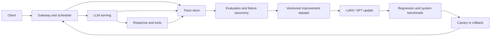

# Module 08 · Capstone: A Self-Improving LLM Service

[中文](08-capstone.md) · **English** · [Back to AI Infra](../README.en.md)

> Reading time: ~5 minutes · Level: Advanced · Freshness: Evolving · Last reviewed: 2026-08

## Project goal

Build a small but complete system connecting model serving, performance measurement, interaction traces, failure analysis, data generation, fine-tuning, regression testing, and safe deployment.

The goal is not to train the largest model. It is to prove that the entire loop can be explained, measured, reproduced, and rolled back.

## System architecture

## Project boundaries

Deliberately limit the first version:

- Choose a small model that fits available hardware.
- Choose one task with a verifiable success condition.
- Start with single-node serving.
- Start with LoRA/SFT before adding complicated RL.
- Preserve a fixed baseline.
- Run every update through the same quality and system benchmark.

A small scope makes it possible to separate model problems from system problems.

## Milestone 0 · Define the task and invariants

Write down:

- the task the user wants to complete;
- what counts as success, failure, and unacceptable behavior;
- which tools and data are accessible;
- latency, cost, and privacy constraints;
- capabilities that must not regress during an update.

Output: a one-page task contract and the first evaluation set.

## Milestone 1 · Baseline serving

Deploy the model behind a streaming API. Record:

- model, tokenizer, and serving configuration;
- request, prompt-token, and output-token counts;
- queue time, TTFT, TPOT, and end-to-end latency;
- GPU memory, utilization, and failure reason.

Output: a reproducible serving configuration and baseline dashboard.

## Milestone 2 · Tracing and observability

Generate one trace ID per request and connect gateway, model, retrieval, tool, and final-outcome events. Define explicit handling for sensitive information.

Output: a trace schema, example traces, and one incident analysis.

## Milestone 3 · Evaluation and failure classification

Combine deterministic checks, executable verification, LLM judges, and human audit. Assign failures to actionable categories and preserve evaluator versions and disagreements.

Output: a failure taxonomy, rubrics, slice dashboard, and baseline error analysis.

## Milestone 4 · Data and model update

Build a versioned dataset from high-value failures. Record source, selection, filtering, deduplication, consent, splits, and lineage. Run one small LoRA/SFT update.

Output: a dataset manifest, training configuration, checkpoint, and experiment record.

## Milestone 5 · Dual regression testing

A candidate must pass both:

### Model regression

- the baseline task set;
- recent failure slices;
- safety and invariant checks;
- a holdout not used for training.

### System regression

- TTFT, TPOT, and throughput;
- P95/P99 latency;
- peak memory and OOM behavior;
- cost per successful task;
- cancellation, timeout, and overload behavior.

Output: a baseline/candidate comparison and promotion decision.

## Milestone 6 · Canary and rollback

Route limited traffic to the candidate and continuously compare quality, failure rate, resource use, and tail latency. Define promotion and rollback thresholds before observing the results.

Output: a deployment state machine, rollback playbook, and final retrospective.

## Suggested experiment matrix

| Dimension | Example values |
| --- | --- |
| Precision | BF16, INT8, INT4 |
| Prompt length | short, medium, long |
| Concurrency | 1, 4, 16, overload |
| Model version | baseline, candidate |
| Request slice | common, long-tail, safety-critical |
| Cache | prefix cache off/on |

Change only a small number of variables at once and preserve the complete configuration; otherwise the result cannot be explained.

## Definition of done

At completion, the project should answer:

- Which components and versions handled one request?
- What are the dominant latency and memory bottlenecks?
- Where did the new training data come from, and why is it trustworthy?
- Which slices improved, and what did the candidate harm?
- How is an online anomaly detected, stopped, and rolled back?
- Can another person reproduce the same experiment?

If every answer is supported by evidence, the project covers the most important habits of AI infrastructure work.

Back to the [AI Infrastructure overview](../README.en.md).
