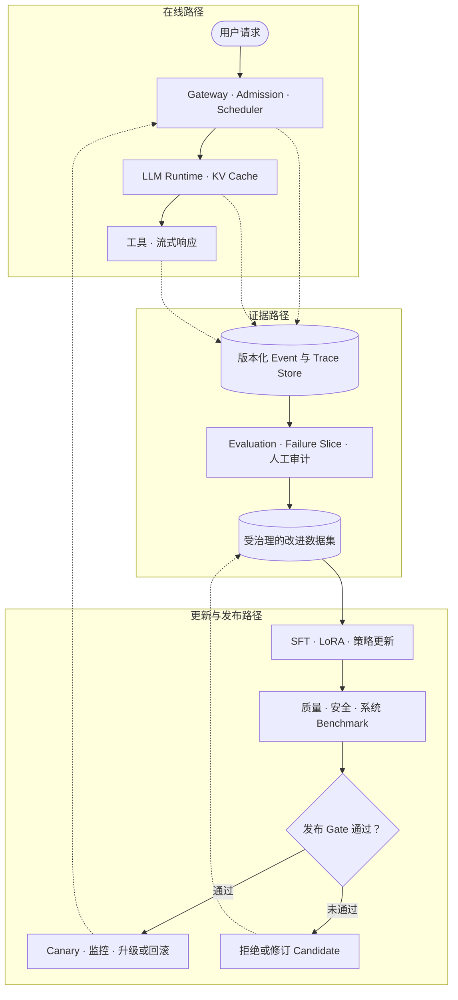

# Module 08 · 综合项目：Self-Improving LLM Service

**中文** · [English](08-capstone.en.md) · [返回 AI Infra](../README.md)

> 阅读时间：约 5 分钟 · 难度：Advanced · 时效性：Evolving · 最近审阅：2026-08

## 项目目标

构建一个小而完整的系统，把模型服务、性能测量、交互轨迹、失败分析、数据生成、微调、回归测试和安全部署连接起来。

目标不是训练最大的模型，而是证明整条链路可以被解释、测量、复现和回滚。

## 系统结构

## 项目边界

第一版主动限制范围：

- 选择一个能够在现有硬件运行的小模型；
- 选择一个有明确成功条件的任务；
- 先使用单节点 serving；
- 先做 LoRA/SFT，不急着加入复杂 RL；
- 保留一个固定 baseline；
- 所有更新都通过同一套质量和系统 benchmark。

范围小，才能把系统问题和模型问题分开。

## Milestone 0 · 定义任务和不变量

先写清楚：

- 用户要完成什么任务；
- 什么算成功、失败和不可接受；
- 哪些工具和数据可以访问；
- latency、cost 和 privacy 限制；
- 哪些能力绝不能因更新退化。

产出：一页 task contract 和第一版 evaluation set。

## Milestone 1 · Baseline serving

部署模型并实现 streaming API。记录：

- model、tokenizer 和 serving 配置；
- request、prompt tokens 和 output tokens；
- queue、TTFT、TPOT、end-to-end latency；
- GPU memory、utilization 和失败原因。

产出：可复现的服务配置和 baseline dashboard。

## Milestone 2 · Trace 与 observability

为每次请求生成统一 trace ID，把 gateway、model、retrieval、tool 和最终结果串起来。保证敏感信息有明确处理策略。

产出：trace schema、样例 trace 和一次故障复盘。

## Milestone 3 · Evaluation 与失败分类

组合 deterministic checks、可执行验证、LLM judge 和人工抽查。把失败分到可采取行动的类别，并保存 evaluator 版本和 disagreement。

产出：failure taxonomy、rubric、slice dashboard 和 baseline error analysis。

## Milestone 4 · 数据和模型更新

从高价值失败中构建版本化 dataset。记录 source、selection、filter、dedup、consent、split 和 lineage。先做一次小规模 LoRA/SFT 更新。

产出：dataset manifest、训练配置、checkpoint 和实验记录。

## Milestone 5 · 双重回归

候选版本必须同时通过：

### 模型回归

- baseline task set；
- 新失败 slice；
- safety 与 invariant checks；
- 未参与训练的 holdout。

### 系统回归

- TTFT、TPOT 与 throughput；
- P95/P99 latency；
- peak memory 与 OOM；
- cost per successful task；
- cancellation、timeout 和 overload 行为。

产出：baseline/candidate 对比报告和 promotion decision。

## Milestone 6 · Canary 与回滚

把少量流量发送给候选版本，实时比较质量、失败率、资源和长尾延迟。提前定义 promotion 与 rollback threshold，而不是看到结果后临时解释。

产出：deployment state machine、rollback playbook 和最终复盘。

## 建议的实验矩阵

| 维度 | 取值示例 |
| --- | --- |
| Precision | BF16、INT8、INT4 |
| Prompt length | 短、中、长 |
| Concurrency | 1、4、16、过载 |
| Model version | baseline、candidate |
| Request slice | 常见、长尾、安全关键 |
| Cache | prefix cache off/on |

一次只改变少量变量，并保存完整配置，否则无法解释结果。

## Definition of done

项目完成时，应该能够回答：

- 一个请求经过了哪些组件和版本？
- 最主要的延迟和显存瓶颈是什么？
- 新训练数据从哪里来，为什么可信？
- 候选模型改善了哪些 slice，又伤害了什么？
- 线上异常发生时，怎样检测、停止和回滚？
- 同一个实验能否由另一个人复现？

如果这些问题都能用证据回答，这个项目就已经覆盖了 AI Infra 最重要的思维方式。

返回：[AI Infra 总览](../README.md)
