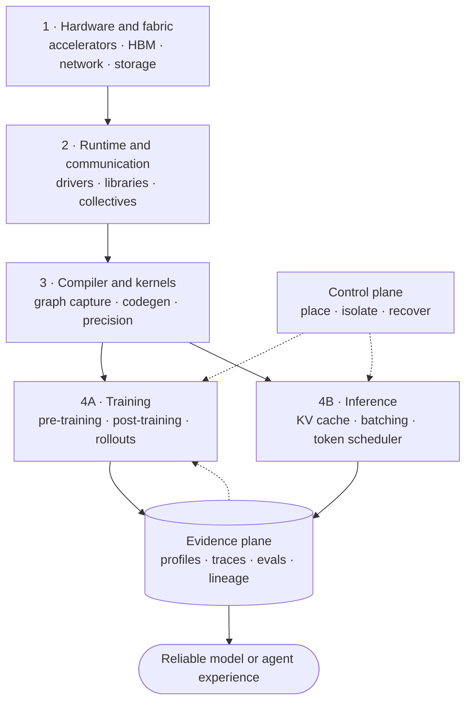

# Modern AI Infra Stack: Where Each Layer Fits

[中文](01-modern-ai-infra-stack.md) · **English** · [Back to AI Infra](../../README.en.md)

> Reading time: ~5 minutes · Type: map · Freshness: Fast-moving · Last reviewed: 2026-08

## The central question

AI infra is not one job or one toolchain. It is the path from silicon to a reliable model experience. The modern way to learn it is to identify **which constraint each layer owns**, then follow one request or training step through the whole stack.

## The ecosystem by responsibility

| Layer | Owns | Representative tools to recognize | Question to answer |
| --- | --- | --- | --- |
| Hardware and fabric | compute, HBM, topology, links | GPU/accelerator architecture, NVLink, InfiniBand/RoCE | Is the limit compute, memory, communication, or I/O? |
| Runtime and libraries | device execution and communication | CUDA/ROCm, cuBLAS, cuDNN, NCCL | Which optimized primitive actually runs? |
| Kernels and compilers | fusion, layout, code generation | Triton, CUTLASS, `torch.compile`/Inductor, XLA | Is framework intent becoming an efficient kernel graph? |
| Training systems | model-state placement and updates | DDP, FSDP2/DTensor, Megatron-style parallelism, DeepSpeed | What is sharded, replicated, communicated, and checkpointed? |
| Post-training and rollout | sample generation and policy updates | SFT, preference optimization, RL/rollout workers | Can generation, scoring, and training stay fresh and reproducible? |
| Inference runtime | cache and token scheduling | vLLM, SGLang, TensorRT-LLM | How are prefill, decode, KV memory, and admission controlled? |
| Platform control plane | placement, isolation, recovery | Kubernetes, Slurm, Ray, Kueue-style queues | Who gets accelerators, and what happens when work fails? |
| Observability and evaluation | evidence and release decisions | profiler traces, system metrics, experiment lineage, eval harnesses | Did the change improve the real workload without regression? |

These names are examples, not a shopping list. Learn the responsibility and bottleneck first; tool APIs change faster than the underlying constraints.

## What is especially modern now

### Compiler-aware model code

Framework code increasingly passes through graph capture and compiler layers before reaching kernels. With `torch.compile`, graph breaks, guards, recompilation, dynamic shapes, and compile time can be production concerns. Learn to inspect generated regions and profiles instead of assuming compilation is free speed.

### Block-scaled low precision

BF16 remains a practical baseline, while FP8 and newer block-scaled formats can reduce compute, memory, and communication costs on supporting hardware. Formats such as MXFP8 and NVFP4 add scale metadata and layout constraints, so the real unit of study is **format + scaling configuration + kernel + hardware + accuracy evidence**, not bit width alone.

### Multidimensional and sparse-model parallelism

Modern large runs compose data, tensor, pipeline, context, and expert parallelism over a device mesh. MoE shifts pressure toward routing, grouped GEMMs, load balance, and AllToAll. The winning strategy depends on model shape and physical topology, not only GPU count.

### Token-level serving schedulers

Serving engines schedule tokens, KV-cache blocks, prefills, and decode steps under irregular demand. Continuous batching, prefix caching, chunked prefill, speculative decoding, and sometimes prefill/decode disaggregation are workload-dependent choices. Optimize tail latency and cost per successful task, not an isolated tokens-per-second number.

### Evaluation as infrastructure

For agents and self-improving systems, traces, executable checks, judge calibration, data lineage, canaries, and rollback are part of the serving/training architecture. A faster model update loop is unsafe if it cannot explain which data and policy produced a change.

## How deep should you go?

Use a **T-shaped** plan:

1. Learn the durable base: C/C++, CPU/GPU memory hierarchy, numerical error, collectives, queueing, benchmarking, and profiling.
2. Pick one vertical slice and build it deeply. A strong default is PyTorch → `torch.compile`/Triton → NCCL/FSDP2 → vLLM or TensorRT-LLM → profiler/eval dashboard.
3. Learn adjacent systems by mapping their responsibilities, not memorizing every API.
4. Re-check versions and support matrices before committing to a fast-moving feature.

## Five-minute mastery check

- Can you place a slow request at one or two likely layers before profiling?
- What is the difference between a framework, compiler, kernel library, runtime, and scheduler?
- Why can lower precision reduce communication but still slow a workload?
- Which parallelism dimension creates AllToAll traffic?
- Why is an evaluation harness part of infra rather than only model research?

## Current primary references

- [PyTorch `torch.compile`](https://docs.pytorch.org/docs/stable/generated/torch.compile.html)
- [Triton tutorials](https://triton-lang.org/main/getting-started/tutorials/)
- [PyTorch FSDP2 `fully_shard`](https://docs.pytorch.org/docs/main/distributed.fsdp.fully_shard.html)
- [NCCL documentation](https://docs.nvidia.com/deeplearning/nccl/)
- [NVIDIA Transformer Engine low-precision guide](https://docs.nvidia.com/deeplearning/transformer-engine/user-guide/examples/fp8_primer.html)
- [vLLM serving documentation](https://docs.vllm.ai/en/latest/cli/serve/)

Continue with [Module 00 · C/C++ Foundations](../../modules/00-c-cpp-foundations.en.md), or choose a path from the [category index](../../README.en.md).
