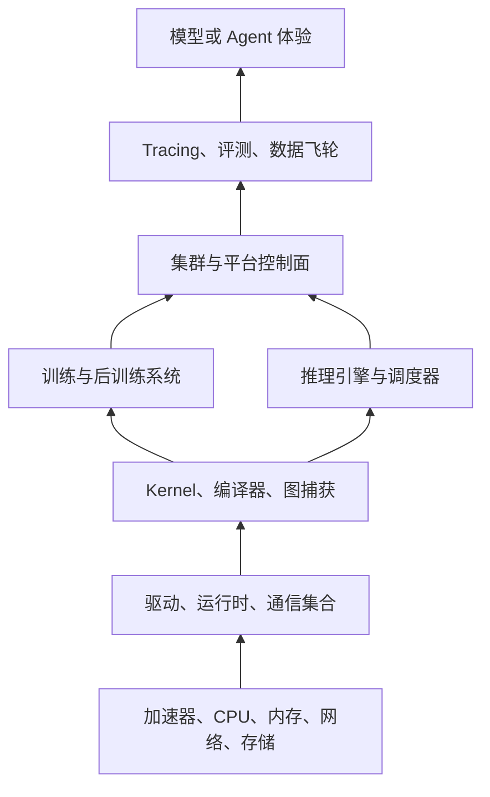

# 现代 AI Infra 全栈：每一层负责什么

**中文** · [English](01-modern-ai-infra-stack.en.md) · [返回 AI Infra](../../README.md)

> 阅读时间：约 5 分钟 · 类型：地图 · 时效性：快速变化 · 最近审阅：2026-08

## 核心问题

AI Infra 不是一个职位，也不是一套固定工具。它是从芯片到可靠模型体验的完整路径。现代的学习方式是先看清楚**每一层负责哪类约束**，再沿着一次请求或一个训练 step 穿过整个系统。

## 按职责理解生态位

| 层 | 负责什么 | 需要认识的代表工具 | 必须回答的问题 |
| --- | --- | --- | --- |
| 硬件与互连 | 计算、HBM、拓扑和链路 | GPU/加速器架构、NVLink、InfiniBand/RoCE | 瓶颈是计算、显存、通信还是 I/O？ |
| 运行时与库 | 设备执行和通信 | CUDA/ROCm、cuBLAS、cuDNN、NCCL | 最终运行的是哪个优化原语？ |
| Kernel 与编译器 | 融合、layout、代码生成 | Triton、CUTLASS、`torch.compile`/Inductor、XLA | 框架表达是否变成高效 kernel graph？ |
| 训练系统 | 模型状态的放置与更新 | DDP、FSDP2/DTensor、Megatron 式并行、DeepSpeed | 什么被切分、复制、通信和 checkpoint？ |
| 后训练与 rollout | 样本生成和策略更新 | SFT、偏好优化、RL/rollout workers | 生成、打分和训练能否保持新鲜且可复现？ |
| 推理运行时 | Cache 与 token 调度 | vLLM、SGLang、TensorRT-LLM | Prefill、decode、KV 内存和准入如何控制？ |
| 平台控制面 | 放置、隔离和恢复 | Kubernetes、Slurm、Ray、Kueue 类队列 | 谁获得加速器，任务失败后怎么办？ |
| 可观测性与评测 | 证据与发布决策 | profiler trace、系统指标、实验 lineage、eval harness | 改动是否改善真实负载且没有回归？ |

这些名字只是例子，不是采购清单。先掌握职责和瓶颈；工具 API 比底层约束变化得更快。

## 当前尤其重要的现代主题

### 对编译器友好的模型代码

框架代码越来越多地经过图捕获和编译层再落到 kernel。使用 `torch.compile` 时，graph break、guard、recompile、动态 shape 和编译时间都可能成为生产问题。应检查生成的编译区域和 profile，而不是默认「compile 就会免费变快」。

### Block-scaled 低精度

BF16 仍是实用基线，FP8 和更新的 block-scaled 格式可以在支持的硬件上减少计算、内存和通信成本。MXFP8、NVFP4 等格式还引入 scale metadata 和 layout 约束，所以真正的研究单位是**格式 + scaling recipe + kernel + 硬件 + 精度证据**，而不是单独看位数。

### 多维并行与稀疏模型

现代大规模训练会在 device mesh 上组合 data、tensor、pipeline、context 和 expert parallel。MoE 会把压力转向 routing、grouped GEMM、负载均衡与 AllToAll。最佳方案取决于模型形状和物理拓扑，不只取决于 GPU 数量。

### Token 级推理调度

Serving engine 要在不规则流量下调度 token、KV-cache block、prefill 与 decode。Continuous batching、prefix caching、chunked prefill、speculative decoding，以及某些场景中的 prefill/decode 分离都依赖具体负载。应优化尾延迟和每个成功任务的成本，而不是孤立的 tokens/s。

### 把评测当成基础设施

对 Agent 和自我改进系统而言，trace、可执行检查、judge 校准、数据 lineage、canary 和 rollback 都属于训练/服务架构。如果系统无法说明哪些数据和策略导致了变化，更快的更新循环并不安全。

## 应该学多深？

采用 **T 型路线**：

1. 学牢耐久基础：C/C++、CPU/GPU 内存层次、数值误差、collective、排队、benchmark 和 profiling。
2. 选择一条垂直链路做深。推荐起点是 PyTorch → `torch.compile`/Triton → NCCL/FSDP2 → vLLM 或 TensorRT-LLM → profiler/eval dashboard。
3. 对相邻系统先理解其职责，不用背下所有 API。
4. 采用快速变化的能力前，重新检查版本和硬件支持矩阵。

## 五分钟掌握检查

- 在 profiling 前，你能否先把慢请求定位到一两个可能的层？
- Framework、compiler、kernel library、runtime 和 scheduler 有什么区别？
- 为什么低精度可能减少通信，却仍然让任务变慢？
- 哪一种并行维度会产生 AllToAll？
- 为什么 eval harness 属于 infra，而不只是模型研究？

## 当前一手资料

- [PyTorch `torch.compile`](https://docs.pytorch.org/docs/stable/generated/torch.compile.html)
- [Triton tutorials](https://triton-lang.org/main/getting-started/tutorials/)
- [PyTorch FSDP2 `fully_shard`](https://docs.pytorch.org/docs/main/distributed.fsdp.fully_shard.html)
- [NCCL documentation](https://docs.nvidia.com/deeplearning/nccl/)
- [NVIDIA Transformer Engine 低精度指南](https://docs.nvidia.com/deeplearning/transformer-engine/user-guide/examples/fp8_primer.html)
- [vLLM serving documentation](https://docs.vllm.ai/en/latest/cli/serve/)

接下来阅读 [模块 00 · C/C++ 基础](../../modules/00-c-cpp-foundations.md)，或从[分类索引](../../README.md)选择目标路线。
