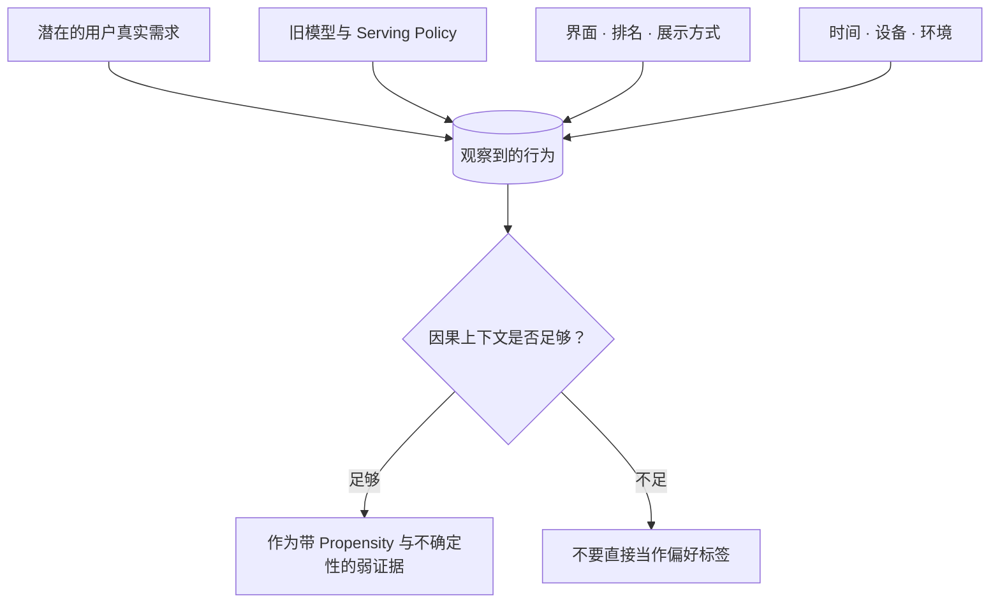

# 数据与反馈：模型到底在从什么里学习？

**中文** · [English](README.en.md)

## 先用一句话讲清楚

模型看到的数据，并不是世界本身，而是**世界经过旧系统、产品界面和记录规则之后留下的痕迹**。

这件事很重要，因为我们经常把“日志里发生了什么”误当成“用户真正想要什么”。

## 一个最简单的例子

假设一个推荐系统从来没有给你展示过爵士乐，只展示流行音乐。

你点击了几首流行歌。日志里会写：

```text
用户看到了流行歌 → 用户点击了流行歌
```

但它不能证明：

```text
用户只喜欢流行歌
```

因为爵士乐根本没有进入你的选择范围。系统先决定了你能看见什么，然后又拿你的点击去证明自己的决定是对的。这就是常见的 **policy bias / exposure bias**。

## 一条日志实际上混合了什么

一次点击、停留或回复，往往同时受到这些因素影响：



所以数据不是一个干净标签，而是多个机制共同产生的结果。

## 五个最常见的问题

### 1. 稀疏

大部分人不会对每个结果都明确点赞或解释。没有反馈，可能是不喜欢，也可能是没看到、没时间、网络断了，或者已经从标题得到答案。

### 2. 延迟

有些结果当下看不出价值。一次搜索可能几天后才帮助用户完成任务，一条建议也可能要长期使用后才知道是否合适。

### 3. 策略偏置

系统只会收到自己选择展示内容的反馈。越依赖旧日志，越可能重复旧策略的盲区。

### 4. 缺少纵向结构

单次点击很容易记录，长期目标变化却很难。Personal AGI 真正需要的是“这个人怎样变化”，而不只是许多互不相连的事件。

### 5. 标签含义不清

一次长停留可能表示内容有价值，也可能表示内容难懂。一个点赞可能喜欢观点、作者、图片，甚至只是礼貌回应。

## 什么是更好的数据设计

好的数据系统不只是保存更多字段，而是把一次观察的语义写清楚：

- **发生了什么**：用户、模型、工具和环境分别做了什么？
- **为什么能看到它**：是哪一个检索、排序或产品策略产生了曝光？
- **反馈何时发生**：是即时反应，还是延迟结果？
- **证据有多强**：明确纠正通常比一次滑动更有信息量。
- **这条数据能支持什么目标**：用于 SFT、偏好学习、RL，还是只适合评估？
- **怎样复现**：模型、prompt、候选集、feature 和数据版本是什么？

## 数据多不等于信息多

一百万次高度相关的点击，可能不如一百次带有明确上下文和纠正原因的交互有价值。

真正要看的是：数据是否增加了关于目标、用户或环境的新信息，而不只是增加行数。

## 它和其他知识点怎样连接

- [表征与记忆](../memory/) 决定这些数据怎样变成长期状态。
- [Search](../search/) 决定系统会生成哪些新观察。
- [Post-Training](../post-training/) 决定这些反馈怎样改变模型行为。
- [Evaluation](../evaluation/) 检查模型是不是只学会了数据里的偏差。
- [Human-in-the-Loop](../systems/human-in-the-loop.md) 可以提供更少但更清晰的纠正信号。

## 我现在会先问的问题

拿到一个数据集时，我不会先问有多少行，而会先问：

1. 这条数据是被什么策略产生的？
2. 哪些人、内容或失败没有机会被记录？
3. 观察到的信号距离真实目标有多远？
4. 它有没有时间顺序和上下文？
5. 如果模型优化这个信号，最可能钻什么空子？
