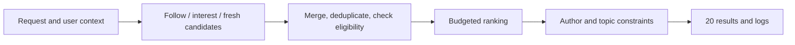

# Design 01: a feed that does more than repeat itself

[中文](feed.md) · **English**

> Original exercise · All scale and budget numbers are assumptions, not platform data.

## Define the task

Build an interest-community homepage with 20 posts, including unfollowed authors. Assume one million eligible posts, a 200 ms server-side p95 budget, and a target of making new posts retrievable within five minutes. Leave ads and video out of scope.

Where does the latency timer start and stop? Does freshness mean indexed or actually displayed? Those are different requirements.

## Start with a small design

Use simple sources and interpretable scoring before choosing a large model. Offline or nearline work prepares representations and indexes; the request path applies fresh permissions and user actions.

## Important trade-offs

| Choice | Benefit | Cost |
| --- | --- | --- |
| Precomputed candidate vectors | Avoid re-encoding every post per request | Update lag; deletions must reach indexes and caches |
| Multiple candidate sources | Make room for niche interests and fresh content | Duplicate candidates, quotas, and timeouts |
| Diversity reranking | Avoid one author or topic dominating the feed | Possible predicted-score loss; benefits need evaluation |
| Timeout fallback | Return useful results during dependency failures | Fallbacks must still pass eligibility and block checks |

Don't add average latencies and call that the budget. Parallel retrieval can be limited by the slowest branch; serial feature dependencies extend the critical path. Use traces to inspect p95/p99 and timeout rates.

## Check the design honestly

Hold candidate budget, evaluation window, and user slices fixed. Compare relevance, incremental candidates, topic coverage, duplicates, freshness, and latency. Separate new and heavy users so a large cohort cannot hide a small one.

Distinguish exposed posts, observed feedback, and unlabeled items. Not shown is not the same as disliked. Offline results inform whether to try controlled deployment; they don't substitute for online satisfaction.

## Challenge the design

Why limit repeated authors if a user likes one author?

It isn't a universal rule. Define the product goal, then compare soft penalties, hard limits, and a user-controlled following feed. The constraint itself needs evaluation.

Can a timed-out interest source fall back to cached results?

Yes, as a candidate fallback, but permissions, deletion, and blocking still require checks. Staleness and a safety violation have different consequences.

Next read [Twitter's request path](../../practice/recommender-systems/01-feed-pipeline.en.md) as a public implementation—not as evidence for this exercise's assumed settings.
