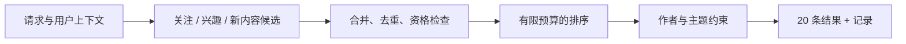

# 设计题 01：做一个不只推荐重复内容的 Feed

**中文** · [English](feed.en.md)

> 自拟练习 · 所有规模和预算都是假设，不是平台数据。

## 先把题目说清楚

做一个兴趣社区：首页返回 20 条帖子，允许出现未关注作者的内容。假设有 100 万篇可推荐帖子，服务端 p95 预算 200 ms，新帖子希望在 5 分钟内有机会被找到。暂时不做广告和视频。

先问两个问题：200 ms 从哪个入口量到哪个出口？新鲜度是“进入索引”还是“真的被展示”？两个定义不一样。

## 从最小方案开始

先用简单候选源和可解释的打分跑通，不急着上最大的模型。离线或近线负责构建候选表示与索引；在线用最新权限和用户操作补上不能过期的条件。

## 关键取舍

| 选择 | 好处 | 需要付出的代价 |
| --- | --- | --- |
| 预计算候选向量 | 避免每个请求重复编码全部帖子 | 更新延迟；删除要同步到索引和缓存 |
| 多路召回 | 给小众兴趣和新内容留下入口 | 重复候选、预算分配和超时处理 |
| 多样性重排 | 避免首页被同一作者或主题占满 | 可能牺牲单条预测分；要验证用户是否受益 |
| 超时后回退 | 依赖失败时仍能返回结果 | 回退内容也必须经过资格与屏蔽检查 |

预算不能只是把平均耗时相加。并行召回常受最慢分支影响，串行特征依赖还会拉长关键路径；要用 trace 看 p95/p99 和超时比例。

## 怎样证明方案没有自欺欺人

固定候选总预算、评估时间窗和用户切片，比较相关性、来源增量、主题覆盖、重复率、新内容覆盖和延迟。把新用户与重度用户分开，别让大群体盖住小群体。

设计评估时还要知道哪些帖子被展示过、哪些有反馈、哪些根本没有标签。未展示不等于不喜欢。离线结果只能决定是否值得受控上线，不是线上满意度的替代品。

## 追问自己

用户很喜欢同一个作者，为什么还要限制同作者数量？

不是一律限制。先说明产品目标和重复内容造成的问题；可以比较软惩罚、硬上限、用户可控的关注流。约束本身也要被评估。

兴趣召回超时，直接返回缓存可以吗？

可以作为候选回退，但权限、删除、屏蔽等条件仍需重新检查。缓存过期与安全违规不是同一等级的损失。

接着读[Twitter 的请求链路](../../practice/recommender-systems/01-feed-pipeline.md)，对照公开实现，而不是把上面的假设当成它的配置。
