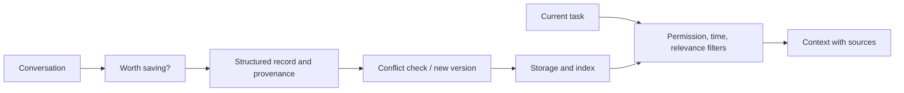

# Design 03: memory that can be corrected and deleted

[中文](memory.md) · **English**

> Original exercise · All example information is fictional.

## Define the task

Add long-term memory to a personal assistant. A user first says Tuesday evenings are free, changes that to Thursday, then requests deletion. Distinguish explicit facts, temporary preferences, and model inferences, with a traceable source.

The goal isn't to store every conversation forever. Useful information must be used correctly and remain correctable and deletable.

## Treat writing as a decision

A teaching record should include a stable ID, content, type, source, event time, validity time, version, and status. Updating one person's schedule must not change a similarly named person's record.

## Three different operations

| Operation | Intended behavior | Important detail |
| --- | --- | --- |
| Update | Activate a new version and supersede the old one | Nearest-neighbor search can still return old records; filter on read |
| Forget | Stop retrieving or lower priority under a policy | This isn't necessarily deletion of source data |
| Delete | Remove source records, index entries, and derived caches as promised | Explain backup retention and cleanup limits |

Start with rules for explicit saves and deletions before adding model-assisted extraction. An inference must not silently become a fact. Ask for confirmation when information conflicts or confidence is low.

## Evaluate a timeline

Create a fictional sequence: write → correct → unrelated question → related question → delete → ask again. Check version validity, provenance, mistaken identity, and whether caches revive deleted information.

Long-term memory needs more than single-answer accuracy: evaluate consistency across turns, correction, unwanted storage, and forgetting boundaries.

## Challenge the design

Is deleting the vector-index entry enough?

Not necessarily. Source records, summaries, caches, or rebuild jobs can reintroduce the information. Define the data flow, deletion scope, and verification.

Should a new statement automatically overwrite conflicting memory?

Check identity, fact type, and validity time first. It may be a temporary exception. Confirm when needed and preserve version relationships rather than silently overwriting.

Foundations: [memory lifecycle](../../02-memory/memory-lifecycle.en.md). Compare this with RAG: both retrieve evidence, but this design also owns how evidence is written and changed.
