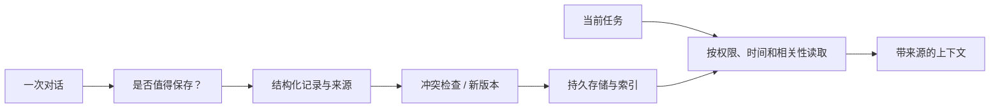

# 设计题 03：记得住，也改得掉

**中文** · [English](memory.en.md)

> 自拟练习 · 示例信息全部虚构。

## 先把题目说清楚

给个人助手加长期记忆。用户先说“周二晚上有空”，后来改成“周四”，又要求删除安排。系统要区分明确事实、暂时偏好和模型推测，并能解释信息来自哪里。

目标不是把全部聊天永久塞进向量库，而是让需要的信息能被正确使用，也能被更正和删除。

## 把写入当成一个决策

教学用记录至少包含：稳定 ID、内容、类型、来源、事件时间、有效时间、版本、状态。一个人的安排改变，不代表另一个人的同名记录也要改掉。

## 三个容易混淆的动作

| 动作 | 应该发生什么 | 不能偷懒的地方 |
| --- | --- | --- |
| 更新 | 新版本生效，旧版本标为被替代 | 向量近邻仍可能返回旧记录，读取时要过滤 |
| 遗忘 | 按策略不再主动检索或降低优先级 | 这不等于已经删除原始数据 |
| 删除 | 按约定清理源记录、索引和派生缓存 | 备份保留期与无法即时清理的边界要说清楚 |

第一版可以用规则决定显式保存和删除，再增加模型辅助提取。推测不应悄悄升级成事实；低置信度或冲突信息可以先向用户确认。

## 怎么测

构造一条虚构时间线：写入 → 更正 → 无关追问 → 相关追问 → 删除 → 再追问。检查系统是否用最新有效版本、能否给出来源、是否错误关联另一个人，以及删除后是否还从缓存拿回来。

长期记忆不是只看一次回答正确率；要看跨轮次的一致性、纠错能力、误保存和遗忘边界。

## 追问自己

只从向量索引删掉，算删除了吗？

不一定。原始记录、摘要、缓存或后台重建任务都可能重新带回信息。需要定义数据流、清理范围和复核方式。

用户现在说的话和旧记忆冲突，直接覆盖吗？

先判断是否同一主体、同一事实和同一有效时间。新的说法可能只是临时例外；必要时确认并保留版本关系，而不是静默覆盖。

补原理：[记忆的生命周期](../../02-memory/memory-lifecycle.md)。把这一题和 RAG 对比：相同的是取证据，不同的是这里还要负责证据的写入和变更。
