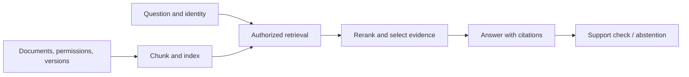

# Design 02: knowledge-base answers you can verify

[中文](rag.md) · **English**

> Original exercise · No internal company documents.

## Define the task

Build question answering over course material. Documents change and access differs by user. Answers need usable citations; insufficient evidence should allow an “I don't know.” The first version takes no external actions.

“Connect a vector database” isn't the goal. The evidence must be authorized for this user, current for the question, and sufficient to support the answer.

## Separate ingestion from answering

Apply permissions during retrieval where possible and check again before selecting evidence. Sending unauthorized text to the model and filtering the final answer is too late.

## Three choices

| Choice | Benefit | Cost and check |
| --- | --- | --- |
| Hybrid keyword and vector retrieval | Handles identifiers as well as paraphrases | Fusion rules, duplicates, candidate budget |
| Retrieve small chunks, then expand context | Precision with surrounding context | Version mismatches; recheck expanded material's permissions |
| Cite a specific version and passage | Readers can verify the claim | Retain versions or clearly report invalidated citations |

More evidence isn't automatically better. Set a context budget and check whether it covers the required facts instead of hiding retrieval gaps in extra text.

## Evaluate the stages

Write a small question set with required documents and facts: cross-passage questions, stale answers, unanswerable questions, and unauthorized material. Measure evidence retrieval, answer support, citation accuracy, appropriate abstention, and latency separately.

Don't treat one model generating questions, answers, and scores as independent validation. Keep a manually checked slice and attribute failures to retrieval, evidence selection, or generation.

## Challenge the design

Why can an answer be wrong after retrieving the right document?

The chunk may miss the necessary passage, the version may be wrong, reranking may discard evidence, or generation may add an unsupported claim. Trace the stages before blaming model size.

What happens to cached answers after access is revoked?

Cache keys and read checks need authorization scope, document versions, and invalidation. A cache hit must not bypass access control.

Foundations: [retrieval](../../04-search/README.en.md) · [evaluation](../../07-evaluation/README.en.md). This is a design to discuss, not the only implementation.
