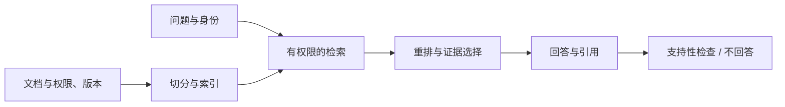

# 设计题 02：让知识库回答有据可查

**中文** · [English](rag.en.md)

> 自拟练习 · 不使用任何公司内部文档。

## 先把题目说清楚

给一个课程资料库做问答。资料会更新，不同用户能看见的文档不同。回答要带可打开的引用，找不到依据时允许说不知道。第一版不做自动执行操作。

不要把目标写成“接一个向量库”。真正要保证的是：回答用到的是当前用户有权访问、版本正确、能支撑结论的证据。

## 两条路径分开画

权限条件应尽可能参与检索，并在选证据时再次检查；不能先把无权看的文本发给模型，再在最终回答里过滤。

## 三个选择

| 选择 | 好处 | 代价与检查 |
| --- | --- | --- |
| 关键词与向量混合 | 编号、专有名词和语义表达各有入口 | 融合规则、重复结果和候选预算 |
| 小块检索，再取相邻上下文 | 找得准，也保留段落关系 | 容易拿到过期版本；扩展后仍要检查权限 |
| 引用到具体版本与片段 | 用户可以复核 | 文档更新后需要保留版本或明确失效 |

证据越多不一定越好。先定义 context budget，再看是否覆盖回答需要的关键事实；不要用更多无关文字掩盖检索缺口。

## 怎么测

自己写一小组问题，标明所需文档和关键事实，包含跨段落、过期答案、没有答案、无权限四类。分别量检索是否找到证据、回答是否被证据支持、引用是否准确、该拒绝时是否拒绝，再看延迟。

不要只让同一个模型生成问题、回答和评分，然后把分数当成独立验证。保留人工检查的小切片，记录失败属于检索、证据选择还是生成。

## 追问自己

召回到了正确文档，为什么仍然答错？

可能切片没覆盖所需段落，版本不对，重排丢了关键证据，或者生成加入了证据没有支持的结论。按阶段查，不直接归因于模型太小。

缓存答案怎样处理权限撤回？

缓存键和读取检查必须考虑身份或权限范围、文档版本与失效机制。缓存命中不能跳过授权检查。

补原理：[检索](../../04-search/README.md) · [评估](../../07-evaluation/README.md)。这里给的是可讨论的设计，不是唯一实现。
