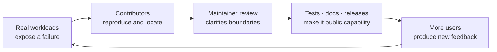
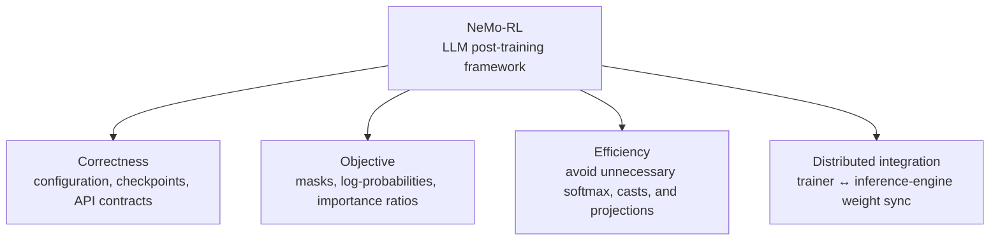

# Open source

[中文](README.md) · **English**

> Reading time: ~4 min · Type: Section index · Freshness: Evolving · Last reviewed: 2026-08

I do not want this section to become a PR scoreboard. A merged patch is satisfying, but the interesting part comes later: other workloads execute it, tests preserve its contract, maintainers reshape it, and future contributors begin to treat it as part of the ground they can stand on.

This section therefore records two things: **how I build judgment inside an unfamiliar production-grade codebase, and how a local repair becomes reusable public capability.**

## Why the ecosystem matters to me

In a private experiment, “works for my run” can survive for a while. Upstream code has to meet hardware, configurations, compatibility constraints, future refactors, and workloads its author has never seen. Review, CI, documentation, and users collectively tighten a local idea into something other people can safely depend on.

That is what I mean by an ecosystem: not merely many repositories, but a feedback loop that accumulates technical judgment. A good contribution fixes today's problem, makes the same class of failure harder to repeat, and leaves the next reader with a clearer explanation of why the system has its current shape.

## The thread I follow in NeMo-RL

[NVIDIA NeMo-RL](nemo-rl/) spans SFT, RL, distillation, and the seam between trainers and inference engines. It is a useful place to learn this kind of judgment because the mathematical objective, framework contracts, and distributed execution must agree at once. My contributions fall into four threads:

They look unrelated, but ask the same question: **does the training code faithfully and economically implement the objective we think we are optimizing?** This is also why maintenance work matters to me: model capability eventually has to pass through these seemingly small contracts.

## Where to start

| If you care about | Start here | Central question |
| --- | --- | --- |
| Post-training correctness | [Set, but never applied](nemo-rl/#config-correctness) | Why is silent failure more expensive than a crash? |
| Mathematics and performance | [Computing something that cancels](nemo-rl/#compute-efficiency) | How do you prove that a large computation cannot affect the result? |
| RL objective implementation | [Saying one thing, doing another](nemo-rl/#objective-correctness) | How can one wrong mask reach the importance ratio and gradient? |
| Distributed systems | [Adding a missing capability](nemo-rl/#distributed-integration) | How do trainer weights cross nodes into a differently sharded inference engine? |

## Which layer each contribution protects

PR count is less informative than the layer each change protects:

| Direction | Representative contributions | Status |
| --- | --- | --- |
| Configuration and reproducibility | [#3271](https://github.com/NVIDIA-NeMo/RL/pull/3271) config-key warnings · [#3389](https://github.com/NVIDIA-NeMo/RL/pull/3389) dataset parameter · [#3071](https://github.com/NVIDIA-NeMo/RL/pull/3071) checkpoint tie-breaking | merged |
| Distillation and inference efficiency | [#3314](https://github.com/NVIDIA-NeMo/RL/pull/3314) remove full-vocab log-softmax · [#3484](https://github.com/NVIDIA-NeMo/RL/pull/3484) skip softmax materialization | merged |
| Objective and interface correctness | [#3551](https://github.com/NVIDIA-NeMo/RL/pull/3551) log-prob mask · [#3512](https://github.com/NVIDIA-NeMo/RL/pull/3512) advantage contract · [#3515](https://github.com/NVIDIA-NeMo/RL/pull/3515) reachable error semantics | under review |
| Compute and memory paths | [#3564](https://github.com/NVIDIA-NeMo/RL/pull/3564) top-k projection · [#3496](https://github.com/NVIDIA-NeMo/RL/pull/3496) deferred fp32 cast · [#3552](https://github.com/NVIDIA-NeMo/RL/pull/3552) lazy optional dependencies | under review |
| Trainer / inference seam | [#3519](https://github.com/NVIDIA-NeMo/RL/pull/3519) cross-node SGLang weight sync | under review |

## When is a change worth sending upstream?

I now ask five questions:

1. **Claim:** which invariant is broken, or which computation is provably redundant?
2. **Evidence:** code path, mathematical identity, minimal reproduction, or a regression test that fails under the broken implementation?
3. **Boundary:** what was verified, what was not, and can a single-device result be extrapolated to multiple nodes?
4. **Fit:** does the solution follow the project's abstractions, compatibility constraints, and maintenance style rather than merely looking clean on my branch?
5. **Afterlife:** six months later, will tests and documentation explain why this constraint exists?

The detailed note preserves this reasoning rather than only the final diff. Locating the failure, drawing the boundary, and aligning with maintainers are what transfer to the next codebase.

## The contributor I want to become

I do not want to optimize for easy-to-merge patches, nor arrive by proposing a rewrite of the core. I would rather accumulate context: begin with small, falsifiable problems, learn why maintainers reject some elegant-looking solutions, and gradually become responsible for an interface, a correctness invariant, or a cross-component data path.

Open source turns “I think this design is reasonable” into a public, refutable technical claim that has to survive evidence and review. It also makes one thing obvious: a capability reaches users not because of one model or one author, but because an ecosystem carries it the rest of the way.

## Continue reading

- [NVIDIA NeMo-RL: from correctness to distributed post-training](nemo-rl/)
- [Merged commits on main](https://github.com/NVIDIA-NeMo/RL/commits/main/?author=tianyi-zhang-02)
- [NeMo-RL repository](https://github.com/NVIDIA-NeMo/RL)
