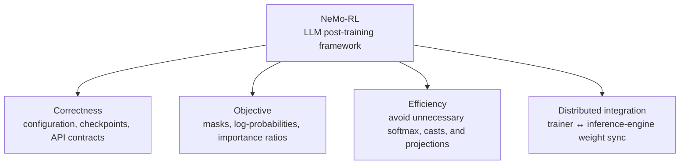

# Open source

[中文](README.md) · **English**

> Reading time: ~4 min · Type: Section index · Freshness: Evolving · Last reviewed: 2026-08

This is not a chronological PR log. It records how I reason about a real post-training framework: **what the system claims to do, what the code actually does, and how to prove and repair the gap.**

The current focus is [NVIDIA NeMo-RL](nemo-rl.en.md), which spans SFT, RL, distillation, and the seam between trainers and inference engines. My contributions fall into four threads:

They look unrelated, but ask the same question: **does the training code faithfully and economically implement the objective we think we are optimizing?**

## Where to start

| If you care about | Start here | Central question |
| --- | --- | --- |
| Post-training correctness | [Set, but never applied](nemo-rl.en.md#config-correctness) | Why is silent failure more expensive than a crash? |
| Mathematics and performance | [Computing something that cancels](nemo-rl.en.md#compute-efficiency) | How do you prove that a large computation cannot affect the result? |
| RL objective implementation | [Saying one thing, doing another](nemo-rl.en.md#objective-correctness) | How can one wrong mask reach the importance ratio and gradient? |
| Distributed systems | [Adding a missing capability](nemo-rl.en.md#distributed-integration) | How do trainer weights cross nodes into a differently sharded inference engine? |

## Contribution map

PR count is less informative than the layer each change protects:

| Direction | Representative contributions | Status |
| --- | --- | --- |
| Configuration and reproducibility | [#3271](https://github.com/NVIDIA-NeMo/RL/pull/3271) config-key warnings · [#3389](https://github.com/NVIDIA-NeMo/RL/pull/3389) dataset parameter · [#3071](https://github.com/NVIDIA-NeMo/RL/pull/3071) checkpoint tie-breaking | merged |
| Distillation and inference efficiency | [#3314](https://github.com/NVIDIA-NeMo/RL/pull/3314) remove full-vocab log-softmax · [#3484](https://github.com/NVIDIA-NeMo/RL/pull/3484) skip softmax materialization | merged |
| Objective and interface correctness | [#3551](https://github.com/NVIDIA-NeMo/RL/pull/3551) log-prob mask · [#3512](https://github.com/NVIDIA-NeMo/RL/pull/3512) advantage contract · [#3515](https://github.com/NVIDIA-NeMo/RL/pull/3515) reachable error semantics | under review |
| Compute and memory paths | [#3564](https://github.com/NVIDIA-NeMo/RL/pull/3564) top-k projection · [#3496](https://github.com/NVIDIA-NeMo/RL/pull/3496) deferred fp32 cast · [#3552](https://github.com/NVIDIA-NeMo/RL/pull/3552) lazy optional dependencies | under review |
| Trainer / inference seam | [#3519](https://github.com/NVIDIA-NeMo/RL/pull/3519) cross-node SGLang weight sync | under review |

## When is a change worth proposing?

Every contribution should answer three questions:

1. **Claim:** which invariant is broken, or which computation is provably redundant?
2. **Evidence:** code path, mathematical identity, minimal reproduction, or a regression test that fails under the broken implementation?
3. **Boundary:** what was verified, what was not, and can a single-device result be extrapolated to multiple nodes?

The detailed note preserves these three steps rather than only the final diff. The reasoning process is what transfers to the next codebase.

## Continue reading

- [NVIDIA NeMo-RL: from correctness to distributed post-training](nemo-rl.en.md)
- [Merged commits on main](https://github.com/NVIDIA-NeMo/RL/commits/main/?author=tianyi-zhang-02)
- [NeMo-RL repository](https://github.com/NVIDIA-NeMo/RL)
