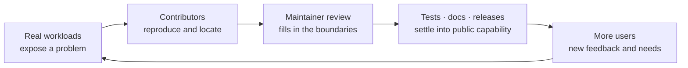
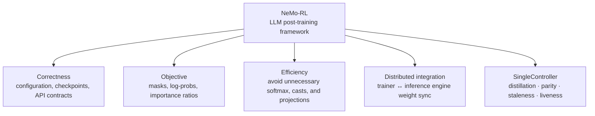

# AI infra, entered through open source

[中文](README.md) · **English**

> Reading time: ~4 min · Type: Section index · Freshness: Evolving · Last reviewed: 2026-09

This block holds the infra I have actually touched: contributing to NeMo RL and, through one
real problem after another, coming to understand a post-training system. The layer as a whole
is not my strength — for a systematic treatment I would send you to
[Awesome-ML-SYS-Tutorial](https://github.com/zhaochenyang20/Awesome-ML-SYS-Tutorial). What is
here is only what happened on my own hands.

I do not really want to write open source up as a PR scoreboard. Getting a patch merged is satisfying, of course, but what actually draws me is that afterwards it no longer belongs only to me: other people's training jobs will run through it, new tests will protect it, maintainers will keep modifying it, and it may become a piece of basic capability that the next contributor relies on by default.

When I first entered NeMo RL I was honestly lost. I could follow the algorithms in the papers, but in the real system the rollout, the trainer, the inference engine, the Ray actors, and weight refit did not connect into one picture. I started contributing not because I already understood the underlying system, but because I wanted real problems to force me to understand it properly.

So what I want to record here is three things: **how I build judgment inside an unfamiliar codebase, how scattered contributions connect into an understanding of a complete system, and how a local fix becomes reusable public capability in the ecosystem.**

## Why I care about the open-source ecosystem

When you work on a project behind closed doors, many problems can be sidestepped for now as long as the current experiment runs. Upstream does not allow that. The code has to face different hardware, different configurations, old interfaces, future refactors, and workloads you have never seen. Maintainer review, CI, documentation, and other users together force you to tighten “works on my machine” into “others can depend on it with confidence.”

This is also what I understand by “ecosystem”: not just many repositories sitting side by side, but a feedback loop that accumulates judgment. A good contribution not only fixes today's bug; it makes the same class of error harder to repeat, and makes it easier for whoever comes later to see why the system is designed the way it is.

## The thread I am currently following in NeMo RL

[NVIDIA NeMo-RL](nemo-rl/README.en.md) covers SFT, RL, distillation, and the cooperation between trainers and inference engines. It is a good place to train this kind of judgment, because the mathematical objective, the framework interfaces, and distributed execution all have to line up at once. Recently my focus has expanded from point-wise correctness to **SingleController**: keeping the algorithm semantics of asynchronous rollout, training, distillation, and weight synchronization consistent on one shared data plane.

These problems look scattered, but they all ask the same thing: **does the training code faithfully and economically implement the objective we think we are optimizing?** Real model capability always has to pass, in the end, through these seemingly unremarkable contracts.

## Where to start

| If you care about | Read this first | Central question |
| --- | --- | --- |
| Why I started contributing | [Why I started looking beneath the abstractions](nemo-rl/README.en.md#why-i-started-looking-beneath-the-abstractions) | Which layers does “underlying” actually include? |
| What NeMo RL is | [Start with the full training loop](nemo-rl/README.en.md#what-is-nemo-rl) | Which components does a post-training framework connect? |
| Asynchronous post-training | [Why SingleController exists](nemo-rl/README.en.md#single-controller) | How do you increase rollout/training overlap without quietly changing the algorithm? |
| Recent work | [What I am adding to SingleController](nemo-rl/README.en.md#current-work) | How do distillation, correctness parity, and observability string into one line? |
| Merged work | [From small fixes to a subsystem](nemo-rl/README.en.md#merged-work) | How do you remove useless computation on mathematical grounds while protecting the experiment configuration? |

## What each of these contributions protects

Rather than counting PRs, a clearer way to look at them is by which layer they protect:

| Direction | Representative contributions | Status |
| --- | --- | --- |
| Configuration and reproducibility | [#3271](https://github.com/NVIDIA-NeMo/RL/pull/3271) config-key warnings · [#3389](https://github.com/NVIDIA-NeMo/RL/pull/3389) dataset parameter takes effect · [#3071](https://github.com/NVIDIA-NeMo/RL/pull/3071) checkpoint tie-breaking | Merged |
| Distillation and inference efficiency | [#3314](https://github.com/NVIDIA-NeMo/RL/pull/3314) remove full-vocabulary log-softmax · [#3484](https://github.com/NVIDIA-NeMo/RL/pull/3484) skip softmax materialization · [#3564](https://github.com/NVIDIA-NeMo/RL/pull/3564) project only teacher top-k | Merged |
| SingleController distillation | [#3843](https://github.com/NVIDIA-NeMo/RL/pull/3843) teacher top-k data path · [#3846](https://github.com/NVIDIA-NeMo/RL/pull/3846) train-pump wiring · [#3849](https://github.com/NVIDIA-NeMo/RL/pull/3849) recipe and functional test | Under review |
| SingleController correctness | [#3786](https://github.com/NVIDIA-NeMo/RL/pull/3786) sample mask · [#3787](https://github.com/NVIDIA-NeMo/RL/pull/3787) reward/advantage semantics · [#3850](https://github.com/NVIDIA-NeMo/RL/pull/3850) valid-sample contract | Under review |
| SingleController observability | [#3759](https://github.com/NVIDIA-NeMo/RL/pull/3759) trajectory age · [#3783](https://github.com/NVIDIA-NeMo/RL/pull/3783) watchdog supervision · [#3760](https://github.com/NVIDIA-NeMo/RL/pull/3760) async PPO failure policy | Under review |
| Objective and interface correctness | [#3551](https://github.com/NVIDIA-NeMo/RL/pull/3551) log-prob mask · [#3512](https://github.com/NVIDIA-NeMo/RL/pull/3512) advantage contract · [#3853](https://github.com/NVIDIA-NeMo/RL/pull/3853) reward-side KL clamp | Under review |
| Compute and memory path | [#3496](https://github.com/NVIDIA-NeMo/RL/pull/3496) deferred fp32 cast · [#3552](https://github.com/NVIDIA-NeMo/RL/pull/3552) lazy optional dependencies | Under review |
| Training / inference seam | [#3519](https://github.com/NVIDIA-NeMo/RL/pull/3519) SGLang cross-node weight sync | Under review |

## When is a change worth sending upstream

I now ask five things first:

1. **Claim:** which invariant is broken, or which part of the computation is provably redundant?
2. **Evidence:** is it a code path, a mathematical identity, a minimal reproduction, or a regression test that goes red under the wrong implementation?
3. **Boundary:** what did I verify and what did I not; can a single-GPU conclusion be extrapolated to multiple nodes?
4. **Fit:** does the solution follow the project's existing abstractions, compatibility constraints, and way of maintaining things, rather than merely looking best on my branch?
5. **Afterlife:** six months from now, when someone else changes this code, will the tests and documentation tell them why this constraint exists?

What the detailed notes preserve is not “which lines changed in the end” but how these judgments were built. What actually transfers to the next codebase is the process of locating the problem, drawing the boundary, and aligning with maintainers, not the patch itself.

## From being lost to subsystem ownership

This is not about cherry-picking small changes that merge easily, nor about rewriting a core module on day one. I would rather build up context on one stretch of the system gradually: first fix small, well-defined problems, understand why maintainers reject certain elegant-looking solutions, and then slowly get to the point where I can be responsible for an interface, a correctness invariant, or a cross-component data flow.

This is also where open source is most valuable to me. It turns “I think this design is reasonable” into a technical judgment that is public, refutable, and has to be backed by evidence. It also breaks the vague “I want to understand the underlying system” into a path I can keep moving along: first trace one configuration option to the end, then understand one objective function, then understand a cross-component data flow, and finally begin to take responsibility for a subsystem's invariant.

A capability never truly lands on the strength of one model or one author alone; the whole ecosystem has to hold it up. What I hope to accumulate in the end is not a string of PR numbers but the judgment that makes this ecosystem more reliable and easier for the next person to understand.

## Continue reading

- [NVIDIA NeMo RL: from isolated PRs to understanding a post-training system](nemo-rl/README.en.md)
- [See the commits merged to main](https://github.com/NVIDIA-NeMo/RL/commits/main/?author=tianyi-zhang-02)
- [NeMo-RL repository](https://github.com/NVIDIA-NeMo/RL)
