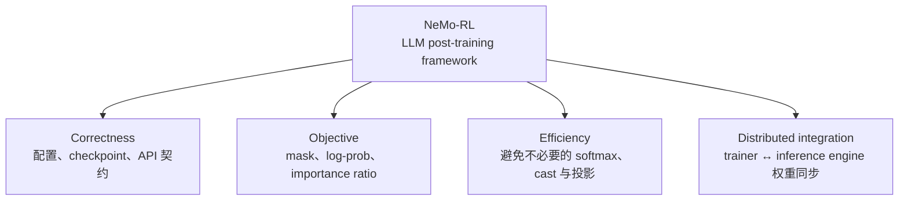

# 开源项目

**中文** · [English](README.en.md)

> 阅读时间：约 4 分钟 · 类型：栏目索引 · 时效性：Evolving · 最近审阅：2026-08

这里不按时间罗列 PR，而是记录我怎样在一个真实的后训练框架里判断问题：**系统声称要做什么，代码实际做了什么，两者之间的差距该怎样证明和修复。**

目前主要写 [NVIDIA NeMo-RL](nemo-rl/)。它覆盖 SFT、RL、蒸馏，以及训练器和推理引擎之间的协作。我的贡献大致落在四条线上：

这四类问题看似分散，其实都在问同一件事：**训练代码是否忠实、经济地实现了我们以为自己在优化的目标。**

## 从哪里开始看

| 如果你关心 | 建议先读 | 核心问题 |
| --- | --- | --- |
| 后训练 correctness | [设置了，但没生效](nemo-rl/#config-correctness) | 为什么静默失败比直接崩溃更危险？ |
| 数学与性能 | [算了一个会被抵消的东西](nemo-rl/#compute-efficiency) | 怎样证明一大片计算不会影响最终结果？ |
| RL 目标实现 | [说要做，但没做](nemo-rl/#objective-correctness) | 一个错误 mask 怎样进入 importance ratio 和梯度？ |
| 分布式系统 | [补一块缺失的能力](nemo-rl/#distributed-integration) | 训练权重怎样跨节点进入另一种并行布局的推理引擎？ |

## 贡献地图

与其看 PR 数量，更清楚的方式是看它们守住了哪一层：

| 方向 | 代表性贡献 | 状态 |
| --- | --- | --- |
| 配置与可复现性 | [#3271](https://github.com/NVIDIA-NeMo/RL/pull/3271) 配置键告警 · [#3389](https://github.com/NVIDIA-NeMo/RL/pull/3389) 数据集参数生效 · [#3071](https://github.com/NVIDIA-NeMo/RL/pull/3071) checkpoint tie-breaking | 已合并 |
| 蒸馏与推理效率 | [#3314](https://github.com/NVIDIA-NeMo/RL/pull/3314) 去掉全词表 log-softmax · [#3484](https://github.com/NVIDIA-NeMo/RL/pull/3484) 跳过 softmax 物化 | 已合并 |
| 目标与接口 correctness | [#3551](https://github.com/NVIDIA-NeMo/RL/pull/3551) log-prob mask · [#3512](https://github.com/NVIDIA-NeMo/RL/pull/3512) advantage contract · [#3515](https://github.com/NVIDIA-NeMo/RL/pull/3515) 可达错误语义 | 审核中 |
| 计算与内存路径 | [#3564](https://github.com/NVIDIA-NeMo/RL/pull/3564) top-k 投影 · [#3496](https://github.com/NVIDIA-NeMo/RL/pull/3496) 延后 fp32 cast · [#3552](https://github.com/NVIDIA-NeMo/RL/pull/3552) 惰性可选依赖 | 审核中 |
| 训练 / 推理衔接 | [#3519](https://github.com/NVIDIA-NeMo/RL/pull/3519) SGLang 跨节点权重同步 | 审核中 |

## 我怎么判断一个改动值得提交

一个改动至少要回答三件事：

1. **Claim：**哪条 invariant 被破坏，或者哪部分计算可以证明是冗余的？
2. **Evidence：**是代码路径、数学恒等式、最小复现，还是会在错误实现下变红的 regression test？
3. **Boundary：**我验证了什么，没有验证什么；单卡结论能否外推到多节点？

详细笔记里保留的不是“最后改了哪几行”，而是这三步怎样建立。因为真正可迁移到下一个代码库的，是判断过程，不是 patch 本身。

## 继续阅读

- [NVIDIA NeMo-RL：从 correctness 到 distributed post-training](nemo-rl/)
- [查看合并到主干的 commits](https://github.com/NVIDIA-NeMo/RL/commits/main/?author=tianyi-zhang-02)
- [NeMo-RL repository](https://github.com/NVIDIA-NeMo/RL)
