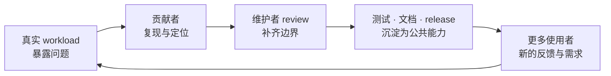
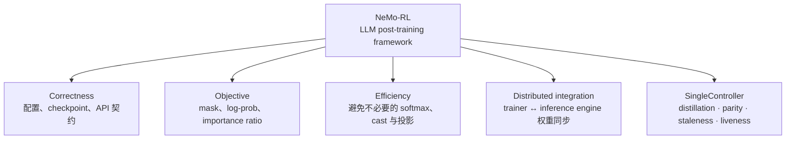

# AI Infra

**中文** · [English](README.en.md)

> 阅读时间：约 4 分钟 · 类型：栏目索引 · 时效性：Evolving · 最近审阅：2026-09

这一块放的是我真正碰过的 infra：在 NeMo RL 里做贡献，顺着一个个真实问题，把 post-training
系统慢慢看明白。

我的看法是：infra 本质上是个工程问题，光看是学不会的。要么进公司做，要么找个开源项目挖进去——
在真实的 workload 和 review 底下，你会被逼着把事情想清楚。科研在我眼里是执着地解决一个问题，
工程也一样，只是问题换了个样子。

## 想深入 AI Infra，可以先看这份

**[Awesome-ML-SYS-Tutorial](https://github.com/zhaochenyang20/Awesome-ML-SYS-Tutorial)** · [zhaochenyang20](https://github.com/zhaochenyang20)

如果你想往 ML Systems / AI Infra 深入，我很推荐这份笔记。它围绕真实的系统开发展开，涵盖 **RL infra、在线与离线推理、SGLang** 等方向，也有中英文内容。

- **想看 RL 怎么真正跑起来**：从 RLHF System Development Notes 入手，看训练和 rollout 怎么衔接。
- **想理解推理系统**：看 SGLang 相关笔记，跟着具体问题理解调度、显存和性能取舍。
- **对多模态推理感兴趣**：看 Omni Model Inference Notes，了解多阶段生成模型的执行与优化。

不用从头刷完，挑一个正在困扰你的问题，配着代码读就好。这里的 NeMo RL 笔记则继续记录我们实际参与的开源工作，两边可以对照着看。

## 这里记录什么

我不太想把开源写成一张 PR 成绩单。改动被合并当然开心，但更有意思的是后面：别人会用它跑训练，维护者会继续改它，下一个贡献者可能会接着往下做。自己修过的一小块代码，就这样变成了大家共同维护的东西。

我最初进入 NeMo RL 时其实很迷茫。论文里的算法能看懂，真实系统里的 rollout、trainer、inference engine、Ray actor、weight refit 却没有连成一幅图。我不是先弄懂了整套系统才开始贡献，而是一边修问题，一边慢慢把它看明白。

所以这里想记录的，不只是改了哪几行代码，还有：**一个不熟悉的仓库该从哪里看起？修完一个问题后，我多弄懂了什么？提交前还要补哪些测试？**

## 为什么我在意开源生态

闭门做项目时，只要当前实验能跑，很多问题可以暂时绕过去；upstream 不行。代码要面对不同硬件、不同配置、旧接口、未来重构和你从没见过的 workload。维护者会在 review 里追问边界，CI 会检查已有功能，使用者还会带来你没考虑过的场景。只证明“我这里能跑”是不够的。

这也是我在意开源生态的原因：大家不只是把仓库放出来，还在通过使用、反馈和修改，一起把代码变得更可靠。好的贡献不仅修掉今天的 bug，还让下一次同类错误更难发生，让后来的人更容易看懂系统为什么这样设计。

## 我目前在 NeMo RL 里追的主线

[NVIDIA NeMo-RL](nemo-rl/) 覆盖 SFT、RL、蒸馏，以及训练器和推理引擎之间的协作。看它的代码时，经常需要来回对照公式、接口和分布式执行过程。最近我的重点已经从单点 correctness 扩展到 **SingleController**：让异步 rollout、训练、蒸馏和权重同步在一个共享 data plane 上保持算法语义一致。

这些问题看似分散，其实都在问同一件事：**代码实际优化的目标，是否和我们想的一样；计算过程中又有没有白做的工作。** 这些细节看起来不起眼，却可能决定训练结果还能不能按原来的设想解释。

## 从哪里开始看

| 如果你关心 | 建议先读 | 核心问题 |
| --- | --- | --- |
| 为什么开始贡献 | [我为什么开始看“底层”](nemo-rl/#why-underlying) | “underlying”到底包含哪些层？ |
| NeMo RL 是什么 | [先看完整训练循环](nemo-rl/#what-is-nemo-rl) | 一个 post-training framework 连接了哪些组件？ |
| 异步 post-training | [SingleController 为什么出现](nemo-rl/#single-controller) | 怎样提高 rollout/training overlap，又不悄悄改变算法？ |
| 最近的工作 | [我目前在 SingleController 里补什么](nemo-rl/#current-work) | Distillation、correctness parity 和 observability 怎样串成一条线？ |
| 已合并的工作 | [从小修到 subsystem](nemo-rl/#merged-work) | 怎样从数学上删除无用计算，并守住实验配置？ |

## 这些贡献分别守住了哪里

下面按问题类型整理了这些改动，方便查找：

| 方向 | 代表性贡献 | 状态 |
| --- | --- | --- |
| 配置与可复现性 | [#3271](https://github.com/NVIDIA-NeMo/RL/pull/3271) 配置键告警 · [#3389](https://github.com/NVIDIA-NeMo/RL/pull/3389) 数据集参数生效 · [#3071](https://github.com/NVIDIA-NeMo/RL/pull/3071) checkpoint tie-breaking | 已合并 |
| 蒸馏与推理效率 | [#3314](https://github.com/NVIDIA-NeMo/RL/pull/3314) 去掉全词表 log-softmax · [#3484](https://github.com/NVIDIA-NeMo/RL/pull/3484) 跳过 softmax 物化 · [#3564](https://github.com/NVIDIA-NeMo/RL/pull/3564) 只投影 teacher top-k | 已合并 |
| SingleController distillation | [#3843](https://github.com/NVIDIA-NeMo/RL/pull/3843) teacher top-k data path · [#3846](https://github.com/NVIDIA-NeMo/RL/pull/3846) train-pump wiring · [#3849](https://github.com/NVIDIA-NeMo/RL/pull/3849) recipe 与 functional test | 审核中 |
| SingleController correctness | [#3786](https://github.com/NVIDIA-NeMo/RL/pull/3786) sample mask · [#3787](https://github.com/NVIDIA-NeMo/RL/pull/3787) reward/advantage semantics · [#3850](https://github.com/NVIDIA-NeMo/RL/pull/3850) valid-sample contract | 审核中 |
| SingleController observability | [#3759](https://github.com/NVIDIA-NeMo/RL/pull/3759) trajectory age · [#3783](https://github.com/NVIDIA-NeMo/RL/pull/3783) watchdog supervision · [#3760](https://github.com/NVIDIA-NeMo/RL/pull/3760) async PPO failure policy | 审核中 |
| 目标与接口 correctness | [#3551](https://github.com/NVIDIA-NeMo/RL/pull/3551) log-prob mask · [#3512](https://github.com/NVIDIA-NeMo/RL/pull/3512) advantage contract · [#3853](https://github.com/NVIDIA-NeMo/RL/pull/3853) reward-side KL clamp | 审核中 |
| 计算与内存路径 | [#3496](https://github.com/NVIDIA-NeMo/RL/pull/3496) 延后 fp32 cast · [#3552](https://github.com/NVIDIA-NeMo/RL/pull/3552) 惰性可选依赖 | 审核中 |
| 训练 / 推理衔接 | [#3519](https://github.com/NVIDIA-NeMo/RL/pull/3519) SGLang 跨节点权重同步 | 审核中 |

## 一个改动什么时候值得送到 upstream

准备提交改动前，我现在会先问自己 5 件事：

1. **问题是什么：**哪条本应成立的约束（invariant）被破坏了？或者，哪些计算可以证明是不必要的？
2. **怎么证明：**能否通过代码、数学推导或最小复现说明问题？能不能补一个在旧实现下会失败的回归测试？
3. **测到了哪一步：**哪些场景已经验证，哪些还没有？单卡上成立的结果，多节点上也成立吗？
4. **是否适合这个项目：**有没有沿用已有接口，保留兼容性，让维护者容易接着改？
5. **以后怎么维护：**半年后别人再改这里，能从测试和文档看懂为什么要这样写吗？

详细笔记会记录我是怎么定位问题、验证修改，以及和维护者讨论的。以后换一个仓库，这些经验可能比某一段 patch 更有用。

## 从迷茫到 subsystem ownership

不是专门挑容易合并的小改动，也不是一上来就重写核心模块。我更想逐渐看懂一个模块和周围组件的关系：先修小而确定的问题，理解维护者为什么拒绝某些漂亮方案，再慢慢做到可以负责一个接口、一条 correctness invariant，或者一段跨组件的数据流。

做开源让我学会了不能只说“这样改应该可以”，还要拿出复现、测试或测量结果。对系统的理解也是一点点积累的：先追一项配置、一个目标函数，再看数据怎么在组件之间流转，慢慢才有能力负责更大的一块。

一个模型能被大家用起来，背后往往有很多人在维护框架、接口、测试和文档。我也希望自己留下的不只是一串 PR 编号，而是几处可靠的改进，让后来的人少踩一点坑。

## 继续阅读

- [NVIDIA NeMo RL：从零散 PR 到理解 Post-Training 系统](nemo-rl/)
- [查看合并到主干的 commits](https://github.com/NVIDIA-NeMo/RL/commits/main/?author=tianyi-zhang-02)
- [NeMo-RL repository](https://github.com/NVIDIA-NeMo/RL)
