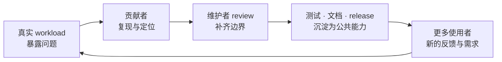
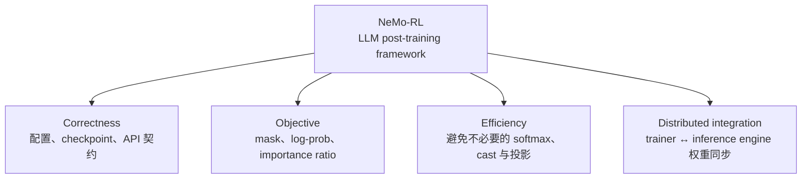

# 开源项目

**中文** · [English](README.en.md)

> 阅读时间：约 4 分钟 · 类型：栏目索引 · 时效性：Evolving · 最近审阅：2026-08

我不太想把开源写成一张 PR 成绩单。一个 patch 被合并当然开心，但真正吸引我的，是它之后不再只属于我：会被别人的训练任务跑到，被新的测试保护，被维护者继续修改，也可能成为下一个贡献者默认依赖的一块地基。

所以这里更想记录两件事：**我怎样在一个陌生而真实的代码库里建立判断，以及一个局部修复怎样长成生态里可复用的公共能力。**

## 为什么我在意开源生态

闭门做项目时，只要当前实验能跑，很多问题可以暂时绕过去；upstream 不行。代码要面对不同硬件、不同配置、旧接口、未来重构和你从没见过的 workload。维护者的 review、CI、文档与其他使用者，会一起逼你把“在我机器上可用”收紧成“别人可以放心依赖”。

这也是我理解的“生态”：不只是很多 repository 放在一起，而是一套会积累判断的反馈循环。好的贡献不仅修掉今天的 bug，还让下一次同类错误更难发生，让后来的人更容易看懂系统为什么这样设计。

## 我目前在 NeMo-RL 里追的主线

[NVIDIA NeMo-RL](nemo-rl/) 覆盖 SFT、RL、蒸馏，以及训练器和推理引擎之间的协作。它很适合训练这种判断，因为数学目标、框架接口和分布式执行必须同时对齐。我的贡献大致落在四条线上：

这四类问题看似分散，其实都在问同一件事：**训练代码是否忠实、经济地实现了我们以为自己在优化的目标。** 这也是我愿意长期做维护性贡献的原因——真正的模型能力，最后总要穿过这些看似不起眼的契约。

## 从哪里开始看

| 如果你关心 | 建议先读 | 核心问题 |
| --- | --- | --- |
| 后训练 correctness | [设置了，但没生效](nemo-rl/#config-correctness) | 为什么静默失败比直接崩溃更危险？ |
| 数学与性能 | [算了一个会被抵消的东西](nemo-rl/#compute-efficiency) | 怎样证明一大片计算不会影响最终结果？ |
| RL 目标实现 | [说要做，但没做](nemo-rl/#objective-correctness) | 一个错误 mask 怎样进入 importance ratio 和梯度？ |
| 分布式系统 | [补一块缺失的能力](nemo-rl/#distributed-integration) | 训练权重怎样跨节点进入另一种并行布局的推理引擎？ |

## 这些贡献分别守住了哪里

与其看 PR 数量，更清楚的方式是看它们守住了哪一层：

| 方向 | 代表性贡献 | 状态 |
| --- | --- | --- |
| 配置与可复现性 | [#3271](https://github.com/NVIDIA-NeMo/RL/pull/3271) 配置键告警 · [#3389](https://github.com/NVIDIA-NeMo/RL/pull/3389) 数据集参数生效 · [#3071](https://github.com/NVIDIA-NeMo/RL/pull/3071) checkpoint tie-breaking | 已合并 |
| 蒸馏与推理效率 | [#3314](https://github.com/NVIDIA-NeMo/RL/pull/3314) 去掉全词表 log-softmax · [#3484](https://github.com/NVIDIA-NeMo/RL/pull/3484) 跳过 softmax 物化 | 已合并 |
| 目标与接口 correctness | [#3551](https://github.com/NVIDIA-NeMo/RL/pull/3551) log-prob mask · [#3512](https://github.com/NVIDIA-NeMo/RL/pull/3512) advantage contract · [#3515](https://github.com/NVIDIA-NeMo/RL/pull/3515) 可达错误语义 | 审核中 |
| 计算与内存路径 | [#3564](https://github.com/NVIDIA-NeMo/RL/pull/3564) top-k 投影 · [#3496](https://github.com/NVIDIA-NeMo/RL/pull/3496) 延后 fp32 cast · [#3552](https://github.com/NVIDIA-NeMo/RL/pull/3552) 惰性可选依赖 | 审核中 |
| 训练 / 推理衔接 | [#3519](https://github.com/NVIDIA-NeMo/RL/pull/3519) SGLang 跨节点权重同步 | 审核中 |

## 一个改动什么时候值得送到 upstream

我现在会先问五件事：

1. **Claim：**哪条 invariant 被破坏，或者哪部分计算可以证明是冗余的？
2. **Evidence：**是代码路径、数学恒等式、最小复现，还是会在错误实现下变红的 regression test？
3. **Boundary：**我验证了什么，没有验证什么；单卡结论能否外推到多节点？
4. **Fit：**这个方案是否顺着项目现有的抽象、兼容性和维护方式，而不是只在我的分支上最漂亮？
5. **Afterlife：**六个月后别人改到这里，测试和文档能否告诉他这条约束为什么存在？

详细笔记里保留的不是“最后改了哪几行”，而是这些判断怎样建立。因为真正可迁移到下一个代码库的，是定位问题、画清边界、与维护者对齐的过程，不是 patch 本身。

## 我希望自己成为怎样的 contributor

不是专门挑容易合并的小改动，也不是一上来就重写核心模块。我更想逐渐对一段系统形成上下文：先修小而确定的问题，理解维护者为什么拒绝某些漂亮方案，再慢慢做到可以负责一个接口、一条 correctness invariant，或者一段跨组件的数据流。

开源对我最大的价值也在这里。它把“我觉得这个设计合理”变成一个公开、可反驳、必须被证据支持的技术判断；也让我看到，一项能力真正落地，从来不只靠某个模型或某个作者，而是靠整个生态把它托住。

## 继续阅读

- [NVIDIA NeMo-RL：从 correctness 到 distributed post-training](nemo-rl/)
- [查看合并到主干的 commits](https://github.com/NVIDIA-NeMo/RL/commits/main/?author=tianyi-zhang-02)
- [NeMo-RL repository](https://github.com/NVIDIA-NeMo/RL)
