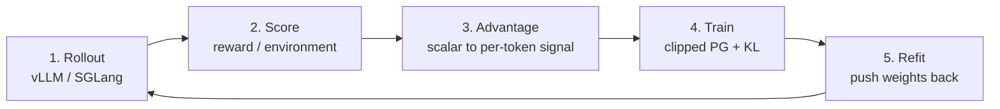

# NVIDIA NeMo-RL: hunting for terms that don't earn their place

[中文](nemo-rl.md) · **English** · [Back to Open source](README.en.md)

> Reading time: ~12 min · Type: Contribution notes · Freshness: Evolving · Last reviewed: 2026-08

## What the library does

NeMo-RL is NVIDIA's open-source **LLM post-training** framework. Post-training is everything after pretraining: SFT, RLHF, GRPO/PPO, distillation. Comparable projects are verl, OpenRLHF, TRL and slime.

At its core is a loop:

Mapped to code:

| Stage | Where |
| --- | --- |
| 1. Rollout | `models/generation/{vllm,sglang,megatron,trtllm}/` |
| 2. Score | `environments/`, reward model |
| 3. Advantage | `algorithms/advantage_estimator.py` |
| 4. Train | `algorithms/loss/loss_functions.py` |
| 5. Refit | `weight_sync/`, `utils/checkpoint_engines/` |

## The genuinely hard part

**The same policy exists in two places at once, sharded differently.**

The trainer shards for training (FSDP / DTensor / Megatron TP-PP-CP); the inference engine shards for serving (vLLM or SGLang TP). Every step, weights move from one to the other — that is refit. Same GPUs is "colocated" (CUDA IPC, fast); different GPUs is "non-colocated" and has to cross the network.

There is a subtler problem: **the logprob of a token has to agree between the two**. The engine computes it during generation; the trainer recomputes it during training. If they disagree, the importance ratio `π_θ / π_old` is wrong — and the whole PPO / GRPO objective rests on that ratio.

Most of what I changed lands in stages 4 and 5.

---

## 1 · Objective math

My favourite category: **read the objective and ask whether each term earns its place.**

### Computing something that cancels

In same-vocabulary top-k knowledge distillation, the student ran `log_softmax` over the **entire** vocabulary (~150k columns) when the loss only uses K≈64 of them.

The key observation: the normalizer `log Z` is common to every term and **cancels in the top-k ratio**. Since it cancels, the full-vocab normalization is pure waste — do it over the gathered K columns instead.

The same shape showed up three more times:

- Computing one sampled token's logprob materialized the whole softmax distribution
- The distillation path upcast a `[B, S, V]` tensor to fp32 **before** gathering K columns. But `gather → cast` and `cast → gather` are numerically identical, so the upcast can move after the gather and act on `[B, S, K]`
- Cross-tokenizer P-KL projected the student onto the **full** teacher vocabulary (128k columns) and then kept `vocab_topk = 8192`. About 94% of the columns were computed, materialized in fp32, all-reduced across the TP group, and thrown away

The argument for the last one is the same as the first: the projection is a sparse matmul, so **each teacher column is an independent contraction** over the student axis — discarded columns cannot influence kept ones, so the slice can move before the matmul. The one thing that would break the identity is a renormalization over the full vocabulary, and the only renormalization in the code happens *within* the top-k subset.

> **A trap I fell into.** I first wrote the equivalence test as `torch.equal` (bitwise). It passed alone and failed inside the full suite. The two matmuls have different **widths** (128k vs 8192 columns), so BLAS is free to block and accumulate differently — floating-point addition is not associative. I switched to a tolerance assertion and stated plainly in the PR that this is *not* bitwise identical.
>
> That lesson is worth more than the change itself: **"mathematically equivalent" and "bitwise identical" are different claims**, and conflating them gets caught in CI.

### Saying one thing, doing another

There is a function called `mask_out_neg_inf_logprobs`. It prints *"…Masking out these positions."*, computes a narrowed mask — and then **returns only the logprobs, discarding the mask.**

All five call sites carry on with the un-narrowed mask.

The substituted `0.0` is not neutral: `log p = 0` means **p = 1**. The generation-side logprob at the same position is finite by construction (around −5.4), so a fabricated difference of `exp(5.4) ≈ 224` flowed into the train/inference mismatch health metrics. Worse: under sequence-level importance sampling (GSPO) that difference is **summed across the sequence and exponentiated**, so an inflated weight multiplies the whole sequence's loss — a gradient effect, not just a dirty metric.

The strongest corroboration is written in the repo itself: elsewhere the same filtering is disabled for the reference policy because *"-inf mismatches … cannot be resolved by masking"*. The authors already distrusted the mechanism.

### Six implementations, three return shapes

Six advantage estimators: some returned a tensor, some a tuple, some parked their metrics on the instance for callers to fish out with `hasattr`. Call sites became `isinstance` guessing games.

This is not six separate bugs. **It is a missing contract.** Once they all return one dataclass, callers stop guessing.

> This one broke on first submission, in a very typical way: after my branch was cut, main **added new test doubles** that still returned bare tuples, while I had deleted the compatibility branch. The lesson — a PR that changes a contract must be re-tested *after* rebasing onto current main. Green on your own branch means nothing.

---

## 2 · Config that silently does nothing

The second category: **the user thinks a setting took effect, and nothing happened.**

- Misspell a key in a dataset config and it is dropped with no error and no warning
- Another dataset's `subset` parameter was documented, accepted, and never read; the documented validation split was also wrong
- Choosing the best checkpoint on a metric tie depended on iteration order — not reproducible. A tie means they are equally good by that metric, so the later one has seen more data and is the better default
- A carefully written error message was **dead code**: the function read a dictionary key before resolving the thing that populates it, so the failure surfaced as a bare `KeyError` and the descriptive message could never fire

That last one deserves emphasis. **Silent failure is more expensive than a crash.** A crash at least tells you where to look; a silently ignored setting lets you keep tuning with a wrong mental model, possibly for days.

---

## 3 · The trainer↔inference seam

This category is different in kind: not finding faults, but adding a missing capability.

A maintainer filed an issue: **extend cross-node weight synchronization to the SGLang backend.** Only vLLM supported it.

The root cause is structural:

- **vLLM** runs framework code **inside the engine process** (via a worker extension), so a receive loop can write weights directly into engine memory
- **SGLang** is an HTTP server spawned as a subprocess — **there is no such hook**

My approach: terminate the cross-node transport inside the Ray actor (which sits on the same node as the SGLang server), land the weights in local GPU memory, and reuse a channel that is **already running in production** for the last hop — that HTTP request carries CUDA IPC handles, not weight data, so it never touches the network.

One extra wrinkle: each rank computes its transport bucket boundaries independently, while the receiving endpoint wants all tensor-parallel payloads in a single request. So the two streams have to be **re-aligned by weight name**.

> What this taught me was **not to start coding too early**. My first design rested on a clever assumption; I later found another framework (verl) had solved the same problem and picked a better shape — one receiver per inference GPU rather than cramming them all into a single actor. Two extra hours of reading someone else's implementation saved a rewrite.

This is also the only place I needed real GPUs, and the boundary is sharp: one node can prove *"an IPC handle imported across processes lands bit-exact"*; it cannot prove the cross-node network path, which needs two nodes I do not have. **Writing that boundary into the PR beats pretending it was covered.**

---

## 4 · Engineering: importing a module should not load half an ecosystem

Not strictly objective math, but the process was interesting.

Importing the training entrypoint pulled in wandb, mlflow, swanlab, matplotlib, fastapi and uvicorn. Every CLI invocation, every Ray actor and every test collection paid for it — 7150 modules, about 9 seconds.

**The point is not to chase the wrong source.** I first measured a change that moved a `fastapi` import out of an inference backend: module count went **7150 → 7150**. Unchanged. The real source was training entrypoint → memory-tracking utility → `from ray.scripts.scripts import memory_summary`, i.e. Ray's **CLI entrypoint**, dragging in the dashboard stack.

Another interesting constraint: the logging module's tests contain about 100 `patch("…logger.wandb")` targets. Moving those imports into functions removes the module attribute and breaks 28 tests — a bad trade for a startup-time change. A lazy proxy object kept the module-level names, kept every patch target working, and **changed zero tests**.

Result: **9.04s → 3.77s, 7150 → 5256 modules**, with all four heavy dependencies gone from the import graph.

---

## Looking back: the method mattered more than the results

Seven changes merged, several under review. The reusable lessons are few:

**Verify before proposing.** Several attractive ideas died before I wrote any code — the optimization already existed, or nothing reached that path. **An idea you can kill yourself is one a maintainer should not spend time killing.**

**"It runs" is not "it is tested".** My alignment test for a critical function asserted only weight *names*, not values — and the implementation itself enforces name equality, so the assertion was **invariant under any rank permutation**. Deliberately mutating the code to deliver every shard to the wrong rank left the whole suite green. Tests that cannot detect a regression are worse than no tests, because they manufacture confidence. Since then: **write the test, then break the implementation on purpose and confirm it goes red.**

**State what you did not verify.** Every PR has a section listing what I could not check. It looks like weakening your case; it does the opposite. What reviewers fear is the pit they cannot see — draw the boundary and they are more willing to merge.

**The most expensive mistake is publishing a wrong technical claim.** A few analyses produced confident but incorrect conclusions — that a config took a particular branch, that a change was a no-op. Checked against the code line by line, not one survived. **In public, the cost of a wrong technical assertion is far higher than the cost of being half an hour late.**
