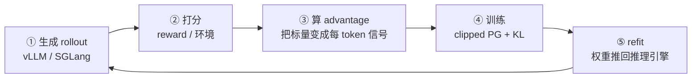

# NVIDIA NeMo-RL：在别人的训练框架里找多余的项

**中文** · [English](nemo-rl.en.md) · [返回开源项目](README.md)

> 阅读时间：约 12 分钟 · 类型：贡献笔记 · 时效性：Evolving · 最近审阅：2026-08

## 这个库是干什么的

NeMo-RL 是 NVIDIA 开源的 **LLM 后训练框架**。后训练指预训练之后的一切：SFT、RLHF、GRPO/PPO、蒸馏。同类的还有 verl、OpenRLHF、TRL、slime。

它的核心是一个循环：

对应到代码：

| 环节 | 位置 |
| --- | --- |
| ① 生成 | `models/generation/{vllm,sglang,megatron,trtllm}/` |
| ② 打分 | `environments/`、reward model |
| ③ advantage | `algorithms/advantage_estimator.py` |
| ④ 训练 | `algorithms/loss/loss_functions.py` |
| ⑤ refit | `weight_sync/`、`utils/checkpoint_engines/` |

## 它真正的难点

**同一个策略同时存在于两个地方，而且切法不同。**

训练侧为训练而切（FSDP / DTensor / Megatron 的 TP-PP-CP），推理侧为服务而切（vLLM 或 SGLang 的 TP）。每走一步，权重要从前者搬到后者 —— 这就是 refit。两边在同一批卡上叫 colocated（走 CUDA IPC，快）；不在同一批卡上叫 non-colocated，得走网络。

还有一个更隐蔽的难点：**同一个 token 的 logprob 要在两边算得一致**。生成时引擎算一次，训练时训练器再算一次。两者不一致，重要性比值 `π_θ / π_old` 就是错的 —— 而整个 PPO / GRPO 目标就建立在这个比值上。

后面会看到，我改的东西大多落在 ④ 和 ⑤ 这两块。

---

## 一 · 目标函数的数学

这一类是我最喜欢的：**读目标函数，问每一项是否配得上它的位置。**

### 算了一个会被抵消的东西

同词表的 top-k 知识蒸馏里，student 原本对**整个词表**（约 15 万列）做 log-softmax，但损失只用到其中 K≈64 列。

关键观察是：log-softmax 的归一化常数 `log Z` 对每一项都相同，**在 top-k 的比值里会抵消**。既然抵消，那次全词表归一化就是纯浪费 —— 直接在 gather 出来的 K 列上做即可。

同一个形状后来又出现了三次：

- 求某个已采样 token 的 logprob，只需要一个位置的值，却把整个 softmax 分布物化了出来
- 蒸馏路径上把 `[B, S, V]` 整个升到 fp32，**再** gather 出 K 列。而 `gather → cast` 和 `cast → gather` 数值上等价，所以升精度可以放到 gather 之后，只对 `[B, S, K]` 做
- 跨词表蒸馏的 P-KL 把 student 投影到**完整**教师词表（128k 列），然后只保留 `vocab_topk = 8192` 列。约 94% 的列被算出来、物化成 fp32、跨 TP 做 all-reduce，然后丢掉

最后这个的论证和第一个是同一个：投影是稀疏矩阵乘，**每个教师列是对 student 轴的独立收缩**，所以被丢弃的列影响不了留下的列 —— 于是可以先切列再乘。唯一能破坏这个恒等式的是跨全词表的重归一化，而代码里的归一化恰好只在 top-k 子集内。

> **一个我自己踩的坑。** 我最初把等价性测试写成 `torch.equal`（要求逐位相同）。单独跑通过，放进整个测试套件就挂了。原因是两次矩阵乘的**宽度不同**（128k 列 vs 8192 列），BLAS 可以用不同的分块和累加顺序 —— 浮点加法不满足结合律。改成容差断言，并在 PR 里明确写「不是逐位相同」。
>
> 这个教训比改动本身值钱：**"数学上等价"和"浮点上逐位相同"是两件事**，混淆它们会在 CI 上被当场抓住。

### 说要做、但没做的事

有个函数叫 `mask_out_neg_inf_logprobs`。它会打印一行警告：*"…Masking out these positions."*，然后算出一个收窄的 mask —— **接着只返回 logprobs，把 mask 扔了。**

五个调用点全都继续用着原来那个没收窄的 mask。

而它填进去的替代值 `0.0` 不是中性的：`log p = 0` 意味着 **p = 1**。同一位置的 `generation_logprobs` 按构造是有限的（大约 −5.4），于是 `exp(5.4) ≈ 224` 这个凭空造出来的差值流进了训练/推理一致性的健康指标。更严重的是，在序列级重要性采样下，这个差值会**沿整条序列累加再取指数**，虚高的权重乘的是整条序列的损失 —— 这就不只是脏指标，是进梯度的。

最有力的旁证是仓库自己写的：另一处代码给参考策略关掉了同款过滤，理由是 *"-inf mismatches … cannot be resolved by masking"*。作者自己已经不信任这个机制了。

### 六个实现，三种返回形状

六个 advantage estimator，有的返回张量、有的返回元组、有的把 metrics 挂在实例上让调用方用 `hasattr` 去捞。于是调用点写成了 `isinstance` + `hasattr` 的猜谜。

这不是六个函数各自的问题，**是缺一个契约**。统一成一个数据类之后，调用方不用再猜。

> 这个改动上线前挂了。原因很典型：分支切出去之后，主干**新增了几个测试替身**仍然返回裸元组，而我删掉了兼容分支。教训是 —— 改契约的 PR，必须在 rebase 到最新主干**之后**再跑一遍测试，光看自己分支上是绿的没有意义。

---

## 二 · 静默失效的配置

第二类是：**用户以为设置生效了，其实什么都没发生。**

- 一个数据集配置里写错一个键，系统不报错、不告警，直接丢掉
- 另一个数据集的 `subset` 参数，文档里写着、配置里接受、代码里从不使用；顺带发现文档描述的验证集划分也是错的
- 选最佳 checkpoint 时，如果两个指标打平，选哪个取决于遍历顺序 —— 不可复现。打平意味着按这个指标它们一样好，那更晚的那个见过更多数据，是更合理的默认
- 一句精心写好的报错是**死代码**：函数在解析目标之前就去读一个字典键，而那个键只有在解析成功的分支里才会被写入。所以出错时程序死于一个裸 `KeyError`，那句为这个情况专门写的描述性报错永远执行不到

最后这条值得多说一句。**沉默的失败比崩溃更贵** —— 崩溃至少告诉你去哪看；静默忽略让你带着一个错误的心智模型继续调参，可能几天后才发现。

---

## 三 · 训练器与推理引擎的接缝

这一类和上面两类性质完全不同：不是挑毛病，是补一块缺失的能力。

维护者开了一个 issue：**给 SGLang 后端接上跨节点的权重同步**。当时只有 vLLM 支持。

根因是两个后端的结构不同：

- **vLLM** 让框架的代码跑在**引擎进程内**（通过 worker extension），所以接收循环可以直接把权重写进引擎显存
- **SGLang** 是一个被拉起的 HTTP 服务子进程，**没有这个钩子**

我的方案是：让跨节点传输在 Ray actor 里终结（它和 SGLang 服务在同一节点），权重落到本地显存，最后一跳复用一条**已经在生产里跑着**的通道 —— 那个 HTTP 请求里传的是 CUDA IPC 句柄，不是权重数据，所以不走网络。

额外要处理的是：各 rank 的传输分桶边界是独立算的，而接收端要求一次请求带上所有 TP rank 的载荷，所以两条流要**按权重名重新对齐**。

> 这个 PR 教我的是**别急着写代码**。我最初的设计里有一个自认为聪明的假设，后来发现另一个框架 verl 早就解决过同样的问题，而且选了一个更好的形状 —— 每张推理卡一个接收者，而不是把所有接收者塞进一个 actor。多花两小时读别人的实现，省掉了一次重写。

另外，这块也是我唯一需要真卡的地方。单卡能证的和证不了的，边界很清楚：能证「IPC 句柄跨进程导入后权重逐位正确」，证不了跨节点的网络传输 —— 后者需要两个节点，而我没有。**把这条边界写在 PR 里，比假装覆盖了要好。**

---

## 四 · 工程：导入一个模块不该拉起半个生态

最后一类严格说不算目标函数，但过程有意思。

`import` 训练入口模块会连带加载 wandb、mlflow、swanlab、matplotlib、fastapi、uvicorn。而每次命令行调用、每个 Ray actor、每次跑测试都要付这个代价 —— 加载 7150 个模块，约 9 秒。

**关键是别追错源头。** 我先量了一个"把某个推理后端里的 fastapi 导入移走"的改法 —— 模块数 **7150 → 7150，纹丝不动**。真正的来源是训练入口 → 内存追踪工具 → `from ray.scripts.scripts import memory_summary`，Ray 的**命令行入口**把整个 dashboard 栈拖了进来。

还有个约束很有意思：日志模块的测试里有约 100 处 `patch("…logger.wandb")`。直接把 import 挪进函数会让这些名字在模块上消失，挂掉 28 个测试。为一个启动速度的改动去改 28 个测试，是很糟的交换。最后用了惰性代理对象 —— 模块级名字还在、patch 照常工作、**一行测试都没改**。

结果：**9.04s → 3.77s，7150 → 5256 个模块**，四个重依赖全部不再加载。

---

## 回头看：方法比结果重要

七个改动合并、若干个在审。真正可复用的经验只有几条：

**先验证，再提议。** 有好几个看起来很漂亮的想法，在动手前被自己推翻了 —— 有的是那个优化已经存在，有的是那条路径根本没人走。**能被自己杀掉的想法，就不该让维护者花时间去杀。**

**"跑通了"不等于"测到了"。** 我给一个关键函数写的对齐测试，只断言了权重的名字、没断言数值。而实现本身就强制了名字一致 —— 所以那个断言在**任何 rank 排列下都恒为真**。把代码故意改成把每个分片发给错误的 rank，整个测试套件依然全绿。这类"测不出回归"的测试，比没有测试更危险，因为它给人虚假的安全感。后来我养成习惯：**写完测试就故意把实现改坏，确认它真的会红。**

**主动说出自己没证到的东西。** 每个 PR 里我都写了一节"我没验证的部分"。这看起来是在削弱自己，实际相反 —— 审稿人最怕的是看不见的坑，你把边界画出来，他反而敢合。

**最贵的错误是把一个不成立的结论写进公开评论。** 有几次分析给出了很有说服力但错误的结论 —— 比如断言某个配置文件走了某条分支、断言某个改动是无效的。回到代码逐条核对之后，它们没有一条站得住。**在公开场合，一个错误的技术论断的成本，远高于晚发半小时。**
