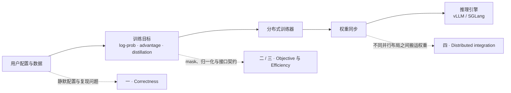
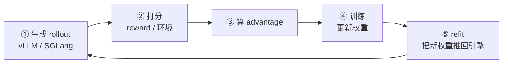

# NVIDIA NeMo-RL：从 correctness 到 distributed post-training

**中文** · [English](nemo-rl.en.md) · [返回开源项目](README.md)

> 阅读时间：约 12 分钟 · 类型：贡献笔记 · 时效性：Evolving · 最近审阅：2026-08

NeMo-RL 是 NVIDIA 开源的 LLM 后训练框架，覆盖预训练之后的 SFT、RL、蒸馏，以及训练器与推理引擎之间的协作。

我的主线不是“修零散 bug”，而是检查三层是否对齐：**配置表达的实验、目标函数表达的数学、分布式执行表达的系统行为。** 不对齐时，要么训练在优化错误目标，要么花大量资源计算最后不会影响结果的东西。

先看全图，再按兴趣跳读：

下面按理解成本由低到高展开。第一部分只需要软件工程常识；最后一部分才进入训练器和推理引擎的分布式接缝。

---

## 一 · 设置了，但没生效

先从最不需要背景的一类说起。这类问题跟机器学习没什么关系，任何有配置文件的系统都会得这个病：用户写了一行配置，程序收下了，然后什么也没发生。不报错，不告警。

我修过四个：

数据集配置里写错一个键，会被静默丢掉。你以为设置生效了，其实那行字从头到尾没人读过。（[#3271](https://github.com/NVIDIA-NeMo/RL/pull/3271)，已合并）

另一个数据集的 `subset` 参数更彻底，文档里写着、配置里接受、代码里从来不用。查这个的时候顺手发现文档描述的验证集划分也是错的。（[#3389](https://github.com/NVIDIA-NeMo/RL/pull/3389)，已合并）

选「最佳 checkpoint」的时候，如果两个指标打平，选哪一个取决于遍历顺序。同样的实验跑两次可能拿到不同的模型。（[#3071](https://github.com/NVIDIA-NeMo/RL/pull/3071)，已合并）

最后一个我很喜欢：有一句写得很清楚的报错，是死代码。函数在解析目标之前，就去读一个只有解析成功才会被写入的字典键。所以真出错的时候，程序死于一个裸 `KeyError`，那句为这个情况精心准备的提示，永远轮不到它出场。（[#3515](https://github.com/NVIDIA-NeMo/RL/pull/3515)，审核中）

这类问题值得修，是因为沉默的失败比崩溃贵得多。崩溃至少告诉你去哪儿看；静默忽略会让你带着一个错误的心智模型继续调下去，而且你会先怀疑算法、怀疑数据，最后才想到去怀疑那行配置。

---

## 二 · 算了一个会被抵消的东西

第二类需要一点数学，但每个论证都很短，不用读论文。

最干净的一个是知识蒸馏。学生模型原本对整个词表做 log-softmax，十五万列，而损失只用得上其中六十四列。

关键只有一句话：log-softmax 的归一化常数 `log Z` 对每一项都是同一个数，在 top-k 的比值里会抵消掉。既然会抵消，那次全词表的归一化就是白算的，直接在取出来的六十四列上做就行。（[#3314](https://github.com/NVIDIA-NeMo/RL/pull/3314)，已合并）

有意思的是，认出这个形状之后，就会到处看见它：

| 场景 | 实际算了 | 真正需要 |
| --- | --- | --- |
| 求某个 token 的概率（[#3484](https://github.com/NVIDIA-NeMo/RL/pull/3484)） | 整个 softmax 分布 | 一个位置的值 |
| 蒸馏路径升精度（[#3496](https://github.com/NVIDIA-NeMo/RL/pull/3496)） | 把 `[B, S, 15万]` 整个升到 fp32，再取 64 列 | 只对那 64 列升精度 |
| 跨词表蒸馏的投影（[#3564](https://github.com/NVIDIA-NeMo/RL/pull/3564)） | 投影到完整教师词表的 12.8 万列 | 只保留其中 8192 列 |

第二个的道理是，先取出来再升精度和先升精度再取出来，数值上完全一样，所以升精度这一步可以往后挪。

第三个最有嚼头。那个投影是一次稀疏矩阵乘，而矩阵乘的每个输出列，都是对输入轴的一次独立收缩——换句话说，被丢掉的那些列，在数学上根本影响不到留下来的列。既然如此，切片就可以挪到矩阵乘之前做，于是九成四的计算量、显存和跨卡通信一起消失。

唯一能破坏这个恒等式的，是在完整词表上做一次重新归一化。代码里恰好没有这一步，那里的归一化只发生在留下来的 8192 列内部。（[#3564](https://github.com/NVIDIA-NeMo/RL/pull/3564)，审核中）

我在这里踩了个坑，值得记下来。我把等价性测试写成了 `torch.equal`，也就是要求逐位相同。单独跑没问题，放进整个测试套件就挂了。原因是两次矩阵乘的宽度不一样，十二万八千列和八千一百九十二列，BLAS 可以用不同的分块和累加顺序，而浮点加法不满足结合律。「数学上等价」和「浮点上逐位相同」是两回事，我把它们混为一谈，结果在 CI 上被当场抓住。

---

## 三 · 说要做，但没做

这一类要求你知道目标函数长什么样，所以先补一点最小的背景。

强化学习训练里有个核心的量，叫重要性比值：同一个 token，在更新后的策略下和当初采样时的策略下，概率各是多少，两者相除。整个 PPO 和 GRPO 的目标都建立在这个比值上。所以比值算错，梯度就是错的。

有个函数叫 `mask_out_neg_inf_logprobs`。它会打印一行日志：

> *"…Masking out these positions."*（正在 mask 掉这些位置）

然后它确实算出了一个收窄后的 mask。接着它只把概率值返回出去，把那个 mask 扔了。五个调用点，全都还在用原来那个没收窄的 mask。（[#3551](https://github.com/NVIDIA-NeMo/RL/pull/3551)，审核中）

这为什么不是小事？因为被「mask 掉」的位置，填进去的值是 `0.0`。而这里是对数概率，`log p = 0` 意味着 `p = 1`。这不是「忽略这个位置」，这是「百分之百确定」。

同一个位置在采样时的真实概率是有限的，对数大约是负五点四。于是 `exp(5.4) ≈ 224` 这么一个凭空造出来的比值，就流进了训练和推理一致性的健康指标里。更糟的是，如果 importance ratio 按整条序列聚合，这个差值会先沿序列累加再取指数，最后让虚高的权重乘上整条序列的损失。到这一步就不只是指标脏了，是真的进梯度。

最有说服力的旁证，其实是仓库自己写的。另一处代码给参考策略关掉了同款过滤，理由写着 *"-inf mismatches … cannot be resolved by masking"*。作者自己早就不信任这个机制了。

顺带说一个相邻的问题。六个 advantage estimator，有的返回张量，有的返回元组，还有的把指标挂在实例上让调用方用 `hasattr` 去捞。于是调用点写成了猜谜游戏。这不是六个函数各自有毛病，是缺一个契约，统一成一个数据类就解决了。（[#3512](https://github.com/NVIDIA-NeMo/RL/pull/3512)，审核中）

这个改动第一次提交的时候挂了，原因很典型：我的分支切出去之后，主干新增了几个测试替身，仍然返回裸元组，而我把兼容分支删掉了。教训是改契约的 PR 必须 rebase 到最新主干之后再跑一遍测试，绿在自己分支上不说明任何问题。

---

## 四 · 补一块缺失的能力

前面三类都是找毛病，这一类不一样，是补一块本来就没有的能力。它也是唯一需要真卡的，和唯一由维护者点名要的。

要讲清楚它，得先看整个循环长什么样：

前面三类问题都发生在第三步和第四步，这一类在第五步。

难点在于，同一个策略同时存在于两个地方，而且切法不一样。训练侧为了训练而切，推理侧为了服务而切。每走完一步，权重得从前者搬到后者，这个动作叫 refit。如果两边在同一批卡上，走 CUDA IPC 就行，很快；不在同一批卡上，就得过网络。

维护者开了个 issue：跨节点的权重同步目前只支持 vLLM，能不能也支持 SGLang。（[#3519](https://github.com/NVIDIA-NeMo/RL/pull/3519)，审核中）

根因是两个后端的结构不同。vLLM 让框架的代码跑在引擎进程内部，所以接收循环可以直接把权重写进引擎的显存；而 SGLang 是一个被拉起来的 HTTP 服务子进程，压根没有这个钩子。

我的做法是让跨节点传输在 Ray actor 里终结——它和 SGLang 服务在同一个节点上——权重先落到本地显存，最后一跳复用一条已经在生产环境跑着的通道。那条通道的 HTTP 请求里传的是 CUDA IPC 句柄，不是权重数据本身，所以完全不过网络。

还有一件事得处理：每张卡的传输分桶边界是各算各的，而接收端要求一次请求带上所有卡的载荷，所以两条流得按权重名重新对齐。

这个 PR 教我的是别急着写代码。我最初的设计里有个自认为聪明的假设，后来发现 verl 早就解决过同样的问题，而且选了个更好的形状：每张推理卡配一个接收者，而不是把所有接收者塞进同一个 actor。多花两小时读别人的实现，省掉了一次重写。

至于验证，单卡能证什么、证不了什么，边界是清楚的。能证明 IPC 句柄跨进程导入之后权重逐位正确；证不了跨节点的网络传输，那需要两个节点，我没有。把这条边界老老实实写进 PR，比假装覆盖到了要好。

---

## 附 · 一个不属于上面任何一类的

`import` 一下训练入口模块，会连带把 wandb、mlflow、swanlab、matplotlib、fastapi、uvicorn 全拉起来，七千一百五十个模块，差不多九秒。而每次命令行调用、每个 Ray actor、每次跑测试，都要付这笔钱。

这件事的关键是别追错源头。我先量了一个看起来很合理的改法，把某个推理后端里的 fastapi 导入挪走，结果模块数七千一百五十，纹丝不动。真正的来源是训练入口引了内存追踪工具，而它引了 Ray 的命令行入口，那个东西把整个 dashboard 栈都拖了进来。

另一个约束也挺有意思。日志模块的测试里有大约一百处 patch 挂在模块级的名字上，直接把 import 挪进函数会让这些名字消失，一下挂掉二十八个测试。为了一个启动速度的改动去改二十八个测试，是很糟的交换。最后用惰性代理对象绕过去了：名字还在，patch 照常工作，一行测试都没动。

结果是九点零四秒降到三点七七秒，模块数从七千一百五十降到五千二百五十六。（[#3552](https://github.com/NVIDIA-NeMo/RL/pull/3552)，审核中）

---

## 回头看

真正能复用的经验只有四条。

**先验证，再提议。** 好几个看起来很漂亮的想法，在动手之前就被我自己推翻了，有的是那个优化早就存在，有的是那条路径根本没人走。能被自己杀掉的想法，就不该让维护者花时间去杀。

**「跑通了」不等于「测到了」。** 我给一个关键函数写的测试，只断言了权重的名字，没断言数值。而实现本身就强制名字一致，所以那个断言在任何排列下都恒为真。我故意把代码改成把每个分片发给错误的卡，整个测试套件依然全绿。这种测试比没有测试更危险，因为它制造虚假的安全感。之后我养成了习惯：写完测试就故意把实现改坏，确认它真的会红。

**主动说出自己没证到的东西。** 每个 PR 我都写一节「我没验证的部分」。看起来像在削弱自己，实际正好相反——审稿人最怕的是看不见的坑，你把边界画出来，他反而敢合。

**最贵的错误，是把一个不成立的结论写进公开评论。** 有几次分析给出了很有说服力但错误的结论，回到代码里逐条核对之后，没有一条站得住。在公开场合，一个错误技术论断的成本，远高于晚发半小时。
