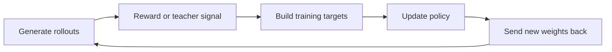
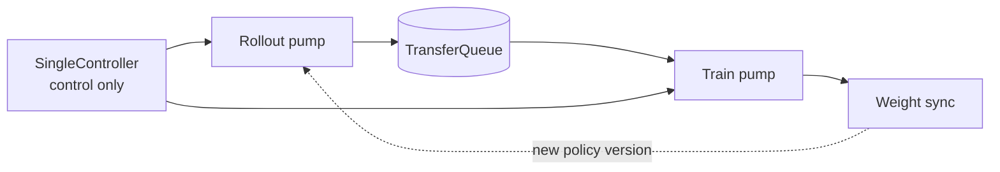
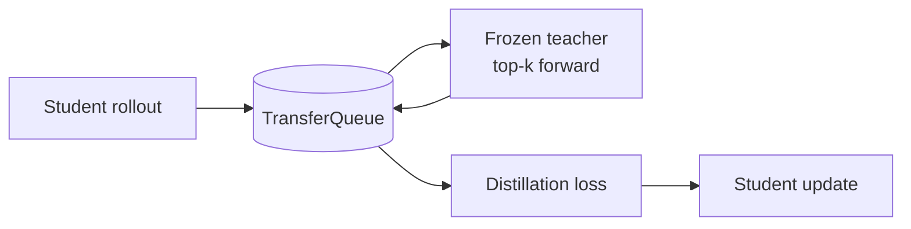

# NVIDIA NeMo RL: from isolated PRs to understanding a post-training system

[中文](README.md) · **English** · [Back to Open source](../README.en.md)

> Reading time: ~15 min · Type: Contribution notes · Freshness: Evolving · Last reviewed: 2026-08

## Why I started looking beneath the abstractions

When I first encountered LLM post-training, I knew the names—SFT, PPO, GRPO, distillation—and could follow the objectives in a paper. Once the diagram became a real codebase, however, I could not answer many basic questions clearly. Who generates the rollouts? Where are log-probabilities recomputed? Why do the trainer and inference engine each hold a copy of the model? How do updated weights return to generation? Does a configuration value ever reach the gradient?

I often heard people refer to the “underlying system,” but the phrase was vague. It does not simply mean CUDA, nor does reading deeper source files automatically produce understanding. I now think of it as a traceable chain:

| Layer | Question that has to be answered |
| --- | --- |
| Mathematical objective | What do the loss, ratio, KL term, and advantage require? |
| Tensor semantics | Do shapes, masks, normalization, and reductions preserve that meaning? |
| Runtime data flow | Which components carry rollouts, teacher signals, training targets, and model state? |
| Distributed execution | Where do data and weights move across GPUs, processes, and nodes, and are their versions consistent? |
| Open-source contract | Do configuration, interfaces, tests, and compatibility let other people depend on the path? |

Understanding what is underneath is therefore not knowing one lower-level term. It is being able to follow a research idea from its equation to its real execution and identify where each layer may diverge.

I began contributing to NeMo RL not because I had already resolved these questions, but because I had not. An open-source codebase gave me a concrete learning loop: start from a reproducible problem, follow the call chain to the real consumer, use mathematics or an experiment to show what is wrong, then let maintainers and CI test whether the claim survives.

My first changes were small: did a configuration take effect, did checkpoint selection behave deterministically, and was a full-vocabulary softmax doing work that could not affect the result? I gradually moved into masks, importance ratios, cross-tokenizer distillation, cross-node weight synchronization, and finally the newer asynchronous SingleController path. In retrospect these were not unrelated PRs. They were the order in which I learned the post-training system.

## Why open source matters here

When reading alone, it is easy to stop at “I mostly understand this.” Contributing upstream does not permit that shortcut. A claim must be explicit, a regression test must actually fail under the broken implementation, unverified boundaries must be stated, and people with deeper context must be able to challenge the reasoning line by line.

The value of open source is therefore more than publishing code or accumulating merged changes. It turns private understanding into public, inspectable, and extensible technical assets:

- a bug fix removes the current failure;
- a regression test makes the same failure harder to reintroduce;
- a clear interface or invariant makes the system easier to extend;
- review tightens a locally plausible idea into something other workloads can safely depend on.

The work covered in this note now spans more than twenty contributions: small correctness repairs, distillation efficiency, runtime safety, and asynchronous-training integration. The count shows sustained effort, but the more important change is that the context has begun to connect. I no longer see only the edited line; I ask which system contract the change protects.

My recent focus is **SingleController**, NeMo RL's newer asynchronous training path. It is a useful test of this understanding: what does asynchrony actually improve, and which algorithmic and systems problems does it make harder to hide?

<a id="what-is-nemo-rl"></a>

## What NeMo RL connects

Training a post-trained model does not end with one call to `loss.backward()`.

GRPO and on-policy distillation, for example, repeatedly execute a loop like this:



NeMo RL closes that loop and scales it across devices and nodes:

- vLLM or SGLang generates rollouts;
- an environment, reward model, or teacher provides the learning signal;
- DTensor or Megatron Core performs training;
- Ray coordinates workers;
- weight refit sends the updated policy back to the inference engine.

The framework supports SFT, DPO, GRPO, PPO-style training, and knowledge distillation. The difficult part is not the list of algorithm names. It is keeping data, model state, and weight versions semantically consistent across the entire loop.

<a id="single-controller"></a>

## Why SingleController exists

Synchronous training is easy to picture: wait for a complete rollout batch, take one training step, then refresh the generation model.

Rollouts do not finish uniformly. One slow environment or long response can leave the other GPUs waiting. SingleController lets generation and training continue independently:



SingleController itself is a CPU-only coordinator. It does not move large tensors or run model forward passes. It schedules the two pumps, chooses which rollouts enter training, supervises failures, and triggers weight synchronization at the right time.

TransferQueue is the data plane between them. Completed rollouts enter the queue, and the trainer draws a batch according to a sampler policy.

This arrangement overlaps generation and training, but it introduces a new problem: the trainer may consume data generated by an older policy. Better utilization makes policy freshness, importance correction, and failure supervision more important, not less.

<a id="current-work"></a>

## What I am adding to SingleController

### Put distillation inside the same loop

On-policy distillation can be summarized as follows: the student generates an answer, then a teacher examines the same token sequence and indicates which outputs it would prefer at each position.

SingleController already had rollout and policy update stages, but no teacher stage between them. My work makes the teacher a natural part of the train pump:



Several design choices matter here.

The teacher does not need a new abstraction. It is still a policy, except that it has no optimizer and never updates. The teacher and student can also share training GPUs: temporarily offload the student, run the teacher forward pass, then release the teacher. This saves resources, but only if the load and offload lifecycle is explicit.

Distillation also does not need reward, advantage, previous log-probabilities, or reference KL. An asynchronous framework cannot assume that every algorithm consumes one universal record. Each algorithm should declare the fields and stages it actually needs.

Finally, the teacher returns top-k logits and vocabulary indices. If teacher and student tokenizers are incompatible, tensors can still flow and produce plausible numbers with the wrong meaning. That mismatch should fail before model loading, not after the loss has begun returning values.

### Check that asynchrony did not quietly change the algorithm

The most dangerous bugs in an asynchronous migration are often not crashes. They are cases where a configuration still exists but no longer affects execution.

Examples include whether filtered samples actually disappear from the loss, whether reward scaling and advantage clipping enter the advantage computation, whether KL clamps stay consistent between reward and loss paths, and whether fully masked microbatches contaminate aggregated metrics.

They appear to be separate mask, configuration, and metric issues, but they protect one invariant:

> **Changing the runtime must not silently change the training objective.**

I therefore no longer stop when I see a configuration field or function call. I follow the value to its real consumer and verify that it changes the data entering the gradient.

### Make the runtime report how asynchronous it is

When rollout and training advance concurrently, the trainer may use data produced several policy updates ago. Higher throughput is not enough; the runtime must expose the age of that data:

```text
trajectory age = current training weight version
               - rollout starting weight version
```

The starting version matters because it is the policy that produced the tokens. The version observed at rollout completion only shows how far the trainer advanced during generation; it does not identify the behavior policy.

Failure supervision has a similar lifecycle issue. After the rollout pump exits, the train pump may still be draining the queue. A watchdog cannot disappear simply because the main producer is finished. A reliable asynchronous runtime must answer at least two questions: **how old is the training data, and is anything still supervising a stalled system?**

## The trade-off

SingleController is not unconditionally better.

**What it gains:**

- rollouts no longer wait at a full-batch barrier;
- generation and training can overlap;
- tensors stay in the data plane rather than passing through the controller;
- the sampler can make the throughput-versus-freshness trade-off explicit.

**What it adds:**

- data from older policies needs importance correction;
- algorithm-specific fields are easier to omit;
- the queue, sampler, two pumps, and model offload form a more complex state machine;
- unit tests can prove local invariants, while the complete multi-GPU path still needs functional validation.

I no longer begin with “is asynchrony faster?” I begin with whether we can still identify where each example came from, which policy produced it, which transformations it passed through, and who is responsible for stopping the system when something fails.

<a id="merged-work"></a>

## How the earlier contributions led here

My earlier merged work concentrated on data correctness and distillation efficiency.

On the data side, I worked on silent configuration, dataset-subset handling, and checkpoint tie-breaking. The shared failure mode was an experiment that appeared to run while executing something different from what the user configured.

On the efficiency side, I removed unnecessary full-vocabulary work from distillation and inference log-probability paths. The core technique was not writing a faster kernel. It was first proving that the final loss depends on only a subset of columns, then deleting softmax, casting, or projection work that cannot affect the result.

This progression explains why I moved toward SingleController. The valuable next step was no longer finding one more local optimization; it was learning which invariants an entire subsystem has to preserve. Local correctness, mathematical equivalence, and distributed data flow turned out not to be separate topics. They all protect the semantics of the experiment.

## How I would explain it in an interview

> NeMo RL is NVIDIA's open-source runtime for closing the post-training loop between rollout generation, reward or teacher signals, distributed policy updates, and weight synchronization.
>
> My recent focus is SingleController, its newer asynchronous path. It overlaps rollout generation and policy training through a shared data plane, which can improve utilization but also makes policy freshness, algorithm-specific data contracts, and failure supervision much more important.
>
> I have been using on-policy distillation as a concrete way to extend that architecture: introducing a frozen teacher into the same loop without forcing every algorithm through RL-specific stages. At the same time, I have been auditing whether moving to the new runtime preserves the semantics of masking, reward transformation, KL control, and metric aggregation, and whether the system exposes how stale its training data is.
>
> The common theme is not infrastructure for its own sake. It is understanding how an asynchronous learning system can become faster without becoming less faithful to the experiment the researcher intended.

## What matters to me now

I do not want to reduce open-source work to a PR count, or reduce “underlying systems” to knowing more low-level names. The important change is that I can form continuous judgment in one area: which constraints come from the algorithm, which are execution details, where optimization is safe, where the system should fail fast, and where only real multi-GPU evidence is sufficient.

Open source helped turn confusion into a sequence of falsifiable questions. Papers explain why a method might work; code shows how it actually happens; review and real workloads reveal what my understanding left out.

That is the beginning of subsystem ownership for me. It does not mean claiming to understand the entire framework. It means knowing which path to follow, what evidence can support a claim, and when to say explicitly that a boundary has not yet been verified.

<details>
<summary>Implementation and PR references</summary>

- SingleController distillation: [top-k data path #3843](https://github.com/NVIDIA-NeMo/RL/pull/3843), [teacher stage #3846](https://github.com/NVIDIA-NeMo/RL/pull/3846), [functional path #3849](https://github.com/NVIDIA-NeMo/RL/pull/3849)
- Algorithm parity: [sample mask #3786](https://github.com/NVIDIA-NeMo/RL/pull/3786), [reward / advantage #3787](https://github.com/NVIDIA-NeMo/RL/pull/3787), [valid samples #3850](https://github.com/NVIDIA-NeMo/RL/pull/3850), [KL clamps #3853](https://github.com/NVIDIA-NeMo/RL/pull/3853)
- Runtime safety: [trajectory age #3759](https://github.com/NVIDIA-NeMo/RL/pull/3759), [watchdog supervision #3783](https://github.com/NVIDIA-NeMo/RL/pull/3783), [config guards #3854](https://github.com/NVIDIA-NeMo/RL/pull/3854), [transport validation #3855](https://github.com/NVIDIA-NeMo/RL/pull/3855)
- Earlier merged work: [dataset config #3271](https://github.com/NVIDIA-NeMo/RL/pull/3271), [checkpoint selection #3071](https://github.com/NVIDIA-NeMo/RL/pull/3071), [top-k distillation #3314](https://github.com/NVIDIA-NeMo/RL/pull/3314), [inference log-prob #3484](https://github.com/NVIDIA-NeMo/RL/pull/3484), [cross-tokenizer projection #3564](https://github.com/NVIDIA-NeMo/RL/pull/3564)

</details>
