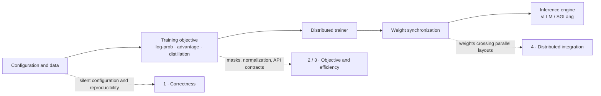
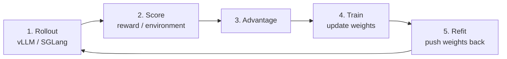

# NVIDIA NeMo-RL: from correctness to distributed post-training

[中文](README.md) · **English** · [Back to Open source](../README.en.md)

> Reading time: ~12 min · Type: Contribution notes · Freshness: Evolving · Last reviewed: 2026-08

NeMo-RL is NVIDIA's open-source LLM post-training framework, spanning SFT, RL, distillation, and coordination between trainers and inference engines.

The thread is not “fixing unrelated bugs.” It is checking whether three layers agree: **the experiment expressed by configuration, the mathematics expressed by the objective, and the system behavior expressed by distributed execution.** When they diverge, training either optimizes the wrong target or spends substantial resources on computation that cannot affect the result.

See the whole path first, then jump to the part you care about:

The sections move from low to high context. The first needs only software-engineering intuition; the last reaches the distributed seam between trainer and inference engine.

---

## 1 · Set, but never applied

Starting with the category that needs the least background. This one has little to do with machine learning — any system with a config file can catch it. The user writes a line, the program accepts it, and then nothing happens. No error, no warning.

I fixed four of these.

Misspell a key in a dataset config and it is silently dropped. You believe the setting took effect; in fact nobody ever read that line. ([#3271](https://github.com/NVIDIA-NeMo/RL/pull/3271), merged)

Another dataset's `subset` parameter went further: documented, accepted by the config, never used in the code. While chasing it I also found the documented validation split was wrong. ([#3389](https://github.com/NVIDIA-NeMo/RL/pull/3389), merged)

When picking the "best checkpoint", a tie on the metric resolved by iteration order. Run the same experiment twice and you can get different models. ([#3071](https://github.com/NVIDIA-NeMo/RL/pull/3071), merged)

My favourite was the last one: a clearly written error message that was dead code. The function read a dictionary key that only gets written on the success branch, and it read it *before* resolving the thing that would populate it. So a real failure died on a bare `KeyError`, and the message written specifically for that case never got its turn. ([#3515](https://github.com/NVIDIA-NeMo/RL/pull/3515), under review)

These are worth fixing because silent failure costs far more than a crash. A crash at least tells you where to look. A silently ignored setting lets you keep tuning with a wrong mental model — and you will suspect the algorithm and the data long before you suspect that line of config.

---

## 2 · Computing something that cancels

The second category needs a little maths, but each argument is short and none of them require reading a paper.

The cleanest one is in knowledge distillation. The student model was running `log_softmax` over the entire vocabulary — 150k columns — when the loss only ever uses 64 of them.

The whole argument is one sentence: the normalizer `log Z` is the same number for every term, so it **cancels** in the top-k ratio. Since it cancels, that full-vocabulary normalization is wasted work; doing it over the 64 gathered columns gives the same answer. ([#3314](https://github.com/NVIDIA-NeMo/RL/pull/3314), merged)

The interesting part is that once you recognize this shape, you see it everywhere:

| Situation | What was computed | What was needed |
| --- | --- | --- |
| One token's probability ([#3484](https://github.com/NVIDIA-NeMo/RL/pull/3484)) | The whole softmax distribution | One position's value |
| Upcasting in distillation ([#3496](https://github.com/NVIDIA-NeMo/RL/pull/3496)) | Cast `[B, S, 150k]` to fp32, *then* take 64 columns | Only those 64 columns in fp32 |
| Cross-tokenizer projection ([#3564](https://github.com/NVIDIA-NeMo/RL/pull/3564)) | Project onto the full 128k-column teacher vocabulary | Keep only 8192 of them |

The second one holds because gathering then casting and casting then gathering give identical values, so the cast can move later.

The third is the most interesting. That projection is a sparse matrix multiply, and each output column of a matmul is an independent contraction over the input axis — meaning the discarded columns cannot mathematically influence the ones kept. So the slice can move *before* the matmul, and about 94% of the compute, memory and cross-device communication simply disappears.

The one thing that would break the identity is a renormalization over the full vocabulary. There isn't one: the renormalization in that code happens strictly inside the 8192 columns that survive. ([#3564](https://github.com/NVIDIA-NeMo/RL/pull/3564), under review)

I fell into a trap here worth recording. I wrote the equivalence test as `torch.equal`, i.e. bitwise. It passed on its own and failed inside the full suite. The reason is that the two matmuls have different widths — 128k columns versus 8192 — so BLAS is free to block and accumulate differently, and floating-point addition is not associative. "Mathematically equivalent" and "bitwise identical" are two different claims; I conflated them and CI caught me immediately.

---

## 3 · Saying one thing, doing another

This category assumes you know roughly what the objective looks like, so here is the minimum background.

Reinforcement-learning training turns on a quantity called the importance ratio: for the same token, the probability under the updated policy divided by the probability under the policy that sampled it. The entire PPO and GRPO objective rests on that ratio, so if the ratio is wrong, the gradient is wrong.

There is a function called `mask_out_neg_inf_logprobs`. It prints a line:

> *"…Masking out these positions."*

It then genuinely computes a narrowed mask — and returns only the probabilities, discarding the mask. All five call sites carry on with the original, un-narrowed one. ([#3551](https://github.com/NVIDIA-NeMo/RL/pull/3551), under review)

Why does that matter? Because the value substituted at the "masked" positions is `0.0`, and these are *log* probabilities. `log p = 0` means `p = 1`. That is not "ignore this position"; that is "absolutely certain".

The true sampling-time probability at the same position is finite — a log of roughly −5.4. So a fabricated ratio of `exp(5.4) ≈ 224` flowed straight into the train/inference consistency metrics. Worse, under sequence-level importance sampling that difference is accumulated across the whole sequence and then exponentiated, so an inflated weight multiplies the entire sequence's loss. At that point it is no longer just a dirty metric; it reaches the gradient.

The most convincing corroboration is written in the repository itself. Elsewhere, the same filtering is disabled for the reference policy, with the reason given as *"-inf mismatches … cannot be resolved by masking"*. The authors had already stopped trusting the mechanism.

A neighbouring problem, while I was in there: six advantage estimators, some returning a tensor, some a tuple, some parking their metrics on the instance for callers to fish out with `hasattr`. Call sites had become guessing games. That is not six separate bugs — it is a missing contract, and one dataclass fixed it. ([#3512](https://github.com/NVIDIA-NeMo/RL/pull/3512), under review)

That change failed on first submission for a very typical reason: after my branch was cut, main added new test doubles that still returned bare tuples, and I had deleted the compatibility branch. The lesson is that a PR changing a contract has to be re-tested *after* rebasing onto current main. Green on your own branch proves nothing.

---

## 4 · Adding a capability that wasn't there

The first three categories are about finding faults. This one is different — it fills a gap. It is also the only one that needed real GPUs, and the only one a maintainer asked for by name.

To explain it, you need the loop:

The first three categories all live in steps 3 and 4. This one lives in step 5.

The difficulty is that the same policy exists in two places at once, sharded differently — the trainer shards for training, the inference engine shards for serving. After every step the weights have to move from one to the other, which is what refit means. If both sit on the same GPUs, CUDA IPC handles it and it is fast; if they don't, it has to cross the network.

A maintainer filed an issue: cross-node weight sync only works for vLLM, can it also work for SGLang? ([#3519](https://github.com/NVIDIA-NeMo/RL/pull/3519), under review)

The root cause is structural. vLLM runs framework code *inside* the engine process, so a receive loop can write weights straight into engine memory. SGLang is an HTTP service spawned as a subprocess, and there is simply no such hook.

My approach was to terminate the cross-node transport inside the Ray actor — which sits on the same node as the SGLang service — land the weights in local GPU memory, and reuse a channel already running in production for the last hop. That channel's HTTP request carries CUDA IPC handles rather than the weight data itself, so it never touches the network.

One more thing needed handling: each device computes its transport bucket boundaries independently, while the receiving end wants every device's payload in one request. So the two streams have to be re-aligned by weight name.

What this PR taught me was not to start coding too early. My first design rested on an assumption I was rather pleased with; I later found that verl had solved the same problem and picked a better shape — one receiver per inference GPU, rather than cramming them all into a single actor. Two extra hours reading someone else's implementation saved a rewrite.

As for validation, the boundary is clear. One node can prove that an IPC handle imported across processes lands bit-exact. It cannot prove the cross-node network path, which needs two nodes I do not have. Writing that boundary into the PR honestly beats pretending it was covered.

---

## Appendix · One that fits none of the above

Importing the training entrypoint pulls in wandb, mlflow, swanlab, matplotlib, fastapi and uvicorn — 7150 modules, about nine seconds. Every CLI invocation, every Ray actor and every test collection pays it.

The trick here was not chasing the wrong source. I first measured a very plausible-looking fix, moving a `fastapi` import out of one inference backend: module count 7150, completely unchanged. The real source was the training entrypoint pulling in a memory-tracking utility, which pulls in Ray's *command-line* entrypoint, which drags the whole dashboard stack along.

Another constraint made it interesting. The logging module's tests contain roughly a hundred patches aimed at module-level names; moving those imports into functions makes the names disappear and breaks 28 tests. Rewriting 28 tests to buy startup time is a bad trade. A lazy proxy object avoided it: the names stay, the patches keep working, and not a single test changed.

The result was 9.04s down to 3.77s, and 7150 modules down to 5256. ([#3552](https://github.com/NVIDIA-NeMo/RL/pull/3552), under review)

---

## Looking back

Only four things generalize.

**Verify before proposing.** Several attractive ideas died before I wrote any code — the optimization already existed, or nothing actually reached that path. An idea you can kill yourself is not one a maintainer should spend time killing.

**"It runs" is not "it is tested".** My test for one critical function asserted the weight *names* and not the values. But the implementation itself enforces name equality, so the assertion was true under any permutation. I deliberately mutated the code to send every shard to the wrong device and the whole suite stayed green. That kind of test is worse than no test, because it manufactures confidence. Since then I write the test, then break the implementation on purpose to confirm it really goes red.

**Say what you did not verify.** Every PR gets a section listing what I could not check. It looks like weakening your own case; it does the opposite. What reviewers fear is the pit they cannot see — draw the boundary and they become more willing to merge.

**The most expensive mistake is publishing a wrong technical claim.** A few analyses produced confident but incorrect conclusions. Checked line by line against the code, not one survived. In public, a wrong technical assertion costs far more than being half an hour late.
