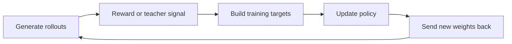
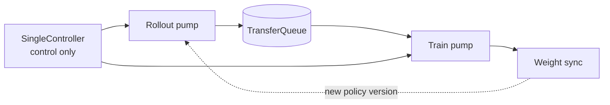
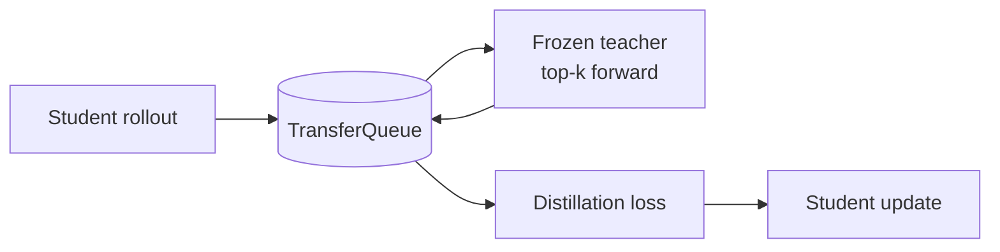

# NVIDIA NeMo RL：从零散 PR 到理解 Post-Training 系统

**中文** · [English](README.en.md) · [返回开源项目](../README.md)

> 阅读时间：约 15 分钟 · 类型：贡献笔记 · 时效性：Evolving · 最近审阅：2026-08

<a id="why-underlying"></a>

## 我为什么开始看“底层”

刚开始接触 LLM post-training 时，我知道 SFT、PPO、GRPO、distillation 这些名字，也能读懂论文里的目标函数。但一旦论文图变成真实代码，很多最基本的问题反而说不清：rollout 到底由谁生成，log-prob 在哪里重算，trainer 和 inference engine 为什么各有一份模型，训练后的权重怎样回到生成端，一条配置最后有没有真的改变梯度。

那段时间我经常听到 “underlying system” 或“底层原理”，但这个词很模糊。底层不是单独指 CUDA，也不是把框架源码读得越深越好。对我来说，它后来变成了一条可以追踪的链路：

| 层次 | 真正要回答的问题 |
| --- | --- |
| 数学目标 | 论文里的 loss、ratio、KL 和 advantage 到底要求什么？ |
| Tensor 语义 | shape、mask、normalization 与 reduction 是否保持了那个数学含义？ |
| Runtime 数据流 | rollout、teacher signal、training target 和 model state 经过哪些组件？ |
| 分布式执行 | 数据与权重在哪些 GPU、进程和节点之间移动，版本是否一致？ |
| 开源契约 | 配置、接口、测试和兼容性是否让别人可以可靠地依赖这条路径？ |

所谓理解 underlying，不是知道某一个更低层的名词，而是能够把一个研究想法从公式一路追到真实执行，并指出每一层可能在哪里偏离。

我开始给 NeMo RL 做贡献，并不是因为这些问题已经想明白了，恰恰是因为没有想明白。开源代码给了我一条很具体的学习路径：从一个可复现的问题出发，沿调用链找到真正的 consumer，用数学或实验说明哪里不对，再让维护者和 CI 检查我的判断是否站得住。

最初我修的都是很小的地方：配置有没有真的生效、checkpoint 选得对不对、某段 full-vocabulary softmax 是否白算了。后来逐渐进入 mask、importance ratio、跨词表蒸馏、跨节点权重同步，再到新的异步训练路径 SingleController。回头看，这些不是彼此无关的 PR，而是我理解 post-training system 的顺序。

## 为什么开源对这件事很重要

自己读源码时，很容易在“我大概懂了”那里停下。开源贡献不允许这样：你必须把 claim 写清楚，给出能失败的测试，解释没验证到的边界，并接受熟悉这套系统的人逐条反驳。

因此，开源的意义不只是把代码免费放出来，也不只是累计合并数量。它把个人理解变成公共、可检查、能继续演化的技术资产：

- 一个 bug fix 让当前问题消失；
- 一个 regression test 让同类问题以后更难回来；
- 一个清楚的接口或 invariant 让后来的人更容易扩展系统；
- 一次 review 把只在本地成立的想法，收紧成其他 workload 也能依赖的结论。

截至这篇记录，我在 NeMo RL 里的工作已经覆盖二十多项贡献，既有小而确定的 correctness 修复，也有蒸馏效率、runtime safety 和异步训练集成。数量能说明投入，但真正重要的是上下文开始连起来了：我不再只看某一行代码，而是会问这个改动保护了哪条系统契约。

我最近的重点是 **SingleController**，NeMo RL 新的异步训练路径。它很适合检验这种理解：异步到底解决什么，又会把哪些原本隐藏的算法与系统问题放大。

<a id="what-is-nemo-rl"></a>

## NeMo RL 把哪些系统连起来

训练一个 post-trained model，不是调用一次 `loss.backward()` 就结束了。

以 GRPO 或 on-policy distillation 为例，系统需要不断重复下面这个循环：



NeMo RL 做的，就是把这个循环接起来并扩展到多卡、多节点：

- vLLM / SGLang 负责生成 rollout；
- environment、reward model 或 teacher 提供训练信号；
- DTensor 或 Megatron Core 负责训练；
- Ray 负责组织不同 worker；
- weight refit 把新 policy 送回生成引擎。

它支持 SFT、DPO、GRPO、PPO 类训练和知识蒸馏，但真正困难的地方不是算法名字，而是数据、模型状态和权重版本能否沿着整个循环保持一致。

<a id="single-controller"></a>

## SingleController 为什么出现

同步训练很容易理解：先等一批 rollout 全部完成，再训练一步，然后更新生成模型。

问题是 rollout 的时间并不整齐。一个慢 environment 或长回答就能让其他 GPU 等着。SingleController 的做法，是让生成和训练各自持续工作：



SingleController 本身是一个 CPU-only coordinator。它不搬大 tensor，也不做模型 forward；它负责调度两个 pump、选择哪些 rollout 进入训练、监督异常，并在合适的时候同步权重。

TransferQueue 是中间的数据层。Rollout 完成后把结果放进去，trainer 按 sampler policy 取出一批数据训练。

这个设计能够让 generation 和 training overlap，但它也带来一个新问题：trainer 看到的数据可能来自旧 policy。吞吐提高了，freshness、importance correction 和 failure handling 就必须变得更严格。

<a id="current-work"></a>

## 我目前在 SingleController 里补什么

### 先把 distillation 放进这个循环

On-policy distillation 可以理解成：student 先生成回答，teacher 再看同一串 token，并告诉 student 自己在这些位置上更偏向哪些输出。

SingleController 原本已经有 rollout 和 policy update，但中间没有 teacher。我做的事情，是让 teacher 成为 train pump 中一个自然的 stage：



有几个设计我觉得很关键。

Teacher 不需要一套新抽象。它仍然是一种 policy，只是没有 optimizer，也不会更新。Teacher 和 student 也可以复用训练 GPU：student 暂时 offload，teacher 完成 forward 后再退出。这样能省资源，但模型的 load/offload 顺序必须非常清楚。

另外，distillation 不需要 reward、advantage、previous log-prob 或 reference KL。异步框架不能假设所有算法都消费同一组字段；每种算法应该明确声明自己真正需要什么。

最后，teacher 传回来的是 top-k logits 和 vocabulary indices。只要 teacher 与 student 的词表不兼容，数值仍然可能正常流动，但含义已经错了。这类错误应该在模型加载前被拒绝，而不是等 loss 给出一个看似合理的数字。

### 再确认异步没有悄悄改变算法

我逐渐发现，异步重构最危险的 bug 往往不是 crash，而是“配置还在，但没人用了”。

例如被过滤的 sample 是否真的从 loss 里消失，reward scaling 和 advantage clipping 是否真的进入 advantage，KL 的 clamp 是否在 reward 与 loss 两条路径上保持一致，fully-masked microbatch 是否还会污染统计量。

这些问题看起来分别落在 mask、配置和 metric 上，实际上都在检查同一个 invariant：

> **换一个 runtime，不应该顺便换掉训练目标。**

所以我现在读一条训练路径，不会停在“配置字段存在”或“函数被调用”。我会继续追到真正的 consumer，确认这个值最后是否改变了进入梯度的数据。

### 最后让异步系统说清楚自己有多异步

Rollout 和 trainer 同时前进时，训练使用的数据可能来自几次更新之前的 policy。只知道系统吞吐更高还不够，我们还需要知道这批数据到底有多旧：

```text
trajectory age = current training weight version
               - rollout starting weight version
```

这里必须使用 rollout 开始时的 version，因为那才是产生 token 的 policy。生成结束时的 version 只说明生成期间 trainer 前进了多少，并不代表数据来自哪个分布。

同样，rollout pump 结束后，train pump 可能还在 drain queue。这时 watchdog 不能因为主流程进入收尾就没人等待。一个可靠的 async runtime 至少要回答两个问题：**训练用了多旧的数据，以及系统卡住时是否真的有人还在看。**

## 这些设计的取舍

SingleController 并不是无条件更好。

**它带来的好处：**

- rollout 不再被整步 batch barrier 卡住；
- generation 和 training 可以重叠；
- tensor 留在 data plane，不绕控制器传输；
- sampler 可以明确决定吞吐和 freshness 的取舍。

**它新增的成本：**

- 旧 policy 产生的数据需要 importance correction；
- algorithm-specific fields 更容易漏接；
- queue、sampler、两个 pump 和 model offload 形成了更复杂的状态机；
- unit test 能证明局部 invariant，完整多 GPU 路径仍需要 functional validation。

我现在看这类系统不会先问“异步是不是更快”，而是先问：快了以后，我们是否还知道每条数据从哪来、由哪个 policy 产生、经过哪些变换，以及失败时谁负责停下来。

<a id="merged-work"></a>

## 早期贡献怎样把我带到这里

我之前的 merged contributions 主要在数据 correctness 和蒸馏效率。

数据侧，我处理过 silent config、dataset subset 和 checkpoint tie-breaking。这些问题的共同点是：实验表面上能跑，但实际执行的并不是用户配置的实验。

效率侧，我去掉了蒸馏和 inference log-prob 路径里不必要的 full-vocabulary work。核心方法不是“写一个更快的 kernel”，而是先证明最终 loss 只依赖少数列，然后把不会影响结果的 softmax、cast 或 projection 从计算图里删除。

这段经历也解释了我为什么会转向 SingleController：做久以后，最有价值的已经不是再找到一个局部优化，而是开始理解一个完整子系统应该守住哪些 invariant。局部 correctness、数学等价性和分布式数据流原来不是三类互不相干的题，它们最终都在保护同一个实验语义。

## 面试时我会这样讲

> NeMo RL is NVIDIA's open-source runtime for closing the post-training loop between rollout generation, reward or teacher signals, distributed policy updates, and weight synchronization.
>
> My recent focus is SingleController, its newer asynchronous path. It overlaps rollout generation and policy training through a shared data plane, which can improve utilization but also makes policy freshness, algorithm-specific data contracts, and failure supervision much more important.
>
> I have been using on-policy distillation as a concrete way to extend that architecture: introducing a frozen teacher into the same loop without forcing every algorithm through RL-specific stages. At the same time, I have been auditing whether moving to the new runtime preserves the semantics of masking, reward transformation, KL control, and metric aggregation, and whether the system exposes how stale its training data is.
>
> The common theme is not infrastructure for its own sake. It is understanding how an asynchronous learning system can become faster without becoming less faithful to the experiment the researcher intended.

## 我现在最在意的事

我不想把开源贡献写成 PR 数量，也不想把“底层”理解成会背更多系统名词。更重要的是，我开始能对一个区域形成连续判断：哪里是算法语义，哪里是执行细节，哪里可以优化，哪里必须 fail fast，哪里只能等真实多卡证据。

开源给我的最大帮助，是把迷茫变成一个个可以验证的问题。论文告诉我一个方法为什么可能有效，代码告诉我它实际怎样发生，review 和真实 workload 则告诉我自己的理解遗漏了什么。

对我来说，这才是从“修过一些 bug”走向 subsystem ownership 的开始：不是声称自己已经懂了整套系统，而是知道该沿哪条链路继续追、该拿什么证据说服别人，也知道什么时候应该明确地说“这一部分我还没有验证”。

<details>
<summary>对应实现与 PR，面试需要时再打开</summary>

- SingleController distillation：[top-k data path #3843](https://github.com/NVIDIA-NeMo/RL/pull/3843)、[teacher stage #3846](https://github.com/NVIDIA-NeMo/RL/pull/3846)、[recipe / functional test #3849](https://github.com/NVIDIA-NeMo/RL/pull/3849)
- Algorithm parity：[sample mask #3786](https://github.com/NVIDIA-NeMo/RL/pull/3786)、[reward / advantage #3787](https://github.com/NVIDIA-NeMo/RL/pull/3787)、[valid samples #3850](https://github.com/NVIDIA-NeMo/RL/pull/3850)、[KL clamps #3853](https://github.com/NVIDIA-NeMo/RL/pull/3853)
- Runtime safety：[trajectory age #3759](https://github.com/NVIDIA-NeMo/RL/pull/3759)、[watchdog supervision #3783](https://github.com/NVIDIA-NeMo/RL/pull/3783)、[config guards #3854](https://github.com/NVIDIA-NeMo/RL/pull/3854)、[transport validation #3855](https://github.com/NVIDIA-NeMo/RL/pull/3855)
- Earlier merged work：[dataset config #3271](https://github.com/NVIDIA-NeMo/RL/pull/3271)、[checkpoint selection #3071](https://github.com/NVIDIA-NeMo/RL/pull/3071)、[top-k distillation #3314](https://github.com/NVIDIA-NeMo/RL/pull/3314)、[inference log-prob #3484](https://github.com/NVIDIA-NeMo/RL/pull/3484)、[cross-tokenizer projection #3564](https://github.com/NVIDIA-NeMo/RL/pull/3564)

</details>
