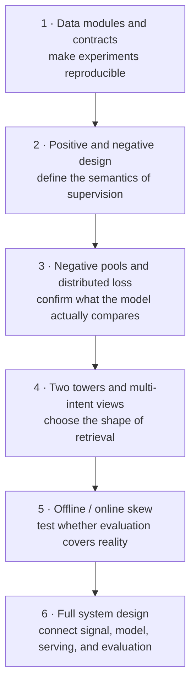

# Notes from practice

[中文](README.md) · **English**

> Reading time: ~3 min · Type: index · Last reviewed: 2026-08

The other chapters explain how a field works. These notes are **what I actually ran into in a real system, and how I ended up thinking about it**.

Different genre, so it gets its own section: a teaching chapter can start from the cleanest example, a practice note has to start from the dirtiest — the data is skewed, the labels are guesses, and offline went up while online didn't.

If you do not know where to start, follow the path from data to evaluation. If you already know the failure, jump directly to its box.



Each note starts from a failure symptom and ends with criteria you can inspect, falsify, or check before release.

## The desensitisation boundary

These notes come from real work, so the boundary has to be a **written rule** rather than a judgment call each time. I missed one once; hence the checklist.

**Never written here:**

- Company, product, team or colleague names;
- Names of internal systems, services, tables, jobs or repositories;
- Data volumes, field names, model configs, hyperparameters, measured results;
- Project timelines, or anything that pins down a specific organisational decision.

**Also never written, and the easiest to miss — internal vocabulary.**

Everyone remembers to strip the numbers. Nobody strips the words. Calling users by a particular house term, or naming a tier with a particular house name, **is itself a fingerprint** — and a sharper one than any number: a peer reads one paragraph and knows the company, often the team. A disclaimer saying "no fields or configs correspond to any company" does not help, because the leak is in the vocabulary, not the data.

So: **every proprietary term gets replaced by the generic one.** Users are users; the middle tier is the near-real-time tier.

**Only written here:** problems, trade-offs, and decision criteria that anyone building a comparable system would hit.

**Self-check:** show it to someone who builds similar systems elsewhere and ask "can you tell which company this is?" If they can, it isn't clean yet.

## Topics

### Recommender systems

Candidate retrieval, sparse feedback, training objectives, and offline evaluation. The intended path is data → labels → loss → representation → evaluation → the full system.

#### [Offline went up, online didn't](recommender-systems/offline-online-skew.en.md)

Selective observation plus a closed feedback loop. Why log-based evaluation systematically overrates a model that will make the bias worse, and why **no change to the loss function fixes it** — only exposure that the model doesn't control, with the propensity logged.

#### [What counts as a positive, and as a negative](recommender-systems/positive-negative-design.en.md)

"No click" is not "not interested". Four sample classes with genuinely different semantics, plus a contradiction present in most implementations and rarely admitted: the same document that says unobserved items aren't negatives goes on to train with in-batch negatives, which treat them as exactly that.

#### [How big is your negative pool, really](recommender-systems/negative-pool-size.en.md)

Multiple devices do not automatically create a global negative pool. A multiple-choice analogy connects local/global pools, differentiable gather, the sampling proposal, and logQ correction.

#### [Two towers, and why the user side becomes several](recommender-systems/two-tower-and-beyond.en.md)

The two-tower shape isn't a modelling preference, it's what precomputation forces. That framing explains why the user side can expand and the content side can't — content is an item, a user is a distribution. Includes the criterion for when multi-tower is *not* worth it.

#### [The modules a data pipeline splits into](recommender-systems/data-pipeline-modules.en.md)

Five modules, one invariant each. Centred on the most expensive bug in the field: time travel — joining today's profile onto a three-week-old exposure, which makes offline look implausibly good and online move not at all.

#### [From noisy feedback to a servable retrieval system](recommender-systems/noise-to-signal-retrieval.en.md)

A full system design note: audit narrow signals and narrow metrics first, then connect a multi-task, multi-tower teacher–student design with selective visual understanding, independent evaluation anchors, and release gates.

## The shared question

```text
How far is the label I have from the thing I want to optimise?
Is that gap random, or was it manufactured by the previous policy?
Is my evaluation set drawn from the same contaminated distribution?
```

The first two decide what the model can learn. The third decides whether you can even detect that the first two went wrong.

## Where to read next

- [Data & feedback](../01-data-and-feedback/README.en.md) — the general form of these problems
- [Evaluation](../07-evaluation/README.en.md) — why one number isn't enough
- [Post-training](../05-post-training/README.en.md) — training algorithms only start to matter once the signal is clean
