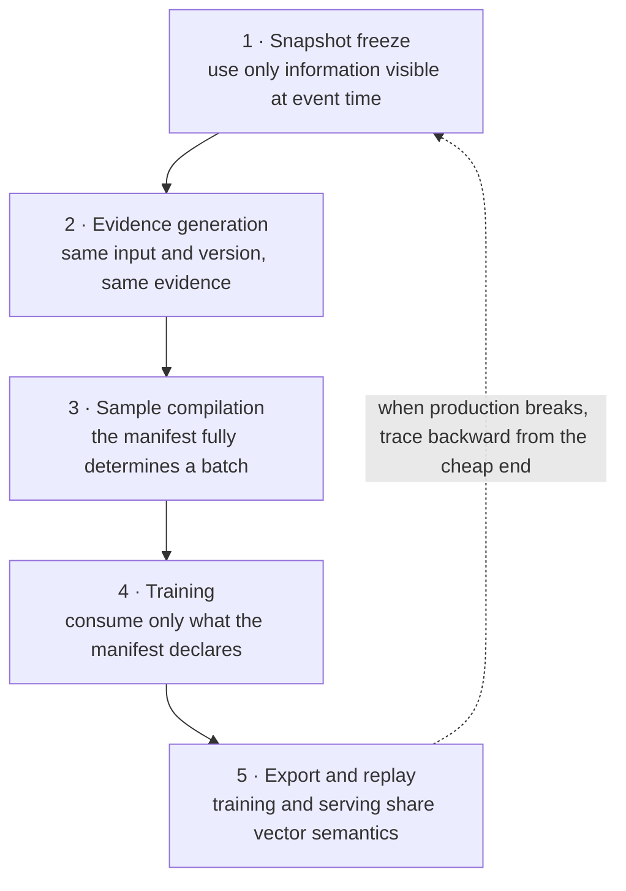

# The modules a data pipeline splits into

[中文](data-pipeline-modules.md) · **English**

> Reading time: ~6 min · Type: practice note · Last reviewed: 2026-08

## In one sentence

Splitting the pipeline into modules isn't about tidy code — it's so that **each module can declare one invariant it is responsible for holding**. Then, when something breaks, you know which layer to interrogate instead of rerunning everything and hoping the number improves.

## Five modules, five invariants

Do not picture five Spark jobs. A more useful picture is five hand-offs, each carrying both data and one promise the next stage relies on.



Break one invariant and the error keeps travelling until it looks like “the model got worse.” That is why debugging should walk this picture backward.

| Module | In → out | What it guarantees | What breaking it looks like |
| --- | --- | --- | --- |
| 1 Snapshot freeze | raw logs → time-bounded event stream | **no information from after the event time** | time travel: offline inflated, online flat |
| 2 Evidence generation | content → versioned structured evidence | same content + same version → same output | trained on v A, served v B; silent feature drift |
| 3 Sample compilation | events + evidence + labels → manifest | one manifest fully determines one batch | experiments incomparable, gains unattributable |
| 4 Training | manifest → checkpoint | consumes only what the manifest declares | quietly read another table; can't reproduce |
| 5 Export & replay | checkpoint → index + offline replay | exported vector space = training vector space | similarities incomparable, quality drifts down |

Only the two that break most often are expanded below.

## Module 1: time travel is the most expensive bug in this field

A training sample answers "at **that moment**, should this content have gone to this user?" So every field in it must have been available at that moment.

Violating it is easy and silent:

- joining **today's** user profile onto an exposure from three weeks ago — the profile already contains behaviour that came after;
- using an item's **final** counters (total likes, total impressions) as features — numbers that didn't exist at event time;
- sampling negatives from "still no interaction as of now" — the user may have interacted last week, just after the event.

The symptom is distinctive: **offline metrics look implausibly good and online shows nothing.** The model learned to predict the past from the future, and that capability doesn't exist in production.

The fix is unglamorous: every dimension table must be **effective-dated**, and joins take the version as of event time rather than the latest. Where that's impossible, use fewer fields — only the ones whose timing you can guarantee.

> A self-check: shift every training timestamp back by a week and rerun. If the metric barely moves, either you aren't using time information at all, or — worse — you're using the future.

## Module 2: evidence needs a version

Any model-generated intermediate feature — visual evidence, content classification, quality scores — is **another model's output**, and that model will be replaced.

Without a version, this happens: training reads evidence from teacher v3; three weeks after launch the teacher moves to v4 and the corpus is re-scored; serving now reads v4. The field names are identical and the semantics are not. **Nothing alerts.** Retrieval quality just erodes.

So the evidence table's key must be `(content_id, generator_version)`, the manifest must pin the version, and index rebuilds must be coordinated with evidence rebuilds.

The same logic applies to the content tower itself: after retraining, every vector in the index must be re-encoded, and during a staged rollout the index holds a mix — **the space is inconsistent and similarities are not comparable**. That one doesn't live in the code; it lives in the release process.

## Module 3: the manifest is the only carrier of reproducibility

What an experiment binds:

```text
data snapshot time      label definitions & thresholds    negative sampler & ratios
evidence generator ver. user / content tower versions     ANN index version
downstream ranker ver.  slice definitions                 random seeds
```

The test is simple: **run the same manifest twice, get the same data.**

If it holds, an observed change can be attributed to the module you changed. If it doesn't, you compared two different draws rather than two models — and the usual ending is shipping data drift as a model improvement and watching it revert.

## What the boundaries actually buy you

Once split, debugging has an order:

```text
online didn't move
→ module 5: do exported vectors match training? is the index mixed?
→ module 4: did training really read only the manifest?
→ module 3: what's the manifest diff between the two runs?
→ module 2: did an evidence version change?
→ module 1: is there time travel?
```

Back to front, because later modules are cheaper to verify. Most "the model doesn't work" ends up being module 1 or 2 — **not a modelling problem, a broken data contract.**

## Degradation is part of the contract

The pipeline must specify failure behaviour up front rather than patching it after launch:

- an image fails to parse → fall back to the text representation; **it must not block the item from entering the index**;
- a user view is missing → the router renormalises over the remaining views rather than zero-filling;
- an evidence version is missing → refuse to start, rather than silently reading the previous one.

The first two protect availability, the third protects correctness. **The third must fail loudly and the first two must degrade quietly** — swap them and you have an incident.

## Where to read next

- [Offline went up, online didn't](offline-online-skew.en.md) — how evaluation still misleads you once every contract holds
- [What counts as a positive, and as a negative](positive-negative-design.en.md) — module 3's label semantics
- [Two towers, and why the user side becomes several](two-tower-and-beyond.en.md) — the model shape behind modules 4 and 5
