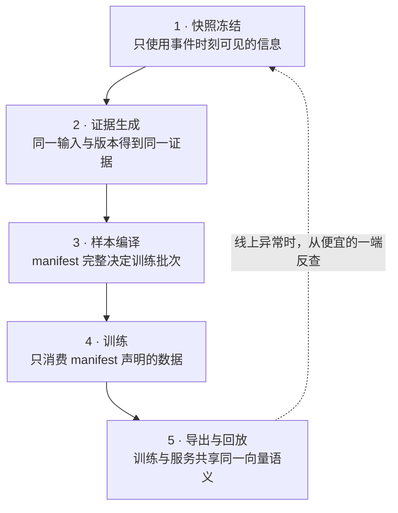

# 数据处理拆成哪几个模块

**中文** · [English](data-pipeline-modules.en.md)

> 阅读时间：约 6 分钟 · 类型：实践手记 · 最近审阅：2026-08

## 先用一句话讲清楚

把数据流水线切成模块，不是为了代码好看，是为了**每个模块能声明一条它负责守住的不变量**——出问题时你才知道该去哪一层查，而不是从头重跑一遍看数字会不会变好。

## 五个模块，五条不变量

先别把它想成五个 Spark job。更有用的视角是：每一层接过一份数据，也接过一条必须守住的承诺。



一条不变量破掉，错误会沿着箭头继续传播，最后看起来像“模型效果不好”。这也是为什么排查应该沿着这张图逆向走。

| 模块 | 输入 → 输出 | 它保证什么 | 破了会怎样 |
| --- | --- | --- | --- |
| 1 快照冻结 | 原始日志 → 带时间边界的事件流 | **不使用事件时刻之后的信息** | 时间穿越，离线虚高，线上归零 |
| 2 证据生成 | 内容 → 带版本号的结构化证据 | 同一内容 + 同一版本 → 同一输出 | 训练用 A 版、服务用 B 版，特征漂移 |
| 3 样本编译 | 事件 + 证据 + 标签 → 清单 | 一个清单完全决定一个批次 | 实验不可比，改进无法归因 |
| 4 训练 | 清单 → 检查点 | 只消费清单里声明过的东西 | 悄悄读了别的表，复现不了 |
| 5 导出与回放 | 检查点 → 索引 + 离线重放 | 导出的向量空间 = 训练时的向量空间 | 相似度不可比，召回质量莫名下降 |

下面只展开最容易出事的两条。

## 模块 1：时间穿越是这行最贵的 bug

训练样本要回答的是「在**那个时刻**，该不该把这条内容给这个用户」。所以样本里的每一个字段，都必须是那个时刻可得的。

违反它太容易了，而且不报错：

- 用**今天**的用户画像，去 join 三周前的一次曝光——画像里已经包含了那次曝光之后的行为；
- 用内容的**最终**统计量（总点赞、总曝光）当特征——这些数字在事件发生时还不存在；
- 负样本从「至今仍未互动」的集合里采——但用户可能上周刚互动过，只是在事件时刻之后。

后果非常有辨识度：**离线指标好得不像话，线上完全没有提升。** 因为模型学到的是「用未来预测过去」，而这个能力线上不存在。

守法很朴素：所有维度表都必须是**带生效时间的**，join 的时候按事件时间取那一版，而不是取最新版。做不到就退而求其次——只用能保证时间正确的字段，宁可少。

> 一个自查方法：把训练集里所有样本的时间戳整体往前推一周重跑。如果指标掉得非常小，很可能你根本没在用时间信息，或者更糟——你在用未来。

## 模块 2：证据必须带版本号

任何「模型生成的中间特征」——视觉证据、内容分类、质量分——都是**另一个模型的输出**，而那个模型会被换掉。

不带版本号，就会出现这种情况：训练时读到的是教师模型 v3 生成的证据，上线三周后教师模型升到 v4 重刷了一遍全库，服务时读到的是 v4。两边的字段名一模一样，语义已经变了。**没有任何告警会响**，只有检索质量慢慢往下掉。

所以证据表的主键必须是 `(内容 id, 生成器版本)`，清单里必须钉死用的是哪个版本，索引重建必须和证据版本一起做。

同样的道理适用于内容塔本身：重训之后索引里每个向量都要重编码，灰度期间索引是新旧混合的，**此时向量空间不一致，相似度不可比**。这条不在代码里，在发布流程里。

## 模块 3：清单是可复现性的唯一载体

一次实验绑定的东西：

```text
数据快照时间点     标签定义与阈值      负样本采样器与比例
证据生成器版本     用户塔 / 内容塔版本  ANN 索引版本
下游精排版本       切片定义            随机种子
```

判据很简单：**同一份清单跑两次，必须得到同一批数据。**

做到了，观察到的变化才能归因到你改的那个模块。做不到，你比较的是两次不同的抽卡，而不是两个模型——而这种情况下最常见的结局是把数据漂移当成模型改进，上线后打回原形。

## 模块边界的实际好处

拆开之后，排查有了顺序：

```text
线上没涨
→ 模块 5：导出的向量和训练时一致吗？索引是混的吗？
→ 模块 4：训练真的只读了 manifest 吗？
→ 模块 3：两次实验的 manifest diff 是什么？
→ 模块 2：证据版本变过吗？
→ 模块 1：有没有时间穿越？
```

从后往前查，因为越靠后的模块越便宜验证。绝大多数「模型不 work」最后查出来是模块 1 或模块 2——**不是模型的问题，是数据契约破了**。

## 降级也是契约的一部分

流水线必须规定失败时怎么办，而不是上线后打补丁：

- 某张图解析失败 → 回退到原文表示，**不能阻止这条内容进索引**；
- 某个用户视图缺失 → 路由器对剩余视图重新归一化，而不是补零；
- 证据表某个版本缺失 → 拒绝启动，而不是静默读到上一个版本。

前两条保证可用性，第三条保证正确性。**第三条要吵着失败，前两条要安静降级**——搞反了就是线上事故。

## 从哪里继续读

- [离线涨了，线上不涨](offline-online-skew.md)：数据契约都守住了，评估仍然会骗你的那部分
- [正负样本到底该怎么定义](positive-negative-design.md)：模块 3 里标签语义的展开
- [双塔，以及为什么用户那一侧要拆成多塔](two-tower-and-beyond.md)：模块 4/5 的模型形状
