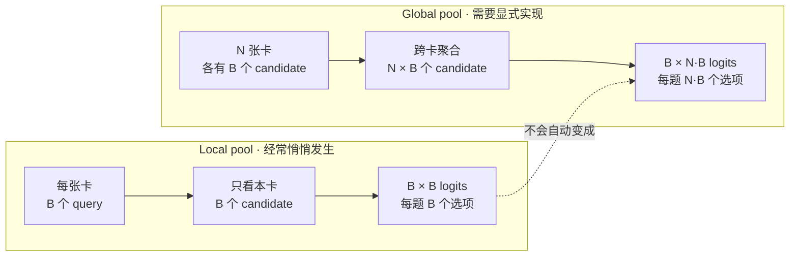
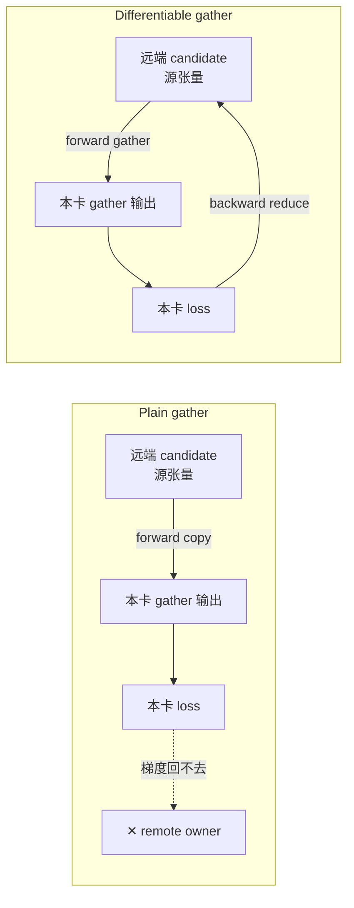
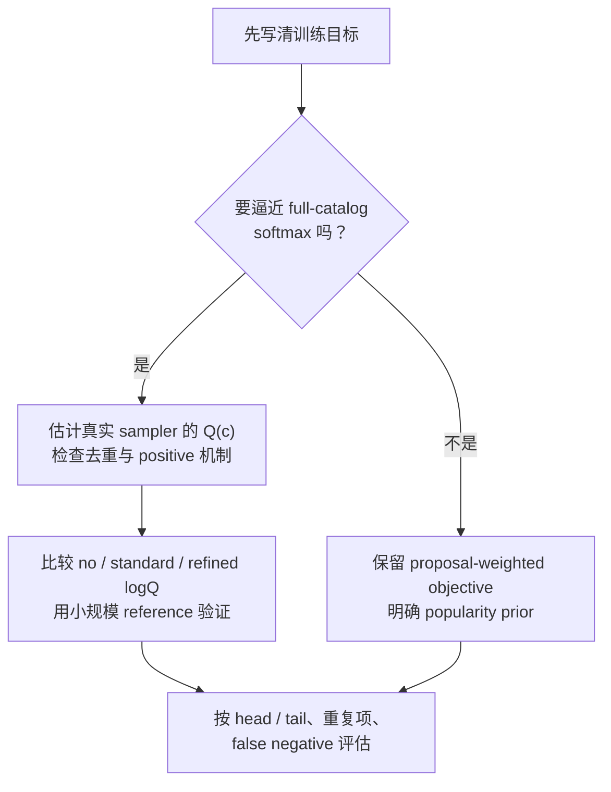

# 负样本池到底有多大

**中文** · [English](negative-pool-size.en.md)

> 阅读时间：约 8 分钟 · 类型：实践手记 · 最近审阅：2026-08

## 先用一句话讲清楚

对比学习说白了就是让模型做选择题。而在多卡训练里，很容易出现这么一件事：你以为自己在出 768 选 1 的题，实际上每张卡都只在做 32 选 1——**而且不会有任何报错**。选项数量与组成共同决定题目有多难；池子大，不等于负样本就一定好。

## 先想一道选择题

假设我要教一个模型「什么内容适合推给这个用户」。

我手上有一条确认的正样本：用户 A 真的喜欢内容 X。怎么用它来训练？

最直接的办法是出一道选择题：给模型看用户 A，再给它一堆候选内容，其中一个是 X，其余都是随便抽来的。让它把 X 挑出来。挑对了就奖励，挑错了就惩罚。

那堆「随便抽来的」就是负样本。它们的数量，就是这道题的选项数。

现在关键的问题来了：**这道题有几个选项？**

- 4 选 1：模型答对了，你几乎学不到东西。瞎蒙都有 25% 正确率，而且四个选项里大概率有三个跟用户 A 八竿子打不着——它只需要分辨「这是不是同一个星球的东西」。
- 768 选 1：随机采样碰到近邻干扰项的概率更高，模型通常需要画出更细的边界；但如果 767 个负样本仍然都很容易，大池子也只是更贵的送分题。

召回阶段面对的现实是后者：候选池里全是似是而非的东西。所以**训练时的选项数太少，就是在用送分题训练一个要去考难题的模型。**

这就是负样本池的意义。**池子的大小决定模型能比较多少候选，采样分布决定它实际在学什么边界。** 两者要一起看。

## 多卡不等于全局负样本

多卡训练里，框架会按并行策略处理模型状态和梯度通信：DDP 复制参数并 all-reduce 梯度，FSDP/ZeRO 才会分片参数、梯度或优化器状态。

但**出题是你自己在损失函数里写的**。框架不知道你的损失函数在干嘛，它不会主动把别的卡上的候选收集过来给你当干扰项。

结果就可能是：你有 24 张卡，每张卡的批大小是 32，你心里默认负样本池是 24×32=768。实际上每张卡只拿自己那 32 个样本互相当干扰项，题目仍然是 32 选 1。



图里最重要的不是数字，而是中间那条虚线：**模型如何并行，与 loss 分母里有多少候选，是两件独立的事。**

| 东西 | DDP | FSDP / ZeRO | 谁决定 |
| --- | --- | --- | --- |
| 参数 | 每卡复制 | 按策略分片，需要时聚合 | 并行框架 |
| 梯度 | all-reduce | reduce-scatter 或等价操作 | 并行框架 |
| 优化器状态 | 通常每卡复制 | 可分片 | 并行框架 |
| 数据 | sampler 给每个 rank 不同 mini-batch | 同左 | 数据加载器 |
| **对比损失的负样本池** | **默认仍可能只有本卡** | **默认仍可能只有本卡** | **loss 实现** |

前四行主要由训练框架和数据加载器决定，最后一行通常不是。所以完全可能出现这个局面：分布式训练没有 bug，但模型做的仍然是一张过于简单的卷子。

**这件事必须去损失函数的代码里确认，看训练配置是看不出来的。** 配置告诉你分片策略是什么，不告诉你分母里有几项。

## 公式里，真正有信息的是分母

现在把上面那道题写下来。这就是 InfoNCE：

$$\mathcal{L} = -\log \frac{\exp\big(s(u, c^+)/\tau\big)}{\sum_{c \,\in\, \{c^+\} \cup \mathcal{N}} \exp\big(s(u, c)/\tau\big)}$$

每个符号是什么：

| 符号 | 意思 | 在代码里是什么 |
| --- | --- | --- |
| $u$ | 一次查询——这里就是「用户 A 当下的状态」 | 用户塔输出的那个向量 `z_u` |
| $c^+$ | 这道题的正确答案，确认过的正样本 | 正样本候选的向量 |
| $\mathcal{N}$ | 干扰项集合，也就是负样本池 | 分母里除正确答案外的所有候选 |
| $s(u,c)$ | 打分函数，双塔里就是两个向量的内积 | `z_u @ z_c` |
| $\tau$ | 温度，控制这个 softmax 有多「尖」 | 一个标量，越小越只关心最像的那几个 |
| 分母 | 所有选项的得分加起来 | **项数 = 选项总数 = $\lvert\mathcal{N}\rvert + 1$** |

这个式子读出来就是：**正确答案的得分，占所有选项得分总和的比例，越高越好。**

所以学习信号几乎全在分母那个求和里。分子只有一项，它自己说明不了任何事——只有跟一堆干扰项比起来它更高，才算学到了东西。

$\mathcal{N}$ 来自本卡的 paired batch 时，选项总数通常是 $B$，其中 $B-1$ 个被当成负样本；全局 gather 后是 $N\times B$ 个选项、$N\times B-1$ 个潜在负样本（先忽略重复内容、多正样本和 false negatives）。

$N$ 是几十的时候，这中间差一个数量级以上。它不需要新标注或改模型结构，但会增加通信、logit 矩阵和 false-negative 风险。因此值得优先核对，却不是无条件的“白捡提升”。

## Gather 之后，梯度能不能回家

朴素的写法长这样：

```python
# 对“精确全局目标”而言是不完整的
parts = [torch.empty_like(z) for _ in range(world_size)]
torch.distributed.all_gather(parts, z)       # 普通 collective 不建立 autograd 路径
z_all  = torch.cat(parts)
logits = z_u @ z_all.T / temperature     # 现在分母有 N*B 项了
loss   = cross_entropy(logits, labels)
```

Forward 看起来已经对了：分母确实变成 $N\times B$ 项。真正麻烦的是 backward。低层的 `torch.distributed.all_gather` 只是通信 primitive，本身不为输入建立 autograd backward。要得到精确的全局对比目标，需要使用带 backward 的 collective，或者自己实现等价的反向归约。

它把别的卡的张量搬过来了，但当前 rank 的 loss 无法沿普通 gather 把梯度传回那些远端源张量。

先看图，会比记 API 名字更直观：



中间还有一种常见折中：gather 远端的 detached 表示，再把本卡 slice 接回计算图。这样本卡 candidate 有梯度，但远端 candidate 仍收不到当前 rank 的贡献。它可以是合理近似，只是不能叫精确 global objective。

如果你声明优化的是“所有 query 对所有 candidate”的精确 global-batch objective，那么这些跨 rank 的 candidate-gradient 项也是目标的一部分。普通 gather 会漏掉它们。

继续用选择题打比方：学生看到了其他考场送来的干扰项，但当前考场对这些题目的修改意见，寄不回原来的出题人。题面变难了，训练目标却只完成了一半。

这不代表训练一定无效：query tower 仍然看到了更多候选，某些近似实现也会刻意接受这个 trade-off。关键是不能把它误称为精确 global loss。

有三种选择，语义不同：

1. 用**带 autograd 的** all-gather，并确认 backward 会把各 rank 的贡献归约回源张量；
2. 自定义 `autograd.Function`：forward gather，backward 用 reduce-scatter / all-reduce 返回完整梯度；
3. gather 后只把本卡 slice 接回计算图。这个常见写法能让本卡 embedding 有梯度，但**不是精确全局目标**；它是省通信/显存的近似，需要单独命名和验证。

原来的这种测试是错的：

```python
z_all = gather(z)  # 假设这是 gather 后的输出
g = torch.autograd.grad(loss, z_all, retain_graph=True)[0]
# 即使 z_all 和远端源张量之间已经断图，loss 对 z_all 仍然可以有非零梯度。
# 它只能证明 loss 使用了 gather 输出，不能证明梯度传回了远端输入。
```

正确测试是做一个很小的 deterministic reference：单进程拼出同一 global batch，计算完整 loss 和参数梯度；再用多 rank 版本跑同样的权重与样本，并比较 loss、query tower 梯度和 candidate tower 梯度。若实现声称等价，三者都应在容差内一致。

## 题变多了，但题是从哪里抽的

这一步最容易被一句“负样本越多越好”带过去。

回到选择题的比方。干扰项是从哪儿来的？是从批次里其他样本的候选里借来的。而批次是从数据里随机抽的，**所以一个内容出现在批次里的概率，正比于它在数据里有多常见。**

热门内容本来就出现得多，于是它反复出现在别人的干扰项里。若训练目标想逼近 full-catalog softmax，这种非均匀 proposal 会造成有偏的梯度估计；热门内容作为 negative 被抽中的频率更高。

把池子扩大后，每个 query 会看到更多从同一 proposal distribution 抽来的热门内容；热门项被抽中的**绝对次数**会上升，但不能笼统说目标里的偏置就严格“放大 $N$ 倍”。相对采样分布没有因此改变，估计方差、重复项、false negatives 和梯度权重却都会变化。

标准的修正叫 logQ correction，在算分数的时候减掉采样概率的对数：

$$s'(u,c) = s(u,c) - \log Q(c)$$

| 符号 | 意思 | 怎么来的 |
| --- | --- | --- |
| $s(u,c)$ | 原始打分（两个向量的内积） | 模型算出来的 |
| $Q(c)$ | 负样本 proposal 中抽到 $c$ 的概率或期望出现次数 | 必须和 sampler、去重方式及推导一致 |
| $-\log Q(c)$ | $Q(c)$ 越小，校正项越大 | 对 proposal 中低概率候选给予更大的 importance correction |
| $s'(u,c)$ | 修正后的分数，拿它进 softmax | 替换上面公式里的 $s$ |

为什么是**减 $\log Q$**？如果目标是逼近 full-catalog softmax，可以把 negative sampler 看成 importance-sampling proposal；在 logit 空间减去 $\log Q(c)$，对应除掉候选因 proposal 高频而被反复抽中的部分。

但 logQ **不是任何对比学习都必须打开的开关**：如果训练目标本来就是某个条件负样本分布，或产品希望保留 popularity prior，目标就不同；标准 logQ 还把确定出现的 positive 当成按 $Q$ 采样，近年的工作专门修正了这个细节。

所以别从“要不要开 logQ”开始，而要从“我究竟想拟合哪个分布”开始：



更稳妥的实验矩阵是 `local/global pool × no/standard/refined correction`，同时固定 sampler、去重规则和评估 index。先写清目标是 full softmax、uniform catalog，还是某个业务 proposal，才能判断 correction 是否正确。

## 顺手检查：你真的需要这样分片吗

既然已经在翻分布式配置了，还有一个常见的错配。

**如果模型状态本身能舒适地放进单卡，把它切到所有卡上，可能是在为不需要的显存节省付跨节点带宽。**

先按实际精度算参数、梯度、master weights 和 Adam states，再加 activation、临时 buffer 与 logit matrix。一个 sub-1B 模型的**模型状态**通常可能放进现代加速器，但长上下文和大负样本池仍可能让 activation 或 $B\times NB$ logits 成为峰值。是否分片应由测量决定，不能只看参数量。

节点内的互联比节点间快一个量级。「节点内分片、节点间复制」这种混合策略能把 all-gather 全压在节点内部，只让梯度同步跨节点——同样的显存预算，通信量差很多。

还有一条特别容易搞混的：**分片参数救不了激活。** 长上下文下真正吃显存的是前向存下来的中间张量，那是梯度检查点管的事，跟参数怎么切没关系。为了治激活爆显存而把分片开到最大，是在拧错的旋钮。

判据是先拆开测量 model state、activation、logits 和通信等待，再比较 DDP、FULL_SHARD 与 HYBRID_SHARD 的吞吐和峰值显存。放得下只说明 DDP 成为候选，不自动说明它一定最快。

## 最后只记住五个问题

1. 我的对比损失，负样本池是本卡的还是全局的？——**去损失函数的代码里看，不要看训练配置**。
2. 如果是全局的，我要精确 global objective 还是近似？多 rank 参数梯度能否和单进程 reference 对上？
3. 池子变大之后，negative proposal、重复项、false negatives 与 correction 是否仍对应我想优化的目标？
4. 我分片的这些东西，单卡到底放不放得下？
5. 真正吃显存的是参数还是激活？我拧的是对应那个的旋钮吗？

## 从哪里继续读

- [正负样本到底该怎么定义](positive-negative-design.md)：干扰项从哪儿来，以及 correction 应该对应什么目标
- [双塔，以及为什么用户那一侧要拆成多塔](two-tower-and-beyond.md)：这个损失训的是什么形状的模型
- [从噪声反馈到可服务的检索系统](noise-to-signal-retrieval.md)：整条链路
- [PyTorch distributed collectives](https://docs.pytorch.org/docs/stable/distributed.html#torch.distributed.all_gather)：low-level `all_gather` 的调用语义
- [PyTorch FSDP sharding strategies](https://docs.pytorch.org/docs/stable/fsdp.html)：DDP、FULL_SHARD 与 HYBRID_SHARD 的通信语义
- [Sampling-Bias-Corrected Neural Modeling for Large Corpus Item Recommendations](https://storage.googleapis.com/gweb-research2023-media/pubtools/pdf/6417b9a68bd77033d65e431bdba855563066dc8c.pdf)：logQ 的 full-softmax / importance-sampling 出发点
- [Correcting the LogQ Correction](https://arxiv.org/abs/2507.09331)：为什么标准 logQ 对确定出现的 positive 仍不完全严谨
