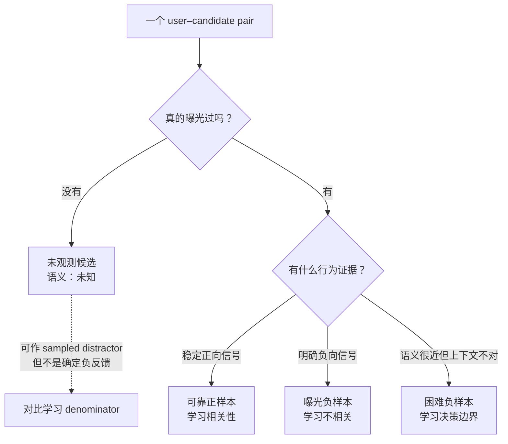

# 正负样本到底该怎么定义

**中文** · [English](positive-negative-design.en.md)

> 阅读时间：约 5 分钟 · 类型：实践手记 · 最近审阅：2026-08

## 先用一句话讲清楚

「没点击」不是一个标签，它是**至少四种情况**的叠加：没看到、看到了不感兴趣、感兴趣但当时没空、看到了但界面没让他点。把它们压成同一个 0，后面再复杂的训练算法也只是在更稳定地学一个错误目标。

## 四类样本，语义完全不同

先问“它有没有被看见”，再谈正负。这个顺序能避免把数据库里的 `0` 误读成用户心里的“不喜欢”。

图里虚线最容易被忽略：未观测候选可以在 sampled objective 里扮演干扰项，但它的**训练角色**不会反过来改写它的**标签语义**。

| 类别 | 定义 | 能推出什么 | 在训练里怎么用 |
| --- | --- | --- | --- |
| 可靠正样本 | 有较强行为证据（不只是一次点击） | 相关 | 正样本 |
| 曝光负样本 | **确实展示过**，且有明确负向行为 | 不相关 | 真负样本，权重最高 |
| 困难负样本 | 语义接近或模型高分，但与当前上下文不匹配 | 「像但不对」 | 教边界 |
| 未观测候选 | 没展示过 | **什么都推不出** | 不能当负样本 |

第二行和第四行的区别是整件事的核心。曝光负样本携带一条真实信息：**用户有机会看到，然后没有正向反应**。未观测候选携带零信息。把它们混在一起，等于把「不喜欢」和「没看见」编码成同一个数。

## 正样本的门槛比想象中重要

一次点击是很弱的证据。标题党能拿到点击，误触也能。常见的做法是要求多个信号叠加——停留时长超过阈值、发生二次动作、或者一段时间后没有负向操作。

但这里有个隐藏的取舍：**门槛越高，正样本越可靠，也越偏向重度用户。**

轻度用户的行为本来就少，把门槛提高会把他们整体从训练集里筛掉。于是模型在重度用户上越来越准，在冷启动用户上越来越差，而总体指标看起来是涨的——因为重度用户贡献了大部分样本量。

所以正样本定义必须**按用户活跃度分桶验证**，不能只看总体。定义变了就重跑一次分桶，这个改动的影响远比它看起来大。

## 标签语义和训练角色不是一回事

几乎所有这类设计文档都会写「未观测候选不能当负样本」，然后在训练一节写「使用批内负样本」。看起来矛盾，其实混用了两个层次：

- **标签语义**：未观测不等于用户不喜欢，不能把它写成确定的负反馈；
- **优化角色**：sampled softmax 仍可把未观测候选放进 denominator，当作当前训练题目的 distractor。

第二种用法不是在声称“用户讨厌它”，而是在用一个可计算的 sampled objective 逼近更大的候选比较。风险来自 proposal distribution、false negatives 和目标错配，不能靠把所有 distractor 叫成“真负样本”来掩盖。

如果目标是逼近 full-catalog softmax，常见做法是 logQ correction，把打分减去 sampling proposal 的对数：

$$s'(u,c) = s(u,c) - \log Q(c)$$

其中 $Q(c)$ 是 sampler 抽到 $c$ 的概率或期望次数，具体定义必须与有无放回、去重和 batch construction 一致。

不做修正并不自动代表模型错误；它代表你优化的是 proposal-weighted objective，而不是无条件等价于 full-catalog softmax。这个差异必须被写进实验定义。

曝光负样本来自另一种数据生成过程，不能直接套用同一个 $Q(c)$。它可以进入额外的 pointwise/pairwise loss，或进入带独立权重的 denominator；具体处理取决于目标，而不是一句“真负样本不修正”就能决定。

## 困难负样本的采样陷阱

「用模型高分但实际不相关的样本做困难负样本」听起来很自然，但它有个自指问题：**这些样本是当前模型选出来的**，所以你在教模型修正它自己已知的错误，而不是它不知道的错误。

两个缓解办法：

- 用**上一个版本**的模型挖困难负样本，而不是当前正在训的这个；
- 混入语义近邻（纯向量距离）而不只是模型高分，前者不依赖当前模型的判断。

另外困难负样本的比例是个真的超参，不是越多越好。比例过高时模型会变得过度保守——它学会了「像但不对」，代价是对真正相关但表面不像的内容也压分。这个失败模式在总体召回上看不出来，要看长尾覆盖。

## 落到检查清单

1. 我的「负样本」里，有多少比例其实是未观测？
2. 曝光负样本和未观测候选，在训练代码里是不是走的**同一条路径**？
3. 批内 distractor 的 proposal 是什么？是否需要 correction，取决于我想逼近什么目标？
4. 正样本门槛改动之后，我有没有按用户活跃度分桶复查？
5. 困难负样本是当前模型挖的，还是上一版挖的？

## 从哪里继续读

- [离线涨了，线上不涨](offline-online-skew.md)：同一个问题在评估层的形态
- [从噪声反馈到可服务的检索系统](noise-to-signal-retrieval.md)：整条链路
- [Post-Training](../05-post-training/)：这些标签确定之后，训练算法才开始有意义
- [负样本池到底有多大](negative-pool-size.md)：local/global pool、可微 gather 与 logQ 的边界
