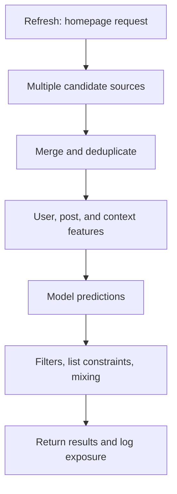

# 01 · One refresh: recommendation isn't one model

[中文](01-feed-pipeline.md) · **English**

> Public implementation: Twitter's 2023 snapshot. The diagram and examples are teaching simplifications, not current production settings.

## Follow one post

Of the 3 paths in the [architecture guide](00-architecture.en.md), this chapter follows only **the online request**. Leave training aside for now; a logical stage also need not be a separate service.

Suppose you like photography. An unfollowed author posts an astrophotography guide. Can the system find it? How does it compare with other posts? Does it still fit into the final list?

A failure at any of those steps can be invisible in an aggregate click metric.

## Follow the request

The 2023 Home Mixer documentation separates sourcing, feature hydration, scoring, filtering, and mixing. Product Mixer organizes pipelines; it is not itself a retrieval model. [Public documentation](https://github.com/twitter/the-algorithm/blob/ee5e7fc18dc0e971a6c02826b196294048765817/home-mixer/README.md)

This is a conceptual data-flow diagram, not the exact code execution order. Eligibility checks can occur at multiple stages. Product elements such as ads have additional logic rather than being ordinary posts with another prediction score.

## Give every arrow a contract

Trace the fictional candidate `post-17` through one request:

| Stage | Useful evidence | What goes wrong without it |
| --- | --- | --- |
| Retrieval | ID, source, source-specific score | Cannot distinguish a retrieval miss from later removal |
| Feature hydration | Values, timestamps, missingness | Defaults and observations become indistinguishable |
| Scoring | Model version and objective predictions | Cannot separate model changes from weight changes |
| Selection and response | Removal reason, position, exposure | “Not shown” gets mistaken for “not liked” |

This is a reading and debugging checklist, not a claim that the repository logs these exact fields.

## Why separate the stages?

Different costs suit different jobs: broad inexpensive retrieval, richer scoring over fewer candidates, then list constraints. A timed-out source can also fail independently.

The price is more interfaces. Fields can disappear, features can become stale, and configurations can disagree with models. Correctness includes preserving meaning across the whole path, not just getting one function right.

## Where to start reading

Read [Home Mixer's flow](https://github.com/twitter/the-algorithm/blob/ee5e7fc18dc0e971a6c02826b196294048765817/home-mixer/README.md), identify the relationship between request entry and candidate pipelines, then follow one source. Ask what goes in, what comes out, and what happens on failure.

Can a stronger ranker recover a useful post retrieval missed?

Not if it still ranks only the same candidate set. Check retrieval coverage before blaming every failure on the ranker.

Can a non-click be labeled irrelevant immediately?

First check exposure, position, and available feedback. Not shown, shown without action, and explicitly rejected are different evidence.

Next: [where candidates come from](02-candidate-retrieval.en.md).
