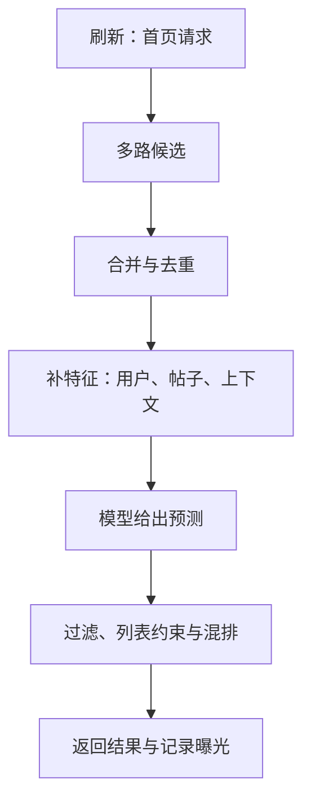

# 01 · 一次刷新：推荐不是一个模型

**中文** · [English](01-feed-pipeline.en.md)

> 公开实现：Twitter 2023 快照。图和例子是教学简化，不表示当前线上参数。

## 先跟着一条帖子走

在[架构导读](00-architecture.md)的 3 条线里，这篇只跟 **online 请求**。先不讨论模型怎么训练，也不把每个逻辑环节都假定成一个独立服务。

假设你喜欢摄影。一位没关注过的作者发了拍星空的教程。它能不能出现在首页，至少有 3 道问题：系统有没有找到它？找到以后怎么比较？最后这一屏是否还留得下它？

任何一步失败，单看最终点击率都不知道原因。

## 请求里到底经过什么

2023 的 Home Mixer 文档把候选获取、特征补齐、打分、过滤与混排拆成不同环节。Product Mixer 提供组织这些 pipeline 的框架，不是某个召回模型。[公开说明](https://github.com/twitter/the-algorithm/blob/ee5e7fc18dc0e971a6c02826b196294048765817/home-mixer/README.md)

这是用于理解的数据流图，不是源码逐行执行顺序。资格检查可能在多个阶段发生；付费内容等产品元素也有独立逻辑，不能简单当成普通帖子的预测分。

## 每条箭头都应有一个约定

用虚构帖子 `post-17` 跟一次请求：

| 阶段 | 你希望看见什么 | 缺了会怎样 |
| --- | --- | --- |
| 召回 | 候选 ID、来源、来源内分数 | 不知道是没找到，还是后面被删掉 |
| 特征补齐 | 特征值、时间戳、缺失标记 | 用默认值与真实值混在一起，难定位回归 |
| 打分 | 模型版本与各目标预测 | 不知道变化来自模型还是权重配置 |
| 选择与返回 | 淘汰原因、最终位置、曝光记录 | 把“没展示”误读成“不喜欢” |

这张表是阅读和调试时的检查清单，不声称公开仓库都按这个字段名记录。

## 为什么要拆，而不是全部交给一个大模型

拆开后，不同阶段能用不同成本解决不同问题：召回尽量快，排序对少量候选花更多计算，列表阶段再处理重复与约束。某一路超时，也可以局部降级。

代价是接口更多：候选会丢字段，特征可能过期，配置也可能和模型不匹配。因此工程上的“正确”不只是一个函数算对，还包括信息在各阶段没有变味。

## 打开仓库先读哪儿

先读 [Home Mixer 的流程说明](https://github.com/twitter/the-algorithm/blob/ee5e7fc18dc0e971a6c02826b196294048765817/home-mixer/README.md)，找到请求入口和候选 pipeline 的关系；再沿一个来源往下看。第一遍只回答：它拿什么输入，吐什么输出，失败时谁兜底？

没召回到一条好帖子，换更强的排序模型能救吗？

在排序仍只处理同一个候选集合的前提下，不能。先检查召回覆盖，而不是把所有问题归给 ranker。

一条帖子没被点击，能直接记成不相关吗？

先确认是否真正曝光、位置如何、有没有观察到反馈。未展示、展示但没操作、明确拒绝，是不同的证据。

下一期：[候选从哪里来](02-candidate-retrieval.md)。
