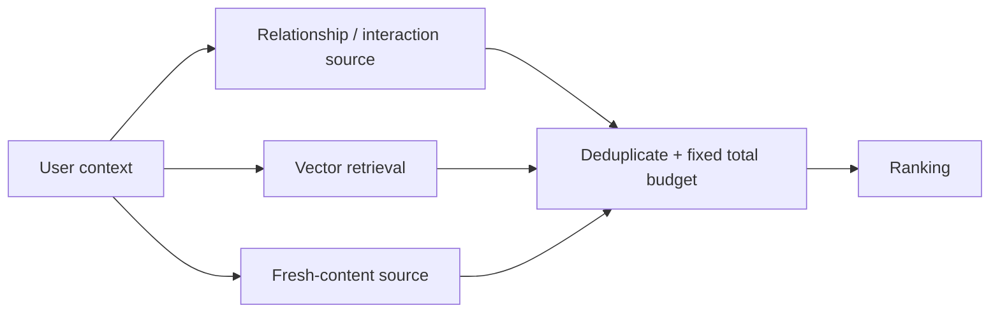

# 02 · Retrieval: decide where to look first

[中文](02-candidate-retrieval.md) · **English**

> Twitter 2023 snapshot plus an invented set example. Counts are not business data.

## There is more than one kind of similarity

This stage decides what gets considered next, not what the reader ultimately sees. Treating retrieval as the final recommendation can overload one model with coverage, detailed scoring, and the quality of the whole list.

A reader may want a familiar author's post or a new tutorial from a stranger. Relationships, shared interactions, and content meaning provide different clues.

Twitter's 2023 materials list Earlybird, UTEG, and Cr Mixer as candidate entry points. SimClusters ANN performs approximate retrieval using community representations; these communities reflect interaction structure, not necessarily human-labeled topics. [Home Mixer](https://github.com/twitter/the-algorithm/blob/ee5e7fc18dc0e971a6c02826b196294048765817/home-mixer/README.md) · [SimClusters ANN](https://github.com/twitter/the-algorithm/blob/ee5e7fc18dc0e971a6c02826b196294048765817/simclusters-ann/README.md)

## What two towers do—and don't do

A teaching dual encoder maps user context and candidate content into vectors, then searches by dot product or cosine similarity. Precomputing candidates avoids expensive full-catalog user–item interactions per request.

Representation compression, training labels, and index coverage still limit what can be found. A better encoder doesn't automatically recover missing feedback or index newly created items.

For why this factorization saves computation and what it gives up, continue with [the two-tower design deep dive](06-why-two-towers.en.md). This episode first connects the candidate sources.



## What does an extra source add?

Suppose a relationship source returns A, B, C and a vector source returns B, C, D. Their union has four candidates, not six. Whether D helps also depends on relevance; uniqueness alone isn't enough.

```python
graph = {"A", "B", "C"}
dense = {"B", "C", "D"}
judged_relevant = {"C", "D"}
union = graph | dense
unique_relevant = (dense - graph) & judged_relevant
print(len(union), sorted(unique_relevant))
```

The output is `4 ['D']`. This is a set demonstration, not a retrieval experiment. Hold the total budget fixed in a real comparison: increasing from three to four candidates can improve coverage without proving the new model is better.

## Which sources earn their budget?

| Source | Potential contribution | Main risk |
| --- | --- | --- |
| Relationships or shared interactions | Social evidence absent from content | Weak coverage for new users or unfamiliar authors |
| Dual-encoder vectors | Broad representational similarity | Label bias, compression, stale indexes |
| Fresh content and exploration | Candidates without established engagement | Uncertainty; needs quality and safety constraints |

When reading SimClusters, notice how it narrows the pool before more precise similarity work. **Approximation saves computation and access cost; it doesn't establish that missed items are irrelevant.**

## Self-check

<details><summary>If two sources have equal Recall, is the second redundant?</summary><p>Not necessarily. They may recover different relevant items. Check overlap, unique relevant candidates, and the union under a fixed budget.</p></details>

<details><summary>Does 0.8 from source A beat 0.7 from source B?</summary><p>Not necessarily. Models, objectives, and calibration may differ. Rescore consistently or validate a fusion method instead of comparing raw magnitudes.</p></details>

Next: [turning candidates into a list](03-ranking-and-diversity.en.md).
