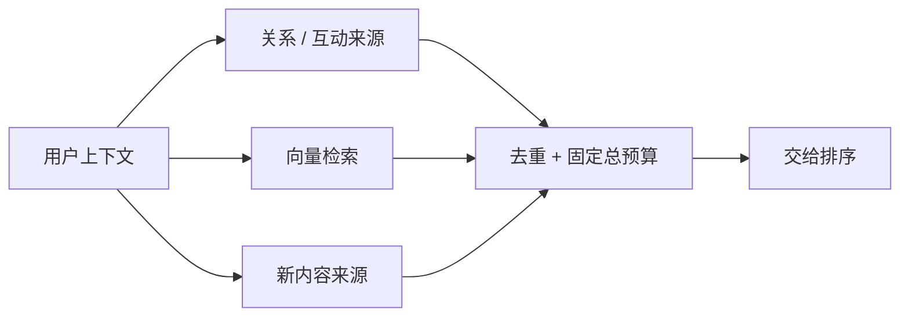

# 02 · 召回：先决定去哪里找

**中文** · [English](02-candidate-retrieval.en.md)

> Twitter 2023 快照 + 自拟集合例子。例子里的数量不是业务数据。

## “相似”不只一种

这一层先回答“哪些内容进入下一轮比较”，还没决定最后给你看什么。把召回和最终推荐混在一起，很容易要求一个模型同时承担覆盖、精细打分和整屏体验。

你可能想看一直关注的作者，也可能想看陌生人写的新教程。关系、共同互动和内容语义，提供的是不同线索。

Twitter 2023 的公开材料列出了 Earlybird、UTEG、Cr Mixer 等候选入口。SimClusters ANN 则利用社区表示与候选集合做近似相似度检索；这里的社区主要来自互动结构，不应直接理解为人工标注的主题分类。[Home Mixer](https://github.com/twitter/the-algorithm/blob/ee5e7fc18dc0e971a6c02826b196294048765817/home-mixer/README.md) · [SimClusters ANN](https://github.com/twitter/the-algorithm/blob/ee5e7fc18dc0e971a6c02826b196294048765817/simclusters-ann/README.md)

## 双塔解决什么，没有解决什么

教学双塔把用户上下文编码成向量，把候选内容编码成另一个向量，再用点积或余弦相似度找近邻。候选可以提前编码，所以不用为每个请求对全量内容做复杂交互。

但表示压缩、训练标签和索引覆盖都会限制能找到的东西。换成更强的 encoder，不会自动补回没被记录的反馈，也不会自动让全新内容进入索引。

想追问“为什么这种分解能省计算，代价又是什么”，可以接着读[双塔设计拆解](06-why-two-towers.md)。这一篇先把多路召回的关系讲清楚。



## 加一路，到底多了什么

假设关系来源找到 A、B、C；向量来源找到 B、C、D。合起来有 4 条，不是 6 条。新增 D 是否有用，还要看它是不是相关；只数不重复候选是不够的。

```python
graph = {"A", "B", "C"}
dense = {"B", "C", "D"}
judged_relevant = {"C", "D"}
union = graph | dense
unique_relevant = (dense - graph) & judged_relevant
print(len(union), sorted(unique_relevant))
```

输出是 `4 ['D']`。这是集合演示，不是检索实验。真正比较时，还要固定总预算：原来取 3 条，新方案合并后取 4 条，不能把预算增长的收益全部归给新模型。

## 该保留哪一路

| 来源 | 可能补上的东西 | 主要风险 |
| --- | --- | --- |
| 关系或共同互动 | 内容本身难表达的社交线索 | 新用户、陌生作者覆盖弱 |
| 双塔向量 | 大范围的表示相似性 | 标签偏差、表示压缩、索引陈旧 |
| 新内容与探索 | 尚未积累互动的候选 | 不确定性高，需要质量与安全约束 |

阅读 SimClusters 时，重点看它怎样先缩小候选、再做更精细的相似度计算。**近似检索是在省计算和访问成本，不是在证明被漏掉的内容不相关。**

## 自测

<details><summary>两路的 Recall 一样，第二路就没用吗？</summary><p>不一定。它们可能找回不同的相关内容。要看重叠、独有相关候选和固定预算下的合并结果。</p></details>

<details><summary>用来源 A 的 0.8 和来源 B 的 0.7，能直接说 A 更好吗？</summary><p>未必。分数可能来自不同模型、目标和校准。可以统一重打分或使用有验证依据的融合方式，不能只看数值大小。</p></details>

下一期：[怎样把候选排成一屏](03-ranking-and-diversity.md)。
