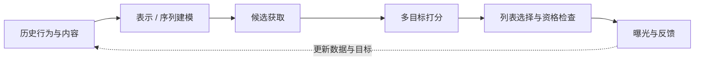

# 04 · 今天的推荐：变强的是哪一层？

**中文** · [English](04-modern-recsys.en.md)

> 核验日期：2026-10-09。X 部分固定到下文链接的 `77d431a` 快照；讨论公开代码与论文，不声称知道完整线上配置。

## 先别把“新”理解成“全部推倒”

前面读的是 2023 快照。较新的 [X 公开仓库](https://github.com/xai-org/x-algorithm/blob/77d431aabf409ca1c1eed9bec7e2183f7c914e23/README.md)列出 Thunder、Phoenix 和 SimClusters 等来源，区分排序与可见性判断；这不能用旧仓库的模块表直接替代。

[Phoenix 文档](https://github.com/xai-org/x-algorithm/blob/77d431aabf409ca1c1eed9bec7e2183f7c914e23/phoenix/README.md)仍区分双塔检索与更丰富的 Transformer 排序，并说明这一版提供训练和 serving 实现、以及合成数据的本地运行路径。代码公开，不意味着拿到了真实训练数据或能复现生产收益。

## 读一个新模型，先问它替换哪里

读到一个新名字，先写下三件事：**输入是什么、输出是什么、替换旧架构的哪一段**。这比先判断“是不是用了 LLM”更有用。迷路时回到[架构导读](00-architecture.md)，把模型放进对应的框。

同样叫 Transformer，可能用于用户历史编码、候选打分，也可能自回归生成 item ID。只看到名字，还不能判断它替换了这条链上的哪一段。

| 方向 | 改了什么 | 读资料时追问 |
| --- | --- | --- |
| 长序列用户建模 | 怎样表示过去的行为与顺序 | 历史是否可用？重计算放在哪里？ |
| 更强的候选交互 | 用户上下文怎样影响每条候选的预测 | 候选能否互相看到？换 batch 会不会变分？ |
| 多模态内容表示 | 图片、文字等提供什么可用信息 | 信息是否增量？模型是否真的使用了该模态？ |
| 生成式检索 | 直接生成内容标识，而非只做向量近邻 | ID 合法性、新内容、解码成本怎样处理？ |

## 三份资料，三个不同问题

1. **X Phoenix：预测会不会被同批候选干扰？** 文档强调 candidate isolation：候选读取用户上下文，而不是互相 attend。我的理解是，这让单候选打分与列表多样性更容易分开分析；不等于跨请求、跨用户的预测都可无条件缓存。[架构说明](https://github.com/xai-org/x-algorithm/blob/77d431aabf409ca1c1eed9bec7e2183f7c914e23/phoenix/README.md)
2. **Meta 多阶段序列模型：重计算放在哪儿？** 2026 年公开文章把较重的用户建模与轻量在线排序分开。这里值得带走的是计算复用与新鲜度的取舍，而不是照搬它的规模或效果数字。[官方工程文章](https://engineering.fb.com/2026/08/05/ml-applications/from-user-sequences-to-scaling-laws-a-multi-stage-architecture-for-metas-ads-ranking/)
3. **TIGER：检索能否变成生成标识？** 论文用 Semantic ID 与序列模型生成下一物品标识。这是一个研究路线，不代表所有平台都已替换 ANN，也不是“让聊天机器人写推荐理由”。[论文](https://arxiv.org/abs/2305.05065v3)

还有一个容易混的地方：**用了 Semantic ID，不等于在做生成式检索。** 上面的 Phoenix 快照把 SID 当作内容侧输入，检索仍然比较向量；TIGER 则把 ID 序列作为生成目标。关键不是有没有 SID，而是模型最后输出向量，还是逐步生成标识。

## 什么并没有自动消失

反馈仍受曝光策略影响，新内容仍然缺互动，模型仍有延迟与成本约束。更大的模型可以改善表示能力，但不会凭空告诉你未展示内容的真实偏好。

所以先写一句可检验的假设：“我认为某类信息在当前表示中丢失了”，再比较新旧方案。别只写“换成生成式，因为这是趋势”。

## 真想试生成式召回，先把它当一路候选

不用第一天就替换整个系统。可以保留原有召回与 ranker，把生成的 ID 解码为候选，然后走相同的可见性、去重和排序流程。这个增量实验回答的是“多了一种找候选的方法，有没有补到原来缺的内容”，不直接证明端到端生成一定更好。

假设解码出 `[A, B, A, D, ?]`：A、B 当前可见，D 能解析但已删除，`?` 无法解析。按输出条目算，可解析的是 4/5，当前可用的是 3/5；再去重，真正能交给下游的只有 A、B 两条。**“有效 ID 比例”和“独立候选数”不是一个指标。**

接下来才问：这两条是否相关？旧来源是不是已经找到了？解码占了多少时间？不能把 5 次输出直接记成 5 条召回覆盖。

| 固定的部分 | 刻意改变的部分 | 要分开报告 |
| --- | --- | --- |
| 查询、标签、可见内容快照 | 增加生成候选来源 | 有效 ID、独有相关候选 |
| 合并后总候选数、同一 ranker | 不同来源配额 | 相关性、覆盖、来源被淘汰的位置 |
| 延迟与计算预算的口径 | 解码长度或搜索宽度 | 超时率、额外计算、是否值得这份增量 |

新物品如何分配 ID、旧 ID 如何失效，是数据与索引维护问题；约束解码能限制某些非法输出，却不保证生成内容当前仍可见。多模态也是类似思路：先确认图像补了什么信息，再比较遮掉图像的同条件结果。模型名字再新，也不能替代这个对照。

## 自测

用了 Transformer，就算生成式推荐吗？

不算。Encoder 可以只产向量，ranker 可以只预测行为概率。要看训练目标、输出是什么以及是否在生成候选标识。

新版能用合成数据跑通，为什么不能报生产效果？

跑通验证接口、数值与执行路径；真实效果还依赖数据分布、候选池、配置、实验和用户行为，合成数据不能替代。

下一期：[评估小实验](05-evaluation-lab.md)。
