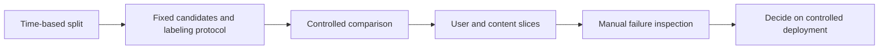

# 05 · Recommender evaluation: why did the score change without a model change?

[中文](05-evaluation-lab.md) · **English**

> Teaching experiment only. All identifiers and scores are invented, with no company or user data.

## Same model, different score

Suppose the only known relevant candidate P scores 0.8. Two other candidates score lower, so P ranks first. Expand the pool with two higher-scoring items and P falls to third.

The model hasn't changed, but Recall@2 drops from one to zero. The added items are explicitly irrelevant in this invented example; real unlabeled items cannot be assumed irrelevant in the same way.

Before the formula, keep Top-K at 2 and switch between the first two pools. Then choose multiple known positives and change only the denominator. These are two different reasons for a score to move.

<div class="widget" data-recsys-evaluation><p>At K=2, P ranks first in the small pool: Recall=1. Adding higher-scoring negatives moves P to third: Recall=0. With 4 positives and 2 hits, standard Recall is 0.5 while the capped-denominator score is 1.</p></div>

The first comparison takes only a few lines to reproduce:

```python
def recall_at_k(ranked, positives, cutoff):
    if not positives:
        return None
    hits = set(ranked[:cutoff]) & set(positives)
    return len(hits) / len(set(positives))

small_pool = ["P", "N1", "N2"]
larger_pool = ["N3", "N4", "P", "N1", "N2"]
print(recall_at_k(small_pool, {"P"}, 2))
print(recall_at_k(larger_pool, {"P"}, 2))
```

This prints `1.0` and `0.0`. [evaluation.py](code/evaluation.py) contains the runnable example using only Python's standard library.

## Don't mix two Recall definitions

This page uses the number of known positives as the denominator:

$$\operatorname{Recall@K}=\frac{|\operatorname{TopK}\cap P|}{|P|}.$$

Dividing by $\min(|P|,K)$ instead defines a different normalized metric. With four known positives and two Top-2 hits, the former is 0.5 and the latter is 1. Without a definition, an “improvement” is ambiguous.

Treat users with no known positives as undefined and report their count, not as perfect scores. Sparse positives make estimates volatile. Cohort comparisons also need sample sizes, exposure opportunities, and candidate sets.

## What must stay fixed?

| Change | Hold fixed at minimum | Also inspect |
| --- | --- | --- |
| New retrieval source | Total candidate budget, time window, labeling protocol | Unique relevant candidates, coverage, latency |
| New ranker | Candidates, feature snapshot, evaluation cohort | Ordering, calibration, cost |
| Diversity reranker | Candidates and base scores | Relevance cost, topic coverage, repetition |
| New training signal | Independent evaluation set and explicit labels | Subgroups, leakage, negative transfer |

These are attribution controls, not claims that stages are independent. Controlled comparisons help locate an effect; end-to-end experiments test the combination.

## Give evaluation a data flow



Logged behavior is not complete preference. A new policy changes exposure, and old logs usually cannot directly reveal reactions to those new exposures. Simulated users can stress-test protocols, edge cases, and feedback loops; they aren't independent evidence of real user benefit.

## Why did the aggregate rise when neither group improved?

Consider purely illustrative numbers. Group A has easier tasks and group B harder ones, with unchanged within-group scores:

| Group | Mean score | Old sample count | New sample count |
| --- | --- | --- | --- |
| A | 0.8 | 20 | 80 |
| B | 0.2 | 80 | 20 |

The old aggregate is `(20×0.8 + 80×0.2)/100 = 0.32`; the new one is `0.68`. The apparent 36-percentage-point increase comes entirely from composition. Fixed 50/50 weights give 0.5 both times.

Fixed weights aren't the only legitimate aggregate. Traffic weighting describes the current population; equal group weights expose smaller cohorts; paired users reduce changes in sample composition. State the question your summary answers and retain group counts and scores.

When comparing representations, fix queries, the item tower/index, candidate budgets, and labels, then inspect per-query differences. Repeated training estimates training variation; appropriate paired resampling estimates evaluation-sample uncertainty. Neither substitutes for the other. Related requests from one user may require user-level grouping rather than treating every request as independent.

Balancing counts does not repair missing labels or exposure bias. Higher Recall in one group may reflect a smaller, easier set of known positives rather than a better experience. Inspect coverage and topical diversity alongside relevance.

## Self-check

<details><summary>Does lower Recall after expanding the pool prove model regression?</summary><p>No. The task changed. Compare models under the same pool and labeling protocol, then report the effects of broader coverage separately.</p></details>

<details><summary>Is higher diversity with unchanged Recall enough to ship?</summary><p>Check relevance of added content, who benefits, safety, and cost. Offline evidence guides the next experiment; it doesn't replace deployment validation.</p></details>

Return to [episode 1](01-feed-pipeline.en.md): you should now be able to name the evidence needed at each stage rather than asking only whether the model's score increased.

Continue into design: [why two towers](06-why-two-towers.en.md) → [component choices](07-component-choices.en.md) → [reliable serving](08-serving-lifecycle.en.md).
